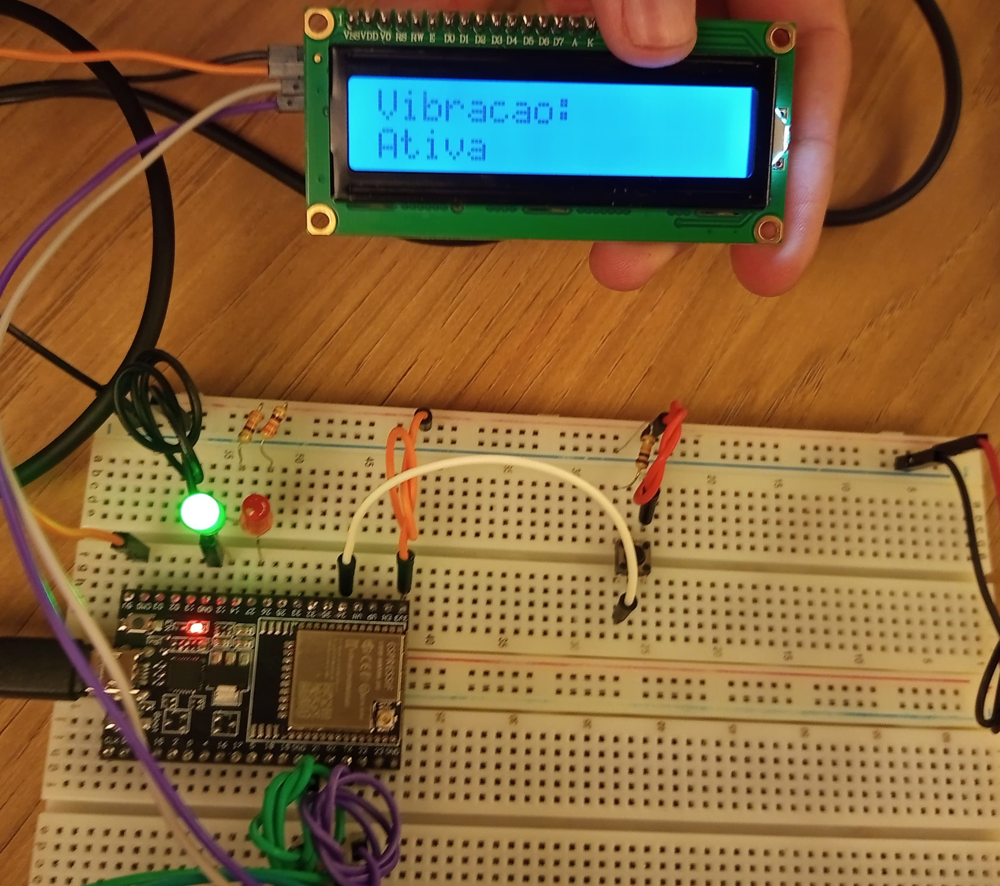
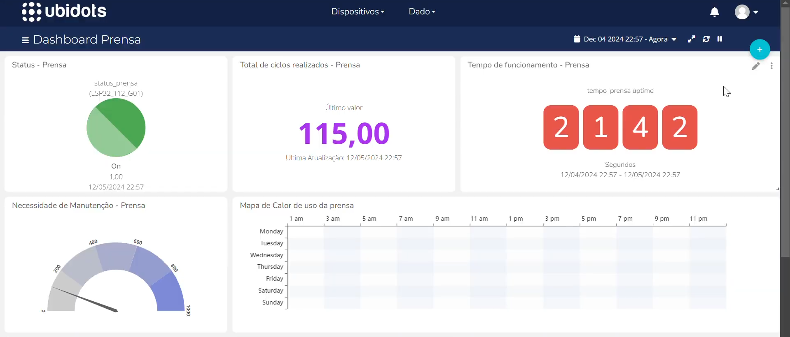
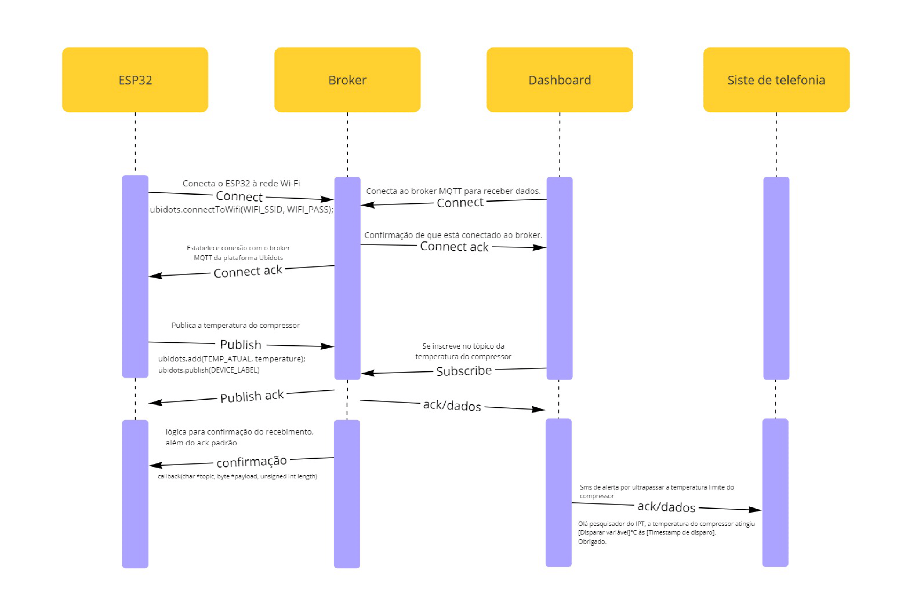

# Documentação IoTDoc - Módulo 4 - Inteli

## Wall-I

#### Integrantes do grupo

<div align="center">
  <table>
     <tr>
      <td align="center"><a href="https://www.linkedin.com/in/cecilslico/">Cecília Coelho</a></td>
      <td align="center"><a href="https://www.linkedin.com/in/danielppdias/"><br>Daniel Dias</a></td>
       <td align="center"><a href="https://www.linkedin.com/in/david-deodato-41b9b72b7/"><br>David Deodato</a></td>
     <td align="center"><a href="https://www.linkedin.com/in/kauanmassuia/"><br>Kauan Massuia</a></td>
      <td align="center"><a href="https://www.linkedin.com/in/milena-castro-vieira/"><br>Milena Castro</a></td>
      <td align="center"><a href="https://www.linkedin.com/in/otavio-vasc/"><br>Otavio Vasconcelos</a></td>
      <td align="center"><a href="https://www.linkedin.com/in/thalyta-viana/"><br>Thalyta Viana</a></td>
    </tr>
  </table>
</div>

## Sumário

[1. Introdução](#c1)

[2. Metodologia](#c2)

[3. Desenvolvimento e Resultados](#c3)

&nbsp;&nbsp;&nbsp;&nbsp;[3.1. Domínio dos fundamentos de negócios](#c31)

&nbsp;&nbsp;&nbsp;&nbsp;&nbsp;&nbsp;&nbsp;&nbsp;[3.1.1 Contexto da Indústria](#c311)

&nbsp;&nbsp;&nbsp;&nbsp;&nbsp;&nbsp;&nbsp;&nbsp;[3.1.2. Análise SWOT](#c312)

&nbsp;&nbsp;&nbsp;&nbsp;&nbsp;&nbsp;&nbsp;&nbsp;[3.1.3. Descrição da Solução a ser Desenvolvida](#c313)

&nbsp;&nbsp;&nbsp;&nbsp;&nbsp;&nbsp;&nbsp;&nbsp;[3.1.4. Value Proposition Canvas](#c314)

&nbsp;&nbsp;&nbsp;&nbsp;&nbsp;&nbsp;&nbsp;&nbsp;[3.1.5. Matriz de Riscos](#c315)

&nbsp;&nbsp;&nbsp;&nbsp;&nbsp;&nbsp;&nbsp;&nbsp;[3.1.6. Política de Privacidade de acordo com a LGPD](#c316)

&nbsp;&nbsp;&nbsp;&nbsp;&nbsp;&nbsp;&nbsp;&nbsp;[3.1.7. Bill of Material (BOM)](#c317)

&nbsp;&nbsp;&nbsp;&nbsp;[3.2. Domínio de Fundamentos de Experiência de Usuário](#c32)

&nbsp;&nbsp;&nbsp;&nbsp;&nbsp;&nbsp;&nbsp;&nbsp;[3.2.1. Personas](#c321)

&nbsp;&nbsp;&nbsp;&nbsp;&nbsp;&nbsp;&nbsp;&nbsp;[3.2.2. Jornada do Usuário e Storyboard](#c322)

&nbsp;&nbsp;&nbsp;&nbsp;[3.3. Solução Técnica](#c33)

&nbsp;&nbsp;&nbsp;&nbsp;&nbsp;&nbsp;&nbsp;&nbsp;[3.3.1. Requisitos Funcionais](#c332)

&nbsp;&nbsp;&nbsp;&nbsp;&nbsp;&nbsp;&nbsp;&nbsp;[3.3.2. Requisitos Não Funcionais](#c332)

&nbsp;&nbsp;&nbsp;&nbsp;&nbsp;&nbsp;&nbsp;&nbsp;[3.3.3. Arquitetura da Solução](#c333)

&nbsp;&nbsp;&nbsp;&nbsp;&nbsp;&nbsp;&nbsp;&nbsp;[3.3.4. Arquitetura do Protótipo](#c334)

&nbsp;&nbsp;&nbsp;&nbsp;[3.4. Resultados](#c34)

&nbsp;&nbsp;&nbsp;&nbsp;&nbsp;&nbsp;&nbsp;&nbsp;[3.4.1.Protótipo Inicial do Projeto usando o Simulador Wokwi](#c341)

&nbsp;&nbsp;&nbsp;&nbsp;&nbsp;&nbsp;&nbsp;&nbsp;[3.4.2. Protótipo Físico do Projeto (offline)](#c342)

&nbsp;&nbsp;&nbsp;&nbsp;&nbsp;&nbsp;&nbsp;&nbsp;[3.4.3. Protótipo do Projeto com MQTT e I2C](#c343)

&nbsp;&nbsp;&nbsp;&nbsp;&nbsp;&nbsp;&nbsp;&nbsp;[3.4.4. Protótipo Físico do Projeto (online)](#c344)

&nbsp;&nbsp;&nbsp;&nbsp;&nbsp;&nbsp;&nbsp;&nbsp;[3.4.5. Protótipo Final do Projeto](#c345)

&nbsp;&nbsp;&nbsp;&nbsp;&nbsp;&nbsp;&nbsp;&nbsp;[3.4.6. Testes de Usabilidade](#c346)

[4. Conclusões e Recomendações](#c4)

&nbsp;&nbsp;&nbsp;&nbsp;[4.1 Conclusões e Recomendações da Prensa](#c41)

&nbsp;&nbsp;&nbsp;&nbsp;[4.2 Conclusões e Recomendações do Compressor](#c42)

&nbsp;&nbsp;&nbsp;&nbsp;[4.3 Recomendações Gerais](#c43)

[5. Referências](#c5)

<br>


# <a name="c1"></a>1. Introdução

&nbsp;&nbsp;&nbsp;&nbsp; O Instituto de Pesquisas Tecnológicas (IPT) é uma instituição de grande porte vinculada ao Governo do Estado de São Paulo, fundada em 1899, com o objetivo de criar e aplicar soluções tecnológicas em diversos setores da economia. Sua atuação abrange pesquisa, desenvolvimento, inovação, serviços tecnológicos e metrológicos, além de educação em tecnologia. O IPT possui uma infraestrutura laboratorial de ponta e equipes multidisciplinares, sendo referência em ensaios, calibrações e consultoria tecnológica.

&nbsp;&nbsp;&nbsp;&nbsp;O problema enfrentado pelo IPT está no monitoramento de mais de 500 equipamentos no laboratório de processos metalúrgicos, que operam sob demanda. A ausência de um sistema eficiente de monitoramento contínuo compromete a manutenção adequada, resultando em custos elevados, menor vida útil dos equipamentos e disponibilidade limitada.


## 1.1 Objetivos <a name="c11"></a>

&nbsp;&nbsp;&nbsp;&nbsp; Para compreender o direcionamento do desenvolvimento do projeto, é essencial primeiro entender os principais objetivos da empresa. De acordo com o entendimento do TAPI (Termo de Abertura de Projeto do Inteli, 2024)<sup>[1](#foot1)</sup>, o ponto focal é desenvolver um dispositivo capaz de monitorar continuamente as condições dos equipamentos, de forma independente da alocação de recursos e com baixos custos para a empresa. Esse dispositivo será utilizado para reduzir custos, prolongar a vida útil das máquinas e aumentar a disponibilidade dos equipamentos monitorados. Além disso, o Instituto de Pesquisa e Tecnologia possui outros objetivos específicos:

- Relatório de interconexões entre o sistema IOT
- Infraestrutura necessária para funcionamento do dispositivo IOT
- Interface de comunicação entre os dispositivos
- Interface de consulta de dados
- Sistema de envio de alarmes para informar problemas detectados.

&nbsp;&nbsp;&nbsp;&nbsp;Em suma, o desenvolvimento do dispositivo de monitoramento contínuo tem como principal objetivo ganhos financeiros e operacionais à empresa, ao reduzir custos, aumentar a vida útil dos equipamentos e melhorar sua disponibilidade. Com a integração de sistemas IoT, interfaces adequadas e um sistema de alertas, o projeto oferecerá uma solução tecnológica eficiente e sustentável, alinhada às necessidades do IPT.

## 1.2 Proposta da solução <a name="c12"> </a>

&nbsp;&nbsp;&nbsp;&nbsp;A proposta de solução envolve a criação de um sistema de monitoramento contínuo para os equipamentos do laboratório de processos metalúrgicos do IPT. Esse sistema permitirá acompanhar, em tempo real, as condições de operação e manutenção dos mais de 500 equipamentos, independentemente da demanda, garantindo que qualquer necessidade de intervenção seja identificada de forma proativa.

&nbsp;&nbsp;&nbsp;&nbsp;Essa solução ajudará a reduzir os custos de manutenção, aumentar a vida útil dos equipamentos e garantir maior disponibilidade para projetos e ensaios, atendendo diretamente os objetivos de eficiência, inovação e sustentabilidade do IPT.


## 1.3 Justificativa <a name="c13"> </a>

&nbsp;&nbsp;&nbsp;&nbsp;A proposta de solução tem grande potencial, pois oferece uma forma de monitorar os equipamentos do laboratório do IPT de maneira contínua e preventiva. Isso ajuda a identificar possíveis problemas antes que afetem o funcionamento, reduzindo custos e evitando que os equipamentos fiquem parados.

&nbsp;&nbsp;&nbsp;&nbsp;Os benefícios incluem maior durabilidade dos equipamentos, redução de gastos com consertos inesperados e maior disponibilidade para uso. A solução se destaca por ser simples, acessível e fácil de aplicar no ambiente do laboratório, trazendo melhorias diretas para a eficiência e o funcionamento do IPT.

---

# <a name="c2"></a>2. Metodologia 

&nbsp;&nbsp;&nbsp;&nbsp;Reference Model for Open Distributed Processing, o RM-ODP, que significa Modelo de Referência para Processamento Distribuído Aberto, é uma família de Padrões Internacionais criada para fornecer uma base sólida para descrever e construir sistemas e aplicações amplamente distribuídos de forma sistemática. O objetivo da padronização do ODP é o desenvolvimento de Padrões Internacionais que permitam que os benefícios da distribuição de sistemas e serviços de processamento de informações sejam realizados em um ambiente de recursos de TI heterogêneos e múltiplos domínios organizacionais<sup>[7](#foot7)</sup>.
<br>
&nbsp;&nbsp;&nbsp;&nbsp;O RM-ODP consiste em 14 Padrões Internacionais que cobrem todas as principais preocupações dos engenheiros de software e arquitetos empresariais que precisam projetar e desenvolver sistemas de TI heterogêneos e interoperáveis ​​de maneira flexível, mas rigorosa. Esse modelo organiza o desenvolvimento de sistemas complexos em cinco "pontos de vista", ou seja, cinco formas de enxergar o sistema, cada uma com um foco específico, de modo que será possível compreender cada uma dessas maneiras na imagem a seguir (Figura 01):

---

<div align="center">
<sub>Figura 01 - Metodologia RM-ODP</sub><br>
<br>
<sup>Fonte: Material disponibilizado pelo Inteli</sup>
</div>

---

&nbsp;&nbsp;&nbsp;&nbsp;**Ponto de vista de negócios**: Define os objetivos e necessidades principais da organização, além de definir o propósito do sistema e o valor que ele irá trazer para a empresa. Ele estabelece políticas, regras e busca se alinhar com os interesses específicos da empresa. <br>
É referência para os requisitos funcionais e não funcionais, uma vez que direcionam os requisitos que o sistema deve possuir para se adequar às regras de negócios e necessidades da empresa, trazendo um foco para beneficiar as partes interessadas envolvidas.

&nbsp;&nbsp;&nbsp;&nbsp;**Requisitos funcionais**: Representam as funções específicas que o sistema precisa realizar para suportar diretamente as operações de negócios. Eles descrevem “o que” o sistema deve fazer para cumprir os objetivos definidos. Os requisitos funcionais garantem que cada operação necessária para atingir os objetivos da empresa esteja disponível no sistema, o que mostra a relação com a visão de negócios.

&nbsp;&nbsp;&nbsp;&nbsp;**Requisitos não funcionais**: Envolvem características de qualidade que garantem a performance, segurança, usabilidade e outros aspectos essenciais para que o sistema funcione bem. Eles não se referem diretamente a uma função específica, mas sim a como e o quão bem o sistema deve operar. Eles ajudam a garantir que o sistema possa operar de maneira confiável e segura, satisfazendo as expectativas de qualidade e mantendo o suporte aos objetivos de negócios em longo prazo. Se o sistema não for confiável ou seguro, ele poderá comprometer os objetivos da empresa, mesmo que tenha todas as funções necessárias.

&nbsp;&nbsp;&nbsp;&nbsp;**Arquitetura**: É a organização estrutural do sistema, incluindo seus componentes, subsistemas, e como eles se relacionam e interagem para dar suporte aos requisitos do sistema. A arquitetura define como as funcionalidades serão implementadas e como as qualidades esperadas do sistema (como performance e segurança) serão garantidas. De modo geral, a arquitetura  organiza e estrutura essas funcionalidades e qualidades.

&nbsp;&nbsp;&nbsp;&nbsp;**Tecnologia**: Envolve a infraestrutura, ferramentas e plataformas necessárias para que a arquitetura do sistema seja implementada de maneira funcional e eficiente. A tecnologia fornece as ferramentas e plataformas que permitem que a arquitetura seja implementada na prática. Escolhas tecnológicas adequadas (como servidores, linguagens de programação, e frameworks) são essenciais para que a arquitetura funcione conforme o esperado. 


&nbsp;&nbsp;&nbsp;&nbsp;Portanto, o modelo RM-ODP é uma metodologia estruturada que oferece uma visão completa e interdependente para o desenvolvimento de sistemas complexos, sendo ideal para projetos de IoT. A partir da definição dos objetivos de negócios, passando pela especificação de requisitos funcionais e não funcionais, organização da arquitetura e escolha de tecnologias, o modelo garante que cada etapa do desenvolvimento esteja alinhada com as metas da organização e com as demandas do sistema. Em projetos de IoT, onde a integração de dispositivos e a interoperabilidade entre sistemas heterogêneos são desafiadoras, essa metodologia ajuda a organizar e a garantir que todas as camadas do sistema, desde a funcionalidade até a performance e segurança, estejam planejadas e implementadas de forma correta. Ao estruturar o desenvolvimento com essa abordagem, é possível não só facilitar o gerenciamento e a escalabilidade do projeto IoT, mas também assegurar que o sistema entregue valor real ao negócio, seja seguro, confiável e adaptável às futuras evoluções tecnológicas e demandas de mercado.


---

# <a name="c3"></a>3. Desenvolvimento e Resultados

## 3.1. Domínio de Fundamentos de Negócio <a name="c31"> </a>

&nbsp;&nbsp;&nbsp;&nbsp;O domínio de Fundamentos de Negócio envolve a compreensão de aspectos essenciais para o desenvolvimento de um projeto ou solução, a fim de garantir que ela atenda tanto às necessidades do mercado quanto aos requisitos de viabilidade e conformidade. Abaixo, exploramos os principais tópicos relacionados a esse domínio, que fornecem uma base sólida para a execução de qualquer empreendimento, baseando-se no entendimento do contexto em que a empresa está inserida e na elaboração e análise das 5 Forças de Porter (Figura 2).

### 3.1.1. Contexto da Indústria <a name="c311"> </a>

&nbsp;&nbsp;&nbsp;&nbsp;O Instituto de Pesquisas Tecnológicas (IPT) atua em um setor dinâmico, competitivo e voltado para inovação tecnológica. A seguir, são apresentados os principais competidores, o modelo de negócio do IPT e as tendências que impactam o setor:

### Concorrência
&nbsp;&nbsp;&nbsp;&nbsp;O IPT enfrenta concorrência de outras instituições de pesquisa e desenvolvimento que também visam melhorar a competitividade e promover a inovação tecnológica no Brasil. Entre os principais competidores estão:

1. **Centro de Tecnologia da Indústria Química e Têxtil (SENAI CETIQT)**: Um centro de excelência que se destaca na inovação e desenvolvimento tecnológico nas áreas de química e têxtil, oferecendo consultorias e serviços de ensaios para empresas têxteis e de confecção. Ele atua em diversas cidades do Brasil, promovendo capacitação e projetos para aumentar a competitividade industrial (SENAI, 2024)<sup>[12](#foot12)</sup>.

2. **Instituto Nacional de Tecnologia (INT)**: Focado em pesquisa, desenvolvimento e inovação para diversos setores industriais, com o objetivo de aumentar a competitividade do Brasil no mercado global. O INT colabora amplamente com empresas para desenvolver novas tecnologias e melhorar processos produtivos (INT, 2024)<sup>[13](#foot13)</sup>.

3. **Embrapa**: Embora sua principal área de atuação seja a agropecuária, a Embrapa também compete em inovação tecnológica, principalmente em biotecnologia e sustentabilidade, oferecendo soluções que abrangem uma gama diversificada de setores, como alimentos e recursos naturais (Embrapa, 2024)<sup>[14](#foot14)</sup>.

&nbsp;&nbsp;&nbsp;&nbsp;Essas instituições, assim como o IPT, possuem uma base sólida em pesquisa e desenvolvimento, oferecendo serviços tecnológicos e soluções inovadoras.

### Modelo de Negócio
&nbsp;&nbsp;&nbsp;&nbsp;O IPT é uma instituição vinculada à Secretaria de Desenvolvimento Econômico do Estado de São Paulo e possui um modelo de negócios diversificado, centrado na oferta de soluções tecnológicas para empresas e o setor público. Seu objetivo é promover a competitividade industrial e o bem-estar social através de inovação, serviços tecnológicos, metrologia e educação técnica.

&nbsp;&nbsp;&nbsp;&nbsp;As principais áreas de atuação do IPT são:

- **Ensaios, análises e calibrações**: Realização de testes laboratoriais para validar a qualidade e a segurança de produtos e processos, auxiliando empresas no cumprimento de normas técnicas e certificações.
- **Pesquisa e Desenvolvimento (P&D)**: Colaboração com empresas no desenvolvimento de novos produtos e tecnologias, impulsionando a inovação em setores de alta tecnologia, como energia e saúde.
- **Consultoria e Certificações**: Oferecimento de consultoria técnica e certificação de produtos e processos para aprimorar a qualidade e segurança nas indústrias.
- **Metrologia**: Desenvolvimento de tecnologias de medição, sendo uma referência em testes e análises que suportam o avanço de indústrias de ponta.

&nbsp;&nbsp;&nbsp;&nbsp;Além disso, o IPT conduz o projeto **IPT Open Experience**, que visa transformar São Paulo em um polo de inovação tecnológica, inspirado no *Silicon Valley*, com foco em tecnologias de alta complexidade (*Hardtech*), e colaboração entre universidades, centros de pesquisa e empresas.

### Tendências do Setor
&nbsp;&nbsp;&nbsp;&nbsp;O setor de atuação do IPT está sendo moldado por diversas tendências tecnológicas e de sustentabilidade, tais como:

- **Manutenção preditiva**: Com o uso de sensores IoT para coleta de dados em tempo real, a manutenção preditiva permite prever falhas em máquinas, reduzindo o tempo de inatividade e os custos com reparos emergenciais. Essa abordagem possibilita o planejamento antecipado de substituição de peças, contribuindo para metas de sustentabilidade ao minimizar o desperdício de recursos.
- **Sustentabilidade e eficiência energética**: A redução do impacto ambiental e a eficiência no uso de recursos naturais são prioridades crescentes nas indústrias. O IPT se alinha a essas demandas através de projetos que promovem a economia circular e a integração de tecnologias IoT na cadeia de suprimentos, otimizando processos e minimizando desperdícios.
- **Indústria 4.0 e digitalização**: A digitalização total dos processos produtivos, por meio de automação avançada e sistemas ciberfísicos, continua transformando o ambiente industrial. A expansão da Indústria 4.0 tem sido ampla, com a adoção crescente dessas tecnologias por empresas de diversos setores, incluindo manufatura e alimentos.

&nbsp;&nbsp;&nbsp;&nbsp;Essas tendências indicam que o IPT e outras instituições de pesquisa estão em uma posição estratégica para colaborar com indústrias que buscam modernização tecnológica e sustentabilidade.


--- 
<div align="center">
<sub>Figura 02 - 5 Forças de Porter</sub><br>
<br>
<sup>Fonte: Material produzido pelos autores (2024)</sup>
</div>

---

### 1. Rivalidade entre Concorrentes
&nbsp;&nbsp;&nbsp;&nbsp;A rivalidade no setor de pesquisa e desenvolvimento tecnológico no Brasil é alta, devido à presença de diversas instituições concorrentes, como o SENAI CETIQT, Instituto Nacional de Tecnologia (INT) e Embrapa. Essas organizações competem por contratos com empresas e o governo, oferecendo serviços como consultoria, ensaios e desenvolvimento de novas tecnologias. Essa competição força o IPT a se diferenciar por meio de inovação contínua, parcerias estratégicas e excelência nos serviços prestados, especialmente em áreas de alta tecnologia e sustentabilidade.

### 2. Ameaça de Novos Entrantes
&nbsp;&nbsp;&nbsp;&nbsp;A ameaça de novos entrantes no mercado de pesquisa e inovação é baixa. Isso se deve principalmente às barreiras significativas de entrada, como a necessidade de altos investimentos em infraestrutura, equipamentos especializados, certificações e acreditações. Além disso, o IPT possui parcerias de longa data com instituições como a USP, o que cria uma barreira adicional para novos concorrentes, tornando a entrada de startups e novas empresas mais desafiadora.

### 3. Poder de Negociação dos Fornecedores
&nbsp;&nbsp;&nbsp;&nbsp;O IPT depende de fornecedores especializados para a aquisição de equipamentos tecnológicos, materiais de pesquisa e serviços de alta precisão. O poder de negociação desses fornecedores é moderado, visto que, apesar de alguns insumos serem fornecidos por poucos players, o IPT tem uma rede ampla de fornecedores e, em muitos casos, pode optar por parcerias estratégicas ou alternativas locais. Em contrapartida, a dependência de tecnologia de ponta e algumas importações de equipamentos especializados podem elevar o poder de barganha dos fornecedores.

### 4. Poder de Negociação dos Clientes
&nbsp;&nbsp;&nbsp;&nbsp;Os clientes do IPT incluem grandes empresas industriais, órgãos públicos e o setor privado, todos buscando soluções inovadoras e serviços tecnológicos. O poder de negociação dos clientes é alto, pois eles têm à disposição uma variedade de outras instituições tecnológicas que também podem fornecer esses serviços. A capacidade de customização, inovação e a relação custo-benefício são fatores que os clientes consideram ao escolher o IPT, o que aumenta o poder de barganha deles.

### 5. Ameaça de Produtos ou Serviços Substitutos
&nbsp;&nbsp;&nbsp;&nbsp;A ameaça de substitutos é moderada. Tecnologias emergentes, como a inteligência artificial, soluções digitais e softwares importados que realizam análises preditivas ou de metrologia, podem atuar como substitutos para alguns serviços prestados pelo IPT. No entanto, a expertise do IPT em áreas complexas, sua tradição e as acreditações que possui oferecem uma barreira substancial contra esses substitutos, especialmente em setores que exigem alta confiabilidade e precisão nos resultados.

### 3.1.2. Análise SWOT <a name="c312"></a>

&nbsp;&nbsp;&nbsp;&nbsp;A Análise SWOT, originária do inglês *"Strengths, Weaknesses, Opportunities, and Threats"*, conhecida também como FOFA, é uma ferramenta utilizada para realizar o planejamento estratégico das ações de uma empresa (EPR Consultoria, 2024)<sup>[2](#foot2)</sup>. Ela visa avaliar tanto os fatores internos, quanto os externos que influenciam a organização. Para isso, considera-se as características da própria empresa, suas forças e fraquezas, e também o seu posicionamento no mercado, com base em oportunidades e ameaças.

&nbsp;&nbsp;&nbsp;&nbsp;Ao estruturar uma Matriz SWOT, compreende-se os aspectos internos da empresa, ou seja, aqueles que estão sob seu controle. Sendo eles, as forças que são os pontos que auxiliam no sucesso da organização e as fraquezas que são os fatores que podem ser prejudiciais e, por isso, precisam ser reavaliados e aprimorados (EPR Consultoria, 2024)<sup>[2](#foot2)</sup>. Já os aspectos externos, que são fatores fora do controle da empresa, normalmente relacionados ao ambiente econômico, político ou social, podem tanto beneficiar quanto prejudicar a organização, sendo classificados como oportunidades ou ameaças (EPR Consultoria, 2024)<sup>[2](#foot2)</sup>. Diante disso, realizou-se a seguinte análise para o Instituto de Pesquisas Tecnológicas (Figura 03):

--- 
<div align="center">
<sub>Figura 03 - Análise SWOT - IPT</sub><br>
<a id="p2"></a><br>
<sup>Fonte: Material produzido pelos autores (2024)</sup>
</div>

---

Forças:

- Realização de parcerias com organizações públicas e privadas: O IPT mantém colaborações com empresas privadas, universidades e órgãos governamentais, o que potencializa a relevância de suas pesquisas e o impacto na inovação industrial.

- Diversidade de áreas de atuação: O IPT possui diversas áreas de atuação, o que lhe permite desenvolver projetos e pesquisas em setores variados, como biotecnologia, energia, meio ambiente, infraestrutura e química (IPT, 2024)<sup>[3](#foot3)</sup>. Essa diversidade de áreas torna o instituto uma referência para diferentes indústrias, além de ampliar sua capacidade de adaptação às demandas.

- Referência na área de pesquisa no país: O IPT é uma das instituições de pesquisa mais antigas do Brasil, com 125 anos de existência (SÃO PAULO,2024)<sup>[4](#foot4)</sup>, o que possibilita que a empresa tenha uma grande experiência no desenvolvimento de pesquisas e uma grande visibilidade no mercado nacional.

- Plataforma de Inovação Colaborativa: A iniciativa IPT Open fortalece o instituto ao criar um ambiente de inovação aberto e colaborativo, que envolve empresas, startups, universidades e o governo (IPT Open, 2024)<sup>[5](#foot5)</sup>. Essa plataforma diversifica as fontes de conhecimento e investimento, acelerando a implementação de soluções tecnológicas.

Fraquezas:

- Dependência de verbas públicas: O instituto de pesquisas, por ser vinculado ao governo do Estado de São Paulo, apresenta uma significativa dependência do financiamento governamental, o que pode gerar algumas limitações por possíveis cortes de verba.

- Processos burocráticos: Por se tratar de uma instituição pública, o IPT possui alguns processos burocráticos, que podem atrasar a execução de projetos e a tomada de decisões para a realização de mudanças ao decorrer desses.

- Altos custos operacionais: O IPT possui altos custos devido à sua ampla infraestrutura e diversos laboratórios, despesas com manutenção de equipamentos e pagamento de pessoas especializadas. Esses custos podem limitar a flexibilidade financeira do instituto, dificultando direcionamentos para outras áreas ou gerando limitações em cenários de redução orçamentária.

Oportunidades:

- Expansão de Parcerias Internacionais: Levando em consideração a influência já existente do IPT no cenário nacional e que a instituição já realiza algumas parcerias internacionais, há uma grande oportunidade para expandir colaborações com instituições e empresas fora do país. Isso poderia não apenas ampliar seu alcance, mas também proporcionar acesso a novos recursos e tecnologias. O IPT já possui um histórico de convênios e colaborações (OLIVEIRA, 2021)<sup>[6](#foot6)</sup>, o que indica um potencial para fortalecer ainda mais essas iniciativas.

- Transformação Digital: As empresas atuais estão passando pela digitalização de processos industriais e o uso de tecnologias emergentes, como inteligência artificial e big data. Sendo assim, a busca pela aplicação dessas tecnologias podem gerar novas frentes de pesquisa e desenvolvimento para o instituto.

- Apoio a Startups e Empresas Inovadoras: O IPT tem a oportunidade de atuar como um facilitador para startups e empresas inovadoras, oferecendo suporte e acesso a sua infraestrutura de pesquisa. Sendo assim, o instituto pode se posicionar como um parceiro estratégico, colaborando com esses novos negócios em projetos de pesquisa e desenvolvimento. O reforço desse tipo de parceria não apenas fortalece o ecossistema de inovação, mas também pode resultar em novas fontes de financiamento e oportunidades de mercado para o IPT.

Ameaças:

- Mudanças no cenário do governo: A instabilidade política e as frequentes mudanças nas diretrizes governamentais podem criar um ambiente incerto que afeta a atuação do IPT. Essas oscilações podem dificultar a definição de metas e estratégias de longo prazo, prejudicando a continuidade e a eficácia das iniciativas de pesquisa. Além disso, a falta de previsibilidade nas políticas públicas pode resultar em uma diminuição da colaboração entre o IPT e seus stakeholders.

- Redução de verbas: A escassez de recursos financeiros é uma ameaça constante para instituições de pesquisa pública como o IPT. Com a pressão por cortes orçamentários e a priorização de outras áreas governamentais, a redução de verbas pode limitar as operações do instituto, prejudicando sua capacidade de investimento em infraestrutura, tecnologia e pessoal especializado.

- Concorrência de Instituições Privadas: Instituições privadas e startups de tecnologia estão ganhando força na área de inovação, oferecendo alternativas mais ágeis e, muitas vezes, mais baratas para o desenvolvimento de novas tecnologias. Essas entidades podem emergir rapidamente, ocupando espaço e influência que antes eram dominados pelos institutos de pesquisa, o que pode levar a uma competição acirrada e à perda de relevância do IPT no cenário tecnológico e científico​.

&nbsp;&nbsp;&nbsp;&nbsp;Diante da análise realizada, é possível perceber a importância da estruturação de uma Matriz SWOT para o planejamento estratégico do IPT. A análise das forças, como a diversidade de áreas de atuação, revela os pontos que fortalecem a organização e permitem sua adaptação às demandas do mercado. Ao mesmo tempo, a identificação das fraquezas e ameaças, como a dependência de verbas públicas e a concorrência crescente de instituições privadas, enfatiza a necessidade de um plano de ação para mitigar esses riscos. Essa abordagem proporciona uma visão abrangente que facilita a formulação de estratégias que podem maximizar os recursos do IPT e aumentar sua relevância no cenário nacional e internacional

### 3.1.3. Descrição da Solução a ser Desenvolvida <a name="c313"> </a>

&nbsp;&nbsp;&nbsp;&nbsp;A solução que será desenvolvida é um dispositivo IoT simples e de baixo custo, que vai monitorar continuamente os equipamentos do laboratório de processos metalúrgicos do IPT. Esse dispositivo vai se conectar à rede sem fio do laboratório e acompanhar dados como temperatura e tempo de uso dos equipamentos.

&nbsp;&nbsp;&nbsp;&nbsp;Os dados coletados serão enviados para um sistema que vai alertar a equipe de manutenção sempre que houver um problema ou a necessidade de consertos. Além disso, o sistema ajudará a organizar as manutenções, garantindo que os equipamentos funcionem bem por mais tempo, sem que falhem de surpresa.

&nbsp;&nbsp;&nbsp;&nbsp;Essa solução vai ajudar a reduzir os custos de manutenção, aumentar a vida útil dos equipamentos e garantir que eles estejam sempre prontos para uso, mesmo em um ambiente difícil, com poeira e umidade. O primeiro passo será a criação de um MVP (Produto Mínimo Viável), que vai monitorar temperatura e tempo de uso, com a possibilidade de incluir outras funções no futuro. No geral, essa solução resolve o problema de falta de monitoramento contínuo, oferecendo uma maneira mais eficiente de cuidar dos equipamentos.

#### Qual é o problema a ser resolvido

&nbsp;&nbsp;&nbsp;&nbsp;O laboratório de processos metalúrgicos do IPT possui mais de 500 equipamentos que funcionam sob demanda, o que significa que eles só operam quando são necessários para testes ou projetos. Devido à falta de monitoramento contínuo, torna-se difícil identificar problemas de manutenção a tempo, o que acaba aumentando os custos operacionais e diminuindo a vida útil dos equipamentos. Esse cenário pode levar a falhas inesperadas, impactando negativamente o funcionamento do laboratório. O desafio, portanto, é garantir um monitoramento eficaz desses equipamentos para reduzir custos e melhorar a disponibilidade e durabilidade.

#### Qual a solução proposta (visão de negócios)

&nbsp;&nbsp;&nbsp;&nbsp;A solução envolve o desenvolvimento de um dispositivo IoT acessível que monitore continuamente variáveis importantes, como temperatura e horas de uso dos equipamentos. Conectado à rede do laboratório, esse dispositivo enviará dados para um sistema que, por sua vez, notificará a equipe de manutenção sobre a necessidade de intervenções preventivas, evitando problemas maiores. Essa abordagem otimiza a gestão da manutenção, reduz custos operacionais e aumenta a disponibilidade dos equipamentos, contribuindo diretamente para o bom funcionamento do laboratório e garantindo uma operação mais eficiente e previsível.

#### Como a solução proposta deverá ser utilizada

&nbsp;&nbsp;&nbsp;&nbsp;O dispositivo IoT será utilizado para monitorar, em tempo real, o status dos equipamentos do laboratório. Ele coletará dados como a temperatura e o tempo de operação e enviará essas informações para um sistema central. Quando qualquer anomalia for detectada, a equipe de manutenção será automaticamente alertada para agir de forma proativa. Essa automação torna o processo de monitoramento mais preciso e prático, eliminando a necessidade de inspeções manuais frequentes e permitindo uma gestão de manutenção mais estratégica e ágil.

#### Quais os benefícios trazidos pela solução proposta

&nbsp;&nbsp;&nbsp;&nbsp;A proposta traz vários benefícios ao laboratório, incluindo uma redução significativa nos custos de manutenção, uma vez que o monitoramento contínuo permitirá a detecção antecipada de possíveis problemas. Além disso, a solução possibilitará a execução de manutenções preventivas no momento certo, prolongando a vida útil dos equipamentos.

&nbsp;&nbsp;&nbsp;&nbsp;Outro ganho importante é a maior disponibilidade dos equipamentos, já que eles terão menos chances de falhar de maneira inesperada, possibilitando uma operação mais eficiente e confiável para atender às demandas de projetos e testes no laboratório.

#### Qual será o critério de sucesso e qual medida será utilizada para o avaliar

&nbsp;&nbsp;&nbsp;&nbsp;O sucesso do projeto será avaliado pela capacidade de reduzir as falhas inesperadas dos equipamentos e, consequentemente, os custos relacionados a reparos emergenciais. Se o sistema de monitoramento alertar a equipe de manutenção de maneira eficiente e as falhas diminuírem, isso será um indicador positivo de que a solução está funcionando.

&nbsp;&nbsp;&nbsp;&nbsp;Além disso, a diminuição dos custos de manutenção e o aumento na disponibilidade dos equipamentos também serão métricas importantes. Comparar os resultados antes e depois da implementação da solução ajudará a verificar se o sistema alcançou os objetivos desejados, tanto na redução de custos quanto na melhoria da operação do laboratório.

### 3.1.4. Value Proposition Canvas <a name="c314"> </a>


&nbsp;&nbsp;&nbsp;&nbsp;O Canvas da Proposta de Valor é uma ferramenta que auxilia no posicionamento do produto no mercado com base nas necessidades do cliente. Além de estruturar a inserção do produto no mercado, ela destaca os diferenciais do projeto. O Canvas é dividido em duas partes: Proposta de Valor e Segmento de Clientes. A parte da proposta de valor define claramente o que o seu produto ou serviço oferece para resolver os problemas ou atender às necessidades do cliente, ou seja, mostra o porquê do cliente ter que selecionar o seu produto e não outro. Já o segmento de clientes serve para entender quem está atendendo com a solução do projeto, ou seja, quem se beneficiará desse produto (Pereira, 2019). <sup>[7](#foot7)</sup> Sendo assim, desenvolveu-se o seguinte canvas (Figura 04).

<div align="center">
<sub>Figura 04 - Canvas Proposta de Valor</sub><br>
<br>
<sup>Fonte: Material produzido pelos autores (2024)</sup>
</div>

- Proposta de Valor
    - Produtos e Serviços

    &nbsp;&nbsp;&nbsp;&nbsp; Os produtos e serviços apresentados é basicamente o desenvolvimento de um dispositivo IoT de baixo custo, projetado para realizar o monitoramento contínuo das condições operacionais dos equipamentos de laboratório, incluindo variáveis críticas como temperatura e tempo de uso. O dispositivo será integrado com uma infraestrutura de rede para transmissão de dados em tempo real, permitindo maior controle sobre o estado dos equipamentos.

    - Analgésicos

    &nbsp;&nbsp;&nbsp;&nbsp; A solução IoT alivia dores relacionadas a altos custos e desperdícios, fornecendo monitoramento contínuo e preciso dos equipamentos. Isso evita o uso excessivo de recursos, minimiza paradas não planejadas e elimina a necessidade de manutenção corretiva frequente, reduzindo significativamente os custos operacionais e aumentando a eficiência do laboratório.

    - Criadores de ganho

    &nbsp;&nbsp;&nbsp;&nbsp; Os Criadores de Ganho do projeto incluem funcionalidades como a medição de temperatura, os alertas de intervenção e manutenção, e o controle da manutenção preventiva. A medição de temperatura permite o monitoramento em tempo real, prevenindo danos causados por sobreaquecimento e garantindo o uso eficiente dos equipamentos. Já os alertas de intervenção e manutenção enviam notificações automáticas assim que os parâmetros operacionais atingem limites críticos, permitindo uma resposta rápida para evitar falhas e reduzir os custos com manutenções corretivas. O controle da manutenção preventiva, por sua vez, facilita o agendamento com base em dados de uso real, garantindo a manutenção regular dos equipamentos e prolongando sua vida útil.


- Perfil do Cliente
    - Trabalhos do cliente

    &nbsp;&nbsp;&nbsp;&nbsp;Os clientes (responsáveis pelos equipamentos no laboratório) precisam garantir a operação contínua e eficiente de mais de 500 equipamentos, monitorando manualmente suas condições ou aguardando que falhas aconteçam para então agir. Essa abordagem reativa aumenta o risco de inatividade, eleva os custos de manutenção e reduz a vida útil dos equipamentos. O dispositivo IoT simplifica esse processo, automatizando o monitoramento e reduzindo o esforço manual para garantir que os equipamentos estejam sempre em perfeito estado de funcionamento.

    - Dores

    &nbsp;&nbsp;&nbsp;&nbsp;A falta de monitoramento contínuo dos equipamentos resulta em custos altos e desperdícios, já que falhas inesperadas aumentam os gastos com manutenções corretivas, reduzem a produtividade e levam ao desperdício de recursos. Além disso, a vida útil dos equipamentos é extremamente afetada, pois sem um acompanhamento adequado das condições operacionais, os equipamentos operam fora dos parâmetros ideais, o que reduz sua durabilidade e gera custos elevados com substituições ou reparos frequentes. Como os equipamentos estão constantemente sendo utilizados para projetos e testes, é essencial garantir que estejam sempre em boas condições, o que exige um monitoramento preciso e uma manutenção eficiente, demandas que a solução proposta busca atender diretamente.

    - Ganhos

    &nbsp;&nbsp;&nbsp;&nbsp;A solução proposta promove a redução de custos operacionais ao minimizar a necessidade de manutenção corretiva, evitar desperdícios de energia e reduzir o uso de insumos que resultam de falhas não detectadas a tempo. O aumento da vida útil dos equipamentos também é garantido, já que o monitoramento contínuo permite que os equipamentos operem dentro de condições ideais, prevenindo desgastes desnecessários e prolongando sua durabilidade. Além disso, os dispositivos integrados à infraestrutura existente de IoT no laboratório otimizam os recursos de comunicação e processamento de dados, criando um ambiente mais conectado e eficiente.

### 3.1.5. Matriz de Riscos <a name="c315"> </a>

&nbsp;&nbsp;&nbsp;&nbsp;A matriz de riscos é uma ferramenta fundamental para o planejamento e execução de projetos, permitindo identificar e avaliar ameaças e oportunidades que podem impactar o desenvolvimento e o resultado final. Neste projeto, nós, como alunos, utilizamos a matriz para mapear os principais riscos e oportunidades relacionados ao desenvolvimento do aparelho de monitoramento IoT que estamos criando em parceria com o IPT. A matriz permite não só visualizar as probabilidades e impactos dos riscos, mas também priorizar ações e estratégias de mitigação para garantir que os objetivos sejam alcançados dentro do prazo e dos requisitos estabelecidos (Pedra, 2024). <sup>[15](#foot15)</sup>

&nbsp;&nbsp;&nbsp;&nbsp;Ao utilizarmos a matriz de riscos, conseguimos, de forma visual e prática, determinar quais riscos demandam atenção imediata e quais oportunidades podem ser exploradas para melhorar o desenvolvimento e a implementação do projeto. A análise detalhada da matriz auxilia na tomada de decisões e no alinhamento das ações ao longo do sprint, como pode ser visto abaixo (Figura 05 e Figura 06).

---

<div align="center">
<sub>Figura 05 - Matriz De Riscos</sub><br>
<br>
<sup>Fonte: Material produzido pelos autores (2024)</sup>
</div>


---

### Descrição Geral dos Riscos

1. **Falta de alinhamento e coordenação entre os membros da equipe** (Probabilidade: 70, Impacto: Moderado)
   - Risco de que a falta de comunicação e alinhamento entre a equipe possa causar atrasos ou inconsistências no desenvolvimento.

2. **Dificuldade em dominar a tecnologia IoT em tempo hábil** (Probabilidade: 70, Impacto: Alto)
   - Como estamos aprendendo e desenvolvendo o projeto simultaneamente, a dificuldade em absorver os conceitos e aplicá-los pode comprometer a entrega.

3. **Atraso na entrega devido à complexidade do desenvolvimento** (Probabilidade: 50, Impacto: Moderado)
   - Devido ao curto prazo e à complexidade envolvida no projeto, existe o risco de não conseguirmos entregar o produto no prazo estabelecido.

4. **Problemas na comunicação entre sensores e sistema** (Probabilidade: 50, Impacto: Muito Alto)
   - A falha em integrar os sensores com o sistema pode resultar em perda de dados e funcionalidades.

5. **Falha no monitoramento dos sensores** (Probabilidade: 50, Impacto: Alto)
   - O risco de que os sensores não funcionem conforme o esperado, impactando a coleta de dados.

6. **Mal funcionamento ou quebra dos componentes durante o desenvolvimento** (Probabilidade: 50, Impacto: Baixo)
   - Componentes podem falhar durante os testes, o que exigiria substituições e ajustes no cronograma.

7. **Não atender a requisitos técnicos ou regulatórios** (Probabilidade: 30, Impacto: Moderado)
   - Existe o risco de que o produto final não esteja em conformidade com normas específicas.

8. **Vulnerabilidades na transmissão de dados entre sensores e servidores** (Probabilidade: 30, Impacto: Alto)
    - Falhas na segurança dos dados podem comprometer a integridade e a eficácia do sistema.

9. **Incompatibilidade entre diferentes sensores e softwares usados** (Probabilidade: 30, Impacto: Muito Alto)
    - A integração de múltiplos componentes pode gerar conflitos que impactam o desempenho do sistema.

10. **Problemas no fornecimento de componentes ou suporte técnico** (Probabilidade: 10, Impacto: Muito Alto)
    - Atrasos no fornecimento de peças ou falta de suporte técnico adequado pode atrasar o progresso.


--- 
<div align="center">
<sub>Figura 06 - Matriz De Oportunidades</sub><br>
<br>
<sup>Fonte: Material produzido pelos autores (2024)</sup>
</div>

---

### Descrição Geral das Oportunidades

1. **Oportunidade de Validação e Expansão do Projeto** (Probabilidade: 30, Impacto: Muito Alto)
   - Se o protótipo for bem-sucedido, há a possibilidade de expandir o projeto e aplicá-lo em outros contextos.

2. **Desenvolvimento de Soft Skills (Trabalho em equipe e liderança)** (Probabilidade: 70, Impacto: Moderado)
   - Trabalhar em equipe e coordenar atividades entre membros diferentes é uma oportunidade para desenvolver habilidades interpessoais e de liderança.

3. **Conexão com profissionais do IPT** (Probabilidade: 50, Impacto: Muito Alto)
   - A interação com especialistas pode abrir portas para futuras colaborações e oportunidades profissionais.

4. **Reconhecimento Acadêmico e Profissional** (Probabilidade: 30, Impacto: Alto)
   - Sucesso no projeto pode levar a um reconhecimento importante tanto na faculdade quanto no mercado de trabalho.

5. **Implementar Melhores Práticas de Sustentabilidade** (Probabilidade: 30, Impacto: Moderado)
   - Incorporar práticas sustentáveis no desenvolvimento e operação do produto pode aumentar sua relevância e impacto.

6. **Domínio prático de tecnologias IoT** (Probabilidade: 70, Impacto: Muito Alto)
   - A necessidade de criar uma solução prática com tecnologias de IoT leva a um possível domínio que pode ser uma oportunidade de crescimento

7. **Desenvolvimento de um produto que agregue valor ao IPT** (Probabilidade: 70, Impacto: Alto)
   - Criar um produto que seja bem-sucedido e agregue valor pode proporcionar reconhecimento e oportunidades futuras.

8. **Aprendizado em gestão de projetos** (Probabilidade: 50, Impacto: Alto)
   - Criar um produto que seja bem-sucedido e agregue valor pode proporcionar reconhecimento e oportunidades futuras.

---

### Plano de Ação para os Riscos Identificados

1. **Falta de alinhamento e coordenação entre os membros da equipe**
   - **Plano de Ação**: Implementar reuniões semanais para garantir o alinhamento das atividades e uso de ferramentas de comunicação como Slack ou Microsoft Teams para atualizações rápidas. Definir responsáveis por cada parte do projeto, facilitando a organização e distribuição de tarefas. Em caso de desentendimentos, realizar mediações rápidas para evitar atrasos.

2. **Dificuldade em dominar a tecnologia IoT em tempo hábil**
   - **Plano de Ação**: Reservar um tempo específico no cronograma para treinamentos e estudos intensivos no início do projeto. Disponibilizar tutoriais e materiais de apoio para estud autônomo. Solicitar ajuda dos profissionais do IPT para orientações práticas e evitar problemas maiores na implementação.

3. **Atraso na entrega devido à complexidade do desenvolvimento**
   - **Plano de Ação**: Dividir o projeto em entregas menores (sprints) e monitorar o progresso regularmente. Definir prazos intermediários que garantam que as entregas sejam feitas dentro do prazo final. Em caso de atrasos, ajustar o escopo das atividades não essenciais.

4. **Problemas na comunicação entre sensores e sistema**
   - **Plano de Ação**: Testar a integração de sensores e sistemas o quanto antes, para identificar falhas potenciais. Manter uma documentação clara dos testes e correções. Ter um plano B para utilizar componentes alternativos, caso os problemas persistam.

5. **Falha no monitoramento dos sensores**
   - **Plano de Ação**: Realizar verificações regulares nos sensores e implementar um sistema de redundância para evitar falhas generalizadas. Desenvolver alertas automáticos que notifiquem a equipe de falhas no monitoramento para permitir uma intervenção rápida.

6. **Mal funcionamento ou quebra dos componentes durante o desenvolvimento**
   - **Plano de Ação**: Manter peças de reposição disponíveis e ter um cronograma com tempo reservado para substituições de emergência. Registrar adequadamente o processo de montagem e manutenção para facilitar a troca de peças.

7. **Não atender a requisitos técnicos ou regulatórios**
   - **Plano de Ação**: Estabelecer uma fase de validação técnica durante o desenvolvimento, onde os requisitos e regulamentos são revisados. Consultar especialistas regulatórios ou o próprio IPT para assegurar que todas as normas estão sendo seguidas.

8. **Vulnerabilidades na transmissão de dados entre sensores e servidores**
   - **Plano de Ação**: Implementar criptografia de dados e seguir as melhores práticas de segurança na transmissão. Realizar testes de penetração para identificar possíveis vulnerabilidades. Adotar medidas de monitoramento e detecção de anomalias.

9. **Incompatibilidade entre diferentes sensores e softwares usados**
   - **Plano de Ação**: Definir, desde o início, a compatibilidade entre os sensores e softwares. Realizar testes de compatibilidade com antecedência e, se necessário, ajustar as especificações dos sensores para evitar problemas futuros.

10. **Problemas no fornecimento de componentes ou suporte técnico**
   - **Plano de Ação**: Identificar fornecedores alternativos desde o início do projeto e manter um estoque de segurança dos componentes mais críticos. Manter um cronograma flexível, ajustável conforme a disponibilidade dos componentes.


&nbsp;&nbsp;&nbsp;&nbsp;A matriz de riscos desenvolvida evidencia que o projeto, apesar dos desafios técnicos e operacionais, possui inúmeras oportunidades para o crescimento acadêmico e profissional dos envolvidos. Os principais riscos identificados estão relacionados à complexidade tecnológica e à gestão de tempo, mas com estratégias de mitigação adequadas, como treinamento intensivo e alinhamento constante da equipe, acreditamos que é possível maximizar as oportunidades e entregar um produto que agregue valor ao IPT. Além disso, o mapeamento das oportunidades nos ajuda a visualizar as áreas onde podemos focar para gerar mais valor, não só para a empresa parceira, mas também para nosso próprio aprendizado e desenvolvimento.


### 3.1.6. Política de Privacidade de acordo com a LGPD <a name="c316"></a>

&nbsp;&nbsp;&nbsp;&nbsp;A Lei Geral de Proteção de Dados Pessoais (LGPD),  lei nº 13.709/2018, estabelece diretrizes importantes e obrigatórias para a coleta, processamento e armazenamento de dados pessoais. Ela foi inspirada na GDPR (General Data Protection Regulation), que entrou em vigência em 2018 na União Europeia, trazendo grandes impactos para empresas e consumidores[16]. Essa lei é fundamental para assegurar os direitos fundamentais de privacidade e liberdade, aplicando-se tanto à grandes instituições, quanto à pequenos negócios[17].

#### Informações gerais sobre a empresa / organização
&nbsp;&nbsp;&nbsp;&nbsp;O Inteli - Insituto de Tecnologia e Liderança, pessoa jurídica de direito privado, com sede na Av. Prof. Almeida Prado, 532 - Butantã - São Paulo / SP, inscrita no CNPJ/MF sob o nº 28.226.170/0001-08 leva a sua privacidade a sério e zela pela segurança e proteção de dados de todos os seus clientes, parceiros, fornecedores e usuários.

#### Informações sobre o tratamento de dados
&nbsp;&nbsp;&nbsp;&nbsp;“Tratamento de Dados Pessoais” significa qualquer operação efetuada no âmbito dos Dados Pessoais, por meio de meios automáticos ou não, tal como a recolha, gravação, organização, estruturação, armazenamento, adaptação ou alteração, recuperação, consulta, utilização, divulgação por transmissão, disseminação ou, alternativamente, disponibilização, harmonização ou associação, restrição, eliminação ou destruição. Também é considerado Tratamento de Dados Pessoais qualquer outra operação prevista nos termos da legislação aplicável; <br>
“Leis de Proteção de Dados” significa todas as disposições legais que regulem o Tratamento de Dados Pessoais, incluindo, porém sem se limitar, a Lei nº 13.709/18, Lei Geral de Proteção de Dados Pessoais (“LGPD”).<br>
Os sensores irão monitorar a temperatura e horas de funcionamento das máquinas, além de dados de status e interconexões com a infraestrutura de rede, serão transmitidos por meio de sistemas de rede sem fio, protocolos seguros e serão armazenados em servidores seguros, podendo ser em nuvem ou localmente. Além disso, os dados são utilizados para monitoramento contínuo, alertas de falhas e geração de relatórios operacionais.

#### Quais são os dados coletados
&nbsp;&nbsp;&nbsp;&nbsp;Os dados coletados são relacionados à temperatura dos equipamentos, níveis de vibração, pressão, tempo de funcionamentodados de conexão entre o dispositivo IoT e a infraestrutura, informações de rede e alarmes de falhas.

#### Onde os dados são coletados
&nbsp;&nbsp;&nbsp;&nbsp;Os dados são coletados através do dispositivo IoT, por meio dos sensores colocados nesse dispositivo, que será acoplado nos equipamentos de laboratório.

#### Para quais finalidades os dados serão utilizadas
&nbsp;&nbsp;&nbsp;&nbsp;Os dados serão utilizados para monitorar a integridade dos equipamentos, através da temperatura e números de horas em funcionamento, gera alarmes para avisos de manutenção dos equipamentos, garantir a integridade dos equipamentos e melhorar a manutenção preventiva, incrementando a vida útil dos equipamentos de laboratório.

####  Onde os dados ficam armazenados
&nbsp;&nbsp;&nbsp;&nbsp;Os dados coletados serão armazenados na nuvem ou localmente, como nos notebooks dos integrantes do grupo no desenvolvimento do projeto.

####  Qual o período de armazenamento dos dados (retenção)
&nbsp;&nbsp;&nbsp;&nbsp;Os dados de temperatura, horas de funcionamento, alertas e relatórios podem ser retidos por 10 semanas, a plena realização do projeto e desenvolvimento do dispositivo.

####  Uso de cookies e/ou tecnologias semelhantes
&nbsp;&nbsp;&nbsp;&nbsp;Não há a necessidade de uso de cookies, uma vez que o projeto se concentra em monitoramento de dispositivos de laboratório e não em interfaces web convencionais.

#### Com quem esses dados são compartilhados (parceiros, fornecedores, subcontratados)
&nbsp;&nbsp;&nbsp;&nbsp;Os dados são compartilhados apenas para assegurar um pleno funcionamento do sistema, seguindo as diretrizes de segurança e privacidade da LGPD. Desse modo, os dados podem ser compartilhados entre estudantes da turma 12, que está desenvolvendo o projeto para o IPT, e entre instrutores da organização, para gerenciar ou suportar certos aspectos das operações em nome do Inteli.

####  Informações sobre medidas de segurança adotadas pela empresa
&nbsp;&nbsp;&nbsp;&nbsp;Buscamos adotar as medidas técnicas e organizacionais previstas pelas Leis de Proteção de Dados adequadas para proteção dos Dados Pessoais na nossa organização. Infelizmente, nenhuma transmissão ou sistema de armazenamento de dados tem a garantia de serem 100% seguros. Caso tenha motivos para acreditar que sua interação conosco tenha deixado de ser segura, favor nos notificar imediatamente. No entanto, além disso, o desenvolvimento da solução é acompanhada por instrutores que podem assegurar que os dados estão sendo tratados e protegidos corretamente.

####  Orientações sobre como a empresa/organização atende aos direitos dos usuários
&nbsp;&nbsp;&nbsp;&nbsp;Você pode, a qualquer momento, requerer: (i) confirmação de que seus Dados Pessoais estão sendo tratados; (ii) acesso aos seus Dados Pessoais; (iii) correções a dados incompletos, inexatos ou desatualizados; (iv) anonimização, bloqueio ou eliminação de dados desnecessários, excessivos ou tratados em desconformidade com o disposto em lei; (v) portabilidade de Dados Pessoais a outro prestador de serviços, contanto que isso não afete nossos segredos industriais e comerciais; (vi) eliminação de Dados Pessoais tratados com seu consentimento, na medida do permitido em lei; (vii) informações sobre as entidades às quais seus Dados Pessoais tenham sido compartilhados; (viii) informações sobre a possibilidade de não fornecer o consentimento e sobre as consequências da negativa; e (ix) revogação do consentimento. Os seus pedidos serão tratados com especial cuidado de forma a que possamos assegurar a eficácia dos seus direitos. Poderá lhe ser pedido que faça prova da sua identidade de modo a assegurar que a partilha dos Dados Pessoais é apenas feita com o seu titular.
<br>
&nbsp;&nbsp;&nbsp;&nbsp;Você deverá ter em mente que, em certos casos (por exemplo, devido a requisitos legais), o seu pedido poderá não ser imediatamente satisfeito, além de que nós poderemos não conseguir atendê-lo por conta de cumprimento de obrigações legais.

####  Informações sobre como o titular de dados pode solicitar e exercer os seus direitos
&nbsp;&nbsp;&nbsp;&nbsp;Caso pretenda exercer qualquer um dos direitos previstos nesta Política de Privacidade e/ou nas Leis de Proteção de Dados, ou resolver quaisquer dúvidas relacionadas ao Tratamento de seus Dados Pessoais, favor contatar-nos através do e-mail inteli@inteli.edu.br.

#### Informações de contato do Data Protection Officer (DPO) ou encarregado de proteção de dados da organização
&nbsp;&nbsp;&nbsp;&nbsp;O Data Protection Officer (DPO), ou Encarregado de Proteção de Dados, desempenha um papel crucial em garantir que uma organização esteja em conformidade com a Autoridade Nacional de Proteção de Dados (ANPD)[]. O contato com o DPO se dá através do email inteli@inteli.edu.br.


### 3.1.7. Bill of Material (BOM) <a name="c317"></a>

&nbsp;&nbsp;&nbsp;&nbsp; O Bill of Materials é uma lista completa de materiais que são utilizados para construir algum produto ou dispostivo (Garrido, 2024)<sup>[11](#foot11)</sup>, ela é fundamental para manter a consistência da produção e evitar o desperdício de materiais. Abaixo, foi realizado a lista de materiais para a realização desse projeto (Figura 07).

<div align="center">
<sub>Figura 07 - Bill of Materials para o Protótipo da Prensa </sub><br>
<br>
<sup>Fonte: Material produzido pelos autores (2024)</sup>
</div>

&nbsp;&nbsp;&nbsp;&nbsp;Os componentes listados no Bill of Materials do Monitorador da Prensa, podem ser descritos da seguinte forma:

- **ESP32 (1 unidade):** Microcontrolador com conectividade Wi-Fi e Bluetooth integrado;

- **BME280 (1 unidade):** Sensor de temperatura, pressão atmosférica e umidade relativa;

- **HC-SR04	(1 unidade):** Sensor ultrassônico para medição de distância em centímetros;

- **Resistor 330Ω	(1 unidade):** Componente eletrônico de 330 ohms para controle de corrente elétrica;

- **Display LCD 16x2	(1 unidade):** Tela para exibir informações com 16 caracteres em 2 linhas;

- **LED Amarelo (1 unidade):** Diodo emissor de luz amarela para indicar alerta;

- **LED Verde (1 unidade):** Diodo emissor de luz verde para indicar status normal;

- **Push Button (1 unidade):** Interruptor momentâneo para interação manual com o sistema;

- **Conector Macho-Macho (4 unidades):** Cabo de conexão direta entre pinos machos;

- **Conector Macho-Fêmea (10 unidades):** Cabo de conexão entre pino macho e soquete fêmea;

- **Conector Fêmea-Fêmea (4 unidades):** Cabo de conexão entre dois soquetes fêmea.

&nbsp;&nbsp;&nbsp;&nbsp;Com base no exposto foi possível estimar os custos totais do projeto em R$ 125,73. Esse valor reflete o custo individual de cada componente, obtido de fabricantes específicos, como o ESP32 por R$ 38,89 e o sensor HC-SR04 por R$14,10.

<div align="center">
<sub>Figura 08 - Bill of Materials para o Protótipo do Compressor </sub><br>
<br>
<sup>Fonte: Material produzido pelos autores (2024)</sup>
</div>

&nbsp;&nbsp;&nbsp;&nbsp;Os componentes listados no Bill of Materials do Monitorador do Compressor (Figura 08), podem ser descritos da seguinte forma:

- **ESP32 (1 unidade):** Microcontrolador com conectividade Wi-Fi e Bluetooth integrado;

- **BME280 (1 unidade):** Sensor de temperatura, pressão atmosférica e umidade relativa;

- **MMA845X (1 unidade):** Acelerômetro digital para medir vibração em três eixos;

- **BUZZER (1 unidade):** Dispositivo sonoro para alertas;

- **Resistor 150Ω (2 unidades):** Componente eletrônico de 150 ohms para limitar corrente elétrica;

- **Resistor 1kΩ (1 unidade):** Resistor de 1000 ohms para ajuste de corrente;

- **Display LCD 16x2 (1 unidade):** Tela para exibir informações com 16 caracteres em 2 linhas;

- **LED Verde (1 unidade):** Diodo emissor de luz verde para indicar status de funcionamento;

- **LED Vermelho (1 unidade):** Diodo emissor de luz vermelho para indicar alerta;

- **Push Button (1 unidade):** Interruptor momentâneo usado para interação manual com o sistema.

- **Conector Macho-Macho (16 unidades):** Cabo de conexão direta entre pinos machos;

- **Conector Macho-Fêmea (4 unidades):** Cabo de conexão entre pino macho e soquete fêmea;

- **Conector Fêmea-Fêmea (8 unidades):** Cabo de conexão entre dois soquetes fêmea.

&nbsp;&nbsp;&nbsp;&nbsp;Também, com base na tabela acima e na descrição dos componentes podemos observar um orçamento possível para o monitorador do compressor. O sensor de temperatura BME280 custando R$ 46,53 em adição as outras peças, o total chega a R$ 182,36.  Essas estimativas servem como base para o planejamento financeiro do projeto, permitindo um controle mais preciso do orçamento.

&nbsp;&nbsp;&nbsp;&nbsp;Portanto, a Bill of Materials não só organiza e detalha os recursos necessários, mas também proporciona um guia prático para a execução do projeto, sendo uma ferramenta indispensável para o sucesso da iniciativa, além de que poderá ser atualizada quando necessário.

**A pesquisa de preços dos componentes foi feita inteiramente pelo website https://www.mercadolivre.com.br**.

---

## 3.2. Domínio de Fundamentos de Experiência de Usuário <a name="c32"> </a>

### 3.2.1. Personas <a name="c321"> </a>
&nbsp;&nbsp;&nbsp;&nbsp;Uma persona é uma representação semi-fictícia de um usuário ou cliente ideal, criada com base em dados reais e pesquisas sobre comportamentos, motivações e necessidades de um público-alvo específico. Ela serve como uma ferramenta essencial no desenvolvimento de estratégias de _marketing_, _design_ de produtos e comunicação, permitindo que organizações compreendam melhor as expectativas e os desafios enfrentados por seus usuários finais. Ao definir uma persona, as organizações podem criar conteúdos, produtos e serviços mais alinhados com os desejos e necessidades reais de seus usuários, tornando suas abordagens mais eficazes e direcionadas. A seguir, será possível visualizar nossa primeira persona (Figura 09):


## Persona 1: Geraldo Souza

### Sobre
&nbsp;&nbsp;&nbsp;&nbsp;Geraldo Souza é um homem muito apegado à sua família, mas que valoriza muito seu trabalho e ser um bom pesquisador. Assim, busca estar sempre se atualizando e aprimorando seus conhecimentos, o que fez com que sua trajetória o levasse a um doutorado em engenharia mineral. Tem como principais hobbies a leitura e corrida.

--- 

<div align="center">
<sub>Figura 09 - Persona Geraldo Souza</sub><br>
<br>
<sup>Fonte: Material produzido pelos autores (2024)</sup>
</div>

---

- **Idade**: 44 anos
- **Gênero**: Masculino
- **Localização**: Pinheiros, São Paulo, SP
- **Escolaridade**: Doutorado em Engenharia Mineral
- **Perfil Socioeconômico**: Classe média alta
- **Formação**: Engenharia Mineral
- **Nível de letramento digital**: 77%
- **Tecnologias Utilizadas**: AutoCAD, SCADA, Excel e Arduino []


### Personalidade
&nbsp;&nbsp;&nbsp;&nbsp;Geraldo é um homem que tende muito a ser metódico, mas que em consegue ter soluções criativas em determinados momentos. Além disso, ele consegue equilibrar seu lado racional com o sentimental, de modo que no trabalho acaba tomando decisões mais racionais. Por fim, ele possui uma personalidade mais introvertida, gostando de fazer as coisas em seu próprio espaço.

### Dores
- Prensa quebrar em momentos inesperados, atrasando projetos.
- Estimar o tempo de duração de pesquisas considerando a possibilidade de quebra de equipamentos.

### Necessidades
- Monitoramento das condições da prensa e compressa.
- Maior tempo útil dedicado às pesquisas.

### Desejos
- Melhor eficiência e disponibilidade dos equipamentos.
- Alertas de falhas e necessidades de manutenção.

### Citações
&nbsp;&nbsp;&nbsp;&nbsp;"Valorizo dedicar meu tempo para o que realmente considero importante."<br>
&nbsp;&nbsp;&nbsp;&nbsp;"Adaptar-se às mudanças é fundamental."<br>
&nbsp;&nbsp;&nbsp;&nbsp;"O custo de uma manutenção de uma máquina quebrada é muito maior que um reparo preventivo."<br>

### Cenários de Interação
&nbsp;&nbsp;&nbsp;&nbsp;Irá interagir com o sistema nos laboratórios específicos quando desejar realizar medições com a prensa ou compressor.

&nbsp;&nbsp;&nbsp;&nbsp;Geraldo Souza, engenheiro de minas, é um profissional experiente, metódico e apegado aos processos tradicionais de trabalho, com um foco especial na pesquisa. Sua principal dor está relacionada à quebra inesperada de equipamentos, o que impacta diretamente seus projetos e prazos. Sua necessidade central é ter mais controle sobre a disponibilidade e o estado dos equipamentos, visando melhorar a produtividade e o tempo útil para suas pesquisas. Ele busca alertas de manutenção preventiva e reativa para evitar falhas inesperadas.

---

## Persona 2: Maria Oliveira

### Sobre
&nbsp;&nbsp;&nbsp;&nbsp;Maria é engenheira de desenvolvimento no IPT, com foco na implementação de novos métodos de monitoramento de desgaste de máquinas. Recém-formada no mestrado, ela busca introduzir inovações tecnológicas no laboratório e otimizar os processos de manutenção. No tempo livre, participa de maratonas de programação e eventos de tecnologia (Figura 10).

---

<div align="center">
<sub>Figura 10 - Persona 2</sub><br>
<br>
<sup>Fonte: Material produzido pelos autores (2024)</sup>
</div>

--- 

- **Idade**: 28 anos
- **Gênero**: Feminino
- **Localização**: São Bernardo do Campo, SP
- **Escolaridade**: Mestrado em Engenharia Mecânica
- **Perfil Socioeconômico**: Classe B
- **Formação**: Engenharia Mecânica
- **Nível de letramento digital**: 75%
- **Tecnologias Utilizadas**: Software de simulação, sensores de vibração e temperatura


### Personalidade
- **Criativo**: 85%
- **Sentimental**: 40%
- **Extrovertido**: 60%
- **Metódico**: 70%

### Dores
- Dificuldade em acessar dados históricos das máquinas de forma consolidada.
- Falta de integração entre sensores e os sistemas de monitoramento.

### Necessidades
- Ferramentas que permitam simulações baseadas em dados reais das máquinas.
- Centralização das informações para facilitar a análise de desempenho.

### Desejos
- Criar um ambiente de monitoramento mais inteligente, com integração entre sensores e o sistema de análise de dados.
- Reduzir o tempo de diagnóstico de falhas e agilizar a manutenção corretiva.

### Citações
 &nbsp;&nbsp;&nbsp;&nbsp;"Se pudéssemos prever com mais precisão quando uma peça vai falhar, evitaríamos paradas inesperadas."

### Cenários de Interação
&nbsp;&nbsp;&nbsp;&nbsp;Maria utiliza a aplicação para configurar novos sensores nas máquinas e fazer simulações baseadas nos dados de temperatura e vibração. Ela visualiza gráficos em tempo real e exporta relatórios para análise futura.

&nbsp;&nbsp;&nbsp;&nbsp;Maria Oliveira, engenheira de desenvolvimento, é jovem, recém-formada e focada na introdução de inovações tecnológicas para otimizar processos. Suas dores envolvem a falta de integração e acesso consolidado aos dados das máquinas, além da dificuldade de análise. Maria precisa de ferramentas avançadas para simulação e análise de desempenho, permitindo um diagnóstico rápido de falhas. Seu objetivo é criar um ambiente inteligente e interconectado para prever e resolver problemas antes que causem paradas.

&nbsp;&nbsp;&nbsp;&nbsp;É notório a partir das persona que enquanto Geraldo busca estabilidade e previsibilidade nos processos, Maria busca inovação e integração tecnológica. Ambos valorizam ferramentas que melhorem a eficiência e a disponibilidade dos equipamentos, mas com perspectivas ligeiramente diferentes devido à experiência e ao foco de cada um. Essas personas destacam a importância de soluções que combinem confiabilidade com inovação tecnológica, visando atender tanto a continuidade dos projetos como a introdução de melhorias no monitoramento e na manutenção dos equipamentos.

&nbsp;&nbsp;&nbsp;&nbsp;Portanto, a criação de personas nos permitiu compreender melhor o público-alvo da nossa solução e garantir que estamos desenvolvendo uma aplicação que atende às suas reais necessidades. Geraldo e Maria representam diferentes perfis de usuários, cada um com suas dores, necessidades e expectativas específicas. Essas personas serão continuamente revisitadas ao longo do projeto, garantindo que as decisões tomadas estejam alinhadas aos objetivos de nossos usuários finais.


### 3.2.2. Jornada do Usuário e Storyboard <a name="c322"> </a>

### Jornadas do Usuário
&nbsp;&nbsp;&nbsp;&nbsp;A jornada do usuário é uma retratação visual do caminho percorrido pelo usuário utilizador do sistema para realizar alguma tarefa específica com ele. A jornada reflete as ações, sentimentos, necessidades do ponto de vista do próprio usuário, gerando assim um melhor entendimento de como irão utilizar a solução realizada, permitindo que sejam identificados pontos fortes e fracos do projeto (MJV Team, 2022)<sup>[18](#foot28)</sup>. Para a elaboração das Jornadas do Usuário do nosso projeto, utilizamos como base a apresentação feita pelo parceiro, que descreveu a utilização das máquinas no dia a dia dos pesquisadores e destacou alguns problemas enfrentados. Além disso, utilizamos a pesquisa e as perguntas realizadas para a construção das personas. Dessa forma, as jornadas foram desenvolvidas com o objetivo de entender como os trabalhadores do Instituto de Pesquisas Tecnológicas lidam com as máquinas e quais são suas expectativas em relação ao sistema de monitoramento do projeto.


**Jornada do Usuário - Geraldo Souza**

&nbsp;&nbsp;&nbsp;&nbsp;A jornada da persona Geraldo Souza demonstra como ele utilizará nosso sistema para otimizar a estimativa de tempo de duração das pesquisas, considerando quebras inesperadas da prensa, a fim de evitar atrasos nos projetos. Através dessa abordagem, o objetivo é reduzir custos extras e aprimorar a eficiência de suas atividades de pesquisa no IPT. A jornada é organizada em cinco fases principais: Planejamento, Preparação, Monitoramento, Análise e Implementação. Cada fase é explorada em quatro aspectos: Atividades, Necessidades, Emoções e Oportunidades, proporcionando uma visão detalhada dos processos e desafios que Geraldo enfrentará para alcançar seus objetivos de pesquisa (Figura 11).

---

<div align="center">
<sub>Figura 11 - Jornada do usuário: Geraldo Souza</sub><br>
<br>
<sup>Fonte: Material produzido pelos autores (2024)</sup>
</div>

---

- Fases e Atividades:
   - Planejamento: Geraldo define o cronograma de pesquisa considerando os intervalos de manutenção, mapeia riscos e possíveis falhas nas máquinas, consulta o histórico de falhas anteriores e acessa dados de manutenção pregressa.
   - Preparação: Ele verifica o estado e calibra os sensores de monitoramento, testa equipamentos críticos para identificar falhas, garante que as peças de reposição estejam disponíveis e obtém um checklist de inspeção para cada equipamento.
   - Monitoramento: Geraldo acompanha o funcionamento da prensa em tempo real, registra todas as paradas não programadas, tem acesso a dados de monitoramento em tempo real e recebe alertas automáticos sobre falhas iminentes.
   - Análise: Ele analisa registros de falhas e tempos de parada, identifica padrões de quebras frequentes, tem acesso a relatórios detalhados de desempenho e usa ferramentas para identificar as causas-raiz das falhas.
   - Implementação: Geraldo ajusta o cronograma de pesquisa com base nas análises, implementa novos processos de manutenção preventiva, recebe permissão para ajustar planos de manutenção e utiliza recursos para treinar a equipe em novos procedimentos.

- Necessidades e Emoções:

&nbsp;&nbsp;&nbsp;&nbsp;Geraldo precisa de dados históricos e acesso a informações de manutenção, ferramentas para monitoramento em tempo real, relatórios detalhados de desempenho e recursos para análise de falhas e treinamento da equipe. Além disso, ele passa por diversas emoções em cada uma das fases, como pode ser observado abaixo.

   - Emoções:

      - Planejamento: Durante a realização do planejamento, ele possui um sentimento de **antecipação** ao definir o cronograma e mapear riscos, imaginando possíveis problemas. Após isso, esse sentimento vai se tranformando em **confiança** ao acessar dados históricos que o ajudam a construir um plano consistente.

      - Preparação: Na fase de preparação, surge o sentimento de **responsabilidade** ao calibrar sensores e garantir peças de reposição, mas também a **ansiedade**, causada pela incerteza de possíveis contratempos na obtenção dos recursos necessários.

      - Monitoramento: Durante a realização do monitoramento, Geraldo sente **empenho** ao acompanhar o funcionamento das máquinas e registrar as paradas não programadas. Enquanto isso, a **preocupação** cria-se nele, esperando por alertas automáticos de falhas iminentes.

      - Análise: Na fase de análise, ele enfrenta a **frustração** ao tentar identificar padrões de falhas, mas também sente **curiosidade** ao explorar as causas raiz, motivado a aprender mais e melhorar o processo.

      - Implementação: Durante essa fase, Geraldo sente-se **satisfeito** ao ajustar o cronograma e implementar processos preventivos, o que leva a um sentimento de **alívio** ao ver a equipe treinada e os novos procedimentos em prática, sabendo que os riscos de falhas foram reduzidos.

- Oportunidades: 

&nbsp;&nbsp;&nbsp;&nbsp;Cada fase oferece a Geraldo a oportunidade de criar uma base de dados sólida, desenvolver um plano preventivo para evitar paradas, implementar notificações automáticas para sinais de desgaste, e compartilhar práticas de manutenção com outras áreas. Essas ações permitem que ele aprimore os processos de manutenção, mostrando sua capacidade de liderança e inovação na prevenção de falhas e na melhoria da eficiência operacional.


**Jornada do Usuário - Maria Oliveira**

&nbsp;&nbsp;&nbsp;&nbsp;A jornada da persona Maria Olveira é a demonstração de como ela irá utilizar nosso sistema de sensor com a obtenção, manipulação e visualização dos dados a fim de obter insights para a empresa de melhorias e pontos fortes a serem aprimorados. A jornada é estruturada em cinco fases principais: Solicitação, Preparação, Utilização, Análise e Consolidação. Cada fase é detalhada em quatro aspectos: Atividades, Necessidades, Emoções e Oportunidades (Figura 12).

---
<div align="center">
<sub>Figura 12 - Jornada do usuário: Maria Oliveira</sub><br>
<br>
<sup>Fonte: Material produzido pelos autores (2024)</sup>
</div>

---

- Fases e Atividades:
   - Solicitar: Maria solicita a instalação dos sensores nas máquinas e garante que tudo esteja em conformidade para o início do processo.
   - Preparar: Ela prepara o ambiente para instalação, organiza os recursos e alinha os detalhes com a equipe de manutenção.
   - Utilizar: Maria monitora os sensores em funcionamento, verifica as leituras iniciais e identifica possíveis problemas de configuração.
   - Analisar: Ela analisa os dados coletados para identificar oportunidades de melhoria no desempenho das máquinas.
   - Consolidar: Maria aplica as mudanças necessárias, consolida os resultados e prepara relatórios para compartilhar com a equipe.

- Necessidades e Emoções:

&nbsp;&nbsp;&nbsp;&nbsp;Maria precisa de clareza nas informações, suporte durante a configuração dos sensores e ferramentas que facilitem a análise dos dados. Ela sente diversas emoções em cada fase, como pode ser observado abaixo.

   - Emoções:

      - Solicitação: Durante essa fase, Maria sente **ansiedade** ao pedir a instalação dos sensores necessários e a configuração do sistema de monitoramento, pois depende de instruções claras sobre o propósito dos sensores e da importância dos dados coletados, esse sentimento se tranforma em **curiosidade** quando ela pensa sobre o potencial dos dados que serão coletados e como eles podem ser usados para gerar insights.

      - Preparação: Maria sente **responsabilidade** em garantir que tudo esteja configurado corretamente, sabendo que isso é importante para o sucesso do projeto.

      - Utilização: Durante a utilização, ela sente-se **empolgada** em ver os sensores funcionando e os dados sendo gerados em tempo real. Porém, ao mesmo tempo sente-se **preocupada** com a possibilidade de mau funcionamento, precisando estar atenta para agir se necessário.

      - Análise: Ao analisar os dados, Maria sente-se **satisfeita** ao visualizar os dados de forma integrada e identificar insights para melhorias. Entretanto, após isso surge um sentimento de **frustração** devido à dificuldade de interpretar todos os dados de maneira eficaz.

      - Consolidação: Durante essa fase, ela sente-se **confiante** ao observar os resultados das mudanças e perceber a eficácia do sistema e como ele traz um impacto positivo no processo de manutenção das máquinas.

- Oportunidades: 

&nbsp;&nbsp;&nbsp;&nbsp;Cada fase oferece a Maria a chance de otimizar processos, aprender com os dados e aplicar melhorias inovadoras no sistema de manutenção, demonstrando sua competência em inovação e tecnologia.


## Storyboards

&nbsp;&nbsp;&nbsp;&nbsp;O storyboard é uma ferramenta visual que organiza imagens em uma sequência cronológica para contar uma história com início, meio e fim, com o objetivo de gerar uma melhor compreensão na experiência do usuário. Ele é muito usado em UX para representar os passos de interação do usuário com um produto ou serviço, promovendo um entendimento comum das user stories e facilitando a priorização de tarefas na equipe de desenvolvimento (Nielsen Norman Group, 2018)<sup>[19](#foot19)</sup>.

**Storyboard - Maria Oliveira (US02)**

&nbsp;&nbsp;&nbsp;&nbsp;O storyboard da persona Maria Oliveira (Figura 13) foi desenvolvido com base na User Story (US02) de número 2, sendo ela: 

&nbsp;&nbsp;&nbsp;&nbsp;US02 - Eu, como uma pesquisadora que frequenta muitos laboratórios, desejo um sistema intuitivo para monitorar as condições das máquinas.

---
<div align="center">
<sub>Figura 13 - Storyboard: Maria Oliveira - US02</sub><br>
<br>
<sup>Fonte: Material produzido pelos autores (2024)</sup>
</div>

---

&nbsp;&nbsp;&nbsp;&nbsp;Este storyboard foi construído levando em consideração a User Story mencionada, além das informações apresentadas pelo parceiro e da visita realizada ao IPT.

**Etapas do Storyboard**

1. **Identificação do Problema:** Maria está no laboratório de processos metalúrgicos e percebe que um dos equipamentos não está funcionando corretamente. Ela se sente chateada e confusa sobre como lidar com a situação;


2. **Notificação do Sistema:** Maria recebe uma notificação por e-mail do sistema de monitoramento das máquinas, informando que o compressor está superaquecido. Com isso, ela compreende a origem do problema;


3. **Acesso ao Dashboard:** Ao clicar no link do dashboard disponível no e-mail, Maria explora a plataforma e se sente confortável com a interface, buscando entender como deve proceder para resolver o problema;


4. **Análise das Informações:** Na plataforma, Maria observa as informações sobre o compressor, entendendo o nível de superaquecimento e as medidas recomendadas para solucionar a questão;


5. **Contato com a Manutenção:** Maria entra em contato com a equipe de manutenção por meio dos contatos disponíveis na plataforma e aguarda suporte para resolver o problema;


6. **Acompanhamento Pós-Conserto:** Após o conserto do compressor, Maria monitora a temperatura do equipamento e verifica que ele está funcionando normalmente. Ela se sente tranquila, sabendo que o sistema de monitoramento agora é eficiente e prático, permitindo que continue sua pesquisa sem interrupções.


**Storyboard - Geraldo Souza (US03)**

&nbsp;&nbsp;&nbsp;&nbsp;O storyboard da persona Geraldo Souza (Figura 14) foi desenvolvido com base na User Story (US03) de número 3, sendo ela: 

&nbsp;&nbsp;&nbsp;&nbsp;US03 - Eu, como um engenheiro de minas, desejo um dispositivo preciso e robusto, para aumentar a eficiência dos equipamentos.

---
<div align="center">
<sub>Figura 14 - Storyboard: Geraldo Souza - US03</sub><br>
<br>
<sup>Fonte: Material produzido pelos autores (2024)</sup>
</div>

---

&nbsp;&nbsp;&nbsp;&nbsp;Assim como o storyboard anterior, este também foi construído levando em consideração a User Story mencionada, além das informações apresentadas pelo parceiro e da visita realizada ao IPT.

**Etapas do Storyboard**

1. **Planejamento da Pesquisa:** Geraldo está planejando uma nova pesquisa no IPT. Ele sabe que falhas inesperadas na prensa podem atrasar o projeto, então decide usar o sistema de monitoramento para prever o desempenho do equipamento e minimizar riscos;


2. **Consulta ao Histórico:** Ele consulta o histórico de uso da prensa no sistema, identificando padrões de uso e de desgaste. Com base nisso, Geraldo estima quando a prensa pode precisar de manutenção durante a pesquisa;


3. **Configuração de Alertas:** Geraldo configura alertas no sistema de monitoramento, para ser avisado quando o equipamento alcançar certos níveis de uso ou temperatura, prevenindo falhas inesperadas e permitindo ajustes no cronograma;


4. **Monitoramento em Tempo Real:** Durante o experimento, Geraldo acompanha o funcionamento da prensa em tempo real pelo dashboard do sistema. Ele se sente mais seguro sabendo que será notificado se houver algum problema;


5. **Ajuste do Cronograma:** Com as informações fornecidas pelo sistema, Geraldo ajusta o cronograma do projeto, considerando as manutenções preventivas da prensa. Assim, ele consegue gerenciar seu tempo e recursos de maneira mais eficiente;


6. **Revisão Pós-Pesquisa:** Após o término da pesquisa, Geraldo revisa o relatório detalhado sobre o uso da prensa, destacando o quanto o sistema ajudou a evitar atrasos. Ele fica satisfeito com a possibilidade de utilizar essa ferramenta em futuros projetos.

&nbsp;&nbsp;&nbsp;&nbsp;Portanto, os storyboards de Maria e Geraldo demonstram como o sistema em desenvolvimento deve contribuir para o dia a dia dos pesquisadores do IPT (Instituto de Pesquisas Tecnológicas). As experiências de ambos os profissionais ressaltam a importância da solução desenvolvida na prevenção de falhas, na otimização do uso de equipamentos e na gestão eficaz de tempo e recursos.

---

## 3.3. Solução Técnica <a name="c33"></a>

&nbsp;&nbsp;&nbsp;&nbsp; A solução tem como objetivo implementar um sistema de monitoramento de temperatura e horas de funcionamento de máquinas em um laboratório de metalurgia. O sistema aborda sensores de temperatura, vibração, LEDs para indicação de estado e um display LCD para exibir informações importantes. O projeto foi desenvolvivo em 5 sprints (10 semanas), no qual cada entrega envolveu a definição de requisitos, arquitetura e a implementação do protótipo.

### 3.3.1. Requisitos Funcionais <a name="c331"></a>

&nbsp;&nbsp;&nbsp;&nbsp;Requisitos funcionais são componentes essenciais na definição do que um sistema deve realizar para atender às necessidades e expectativas dos usuários. Eles detalham as funcionalidades que o software deve fornecer, descrevendo o que o sistema deve fazer, como os dados serão manipulados e como o usuário interagirá com a plataforma. No contexto do projeto do IPT, onde estamos desenvolvendo uma solução para monitoramento e análise preditiva de máquinas com base em sensores de temperatura, vibração e pressão, os requisitos funcionais são fundamentais para garantir que o sistema atenda às demandas operacionais e de gestão.

&nbsp;&nbsp;&nbsp;&nbsp;A importância de definir bem esses requisitos está na garantia de que as funcionalidades desenvolvidas estarão alinhadas com as necessidades práticas do usuário final, como os gerentes técnicos e operadores de equipamentos no IPT. Além disso, requisitos funcionais bem estabelecidos evitam falhas de comunicação entre desenvolvedores e stakeholders, permitindo um desenvolvimento mais eficiente e focado nos resultados esperados. À medida que o projeto evolui, esses requisitos podem ser refinados e expandidos, conforme surgem novas demandas e oportunidades de melhoria.


### Requisitos Funcionais Compressor

<div align="center">
<sub>Quadro 1: Requisitos funcionais do Compressor</sub><br>

| **RF#** | **Descrição** | **Regra de negócio** | 
|----------|----------|----------|
|**RF01**| Medição de Temperatura da Máquina|O dispositivo deve medir continuamente a temperatura do compressor, por meio do sensor de temperatura BME280. A medição deve ocorrer a cada segundo enquanto a máquina estiver ligada.|
|**RF02**|Controle de LED para Indicação de Estado|O LED verde deve permanecer aceso enquanto a temperatura do compressor estiver abaixo de 70°C. Caso a temperatura ultrapasse o limite de 70°C, o LED vermelho será acionado.|
|**RF03**|Alerta de Temperatura Crítica|O dispositivo deve acionar um alerta visual, por meio do acionamento do LED vermelho e enviar uma notificação, por meio do dashboard sempre que a temperatura ultrapassar 70°C. Esse alerta deve continuar até que a temperatura volte ao nível seguro.|
|**RF04**|Medição de Vibração da Máquina|O aparelho deve medir a vibração do compressor, por meio do acelerômetro MMA845x. A medição deve ocorrer a cada segundo. |
|**RF05**| Contagem de Tempo de Operação |O dispositivo deve acumular o tempo total em que a vibração registrada está acima de 0.5, indicando que o compressor está em operação.|
|**RF06**|Exibição de Temperatura no LCD | Ao pressionar o botão, o dispositivo deve exibir a temperatura atual no display LCD, atualizado em tempo real.
|**RF07**|Criação de Chaves de Identificação de Usuário| Somente pesquisadores e funcionários autorizados poderão criar chaves de identificação, associadas a dispositivos específicos para controle de acesso.
|**RF08**| Conexão WiFi e Sincronização com Dashboard | O dispositivo deve se conectar automaticamente à rede WiFi designada para sincronizar dados com o dashboard. Apenas pesquisadores autorizados devem ter acesso aos dados e relatórios no dashboard.
|**RF09**| Formatação e Envio de Dados via MQTT| O dispositivo deve enviar os dados de temperatura e vibração a cada 5 segundos para o servidor via protocolo MQTT, tratadas e formatadas em formato JSON.
|**RF10**| Acesso ao Dashboard em Multiplataforma| Pesquisadores devem poder acessar o dashboard tanto em navegadores web quanto em dispositivos móveis para facilitar o monitoramento e a interação com o dispositivo.
|**RF11**| Geração de Relatórios Automáticos e Gráficos| O sistema deve gerar gráficos de temperatura média e relatórios de tempo de operação, além de enviar resumos dos dados coletados em formato CSV para análise.
|**RF12**| Ajuste de Limite de Temperatura | O dispositivo deve permitir que técnicos autorizados configurem o limite de temperatura máximo, com valor padrão de 70°C, ajustável conforme as especificações de segurança.
|**RF13**| Registro de Temperatura em Memória Local | O dispositivo deve armazenar localmente a leitura de temperatura a cada 10 segundos e enviar para o servidor quando a conexão WiFi estiver disponível. Em caso de falha de rede, o dispositivo deve guardar os dados para envio posterior.
</div>

### Requisitos Funcionais Prensa

<div align="center">
<sub>Quadro 2: Requisitos funcionais da Prensa</sub><br>

| **RF#** | **Descrição** | **Regra de negócio** |
|----------|----------|----------|
| **RF01** | Detecção e Registro do movimento da prensa |O dispositivo deve detectar e registrar o movimento da peça móvel da prensa com o sensor ultrassônico, contabilizando um ciclo apenas quando a peça se mover para baixo e retornar ao ponto inicial.|
| **RF02** | Medição de Temperatura da Máquina | O dispositivo deve medir continuamente a temperatura da prensa, por meio do sensor de temperatura BME280. A medição deve ocorrer a cada segundo. |
| **RF03** | Exibição do número de ciclos e da temperatura no display LCD I2C | O dispositivo deve exibir o número de ciclos completos e a temperatura no display LCD I2C, alternando entre as informações de temperatura e contagem de ciclos a cada 5 segundos. |
| **RF04** | Alerta de manutenção da prensa | O dispositivo deve acionar um LED amarelo para indicar a necessidade de manutenção da prensa ao atingir um limite predefinido de ciclos (valor que pode ser alterado). O alerta deve persistir até que o contador de ciclos seja reiniciado. |
| **RF05** | Armazenamento dos dados coletados | Os dados de temperatura e ciclos completos devem ser armazenados na plataforma Ubidots, permitindo a geração de relatórios e análise de uso da prensa pelos operadores. |
|**RF06**| Registro de Temperatura e dos ciclos em Memória Local | O dispositivo deve armazenar localmente a leitura de temperatura e dos ciclos a cada 10 segundos e enviar para o servidor quando a conexão WiFi estiver disponível. Em caso de falha de rede, o dispositivo deve guardar os dados para envio posterior.
</div>

&nbsp;&nbsp;&nbsp;&nbsp;O processo de definir os requisitos funcionais do dispositivo é fundamental para o desenvolvimento adequado do sistema, uma vez que torna mais claro os processos que devem ser feitos para um sistema de IoT de monitoramento da prensa elétrica e do compressor. Ao garantir uma boa coleta dos dados de temperatura, vibração e ciclos de operação das máquinas, será possível criar um dispositivo que prolongue a vida útil dos aparelhos. A integração com WiFi e a presença de um dashboard são essenciais para permitir que os pesquisadores tenham total controle e acompanhamento de informações importantes das máquinas. Assim, é evidente que esses requisitos são muito importantes para o sucesso do projeto.

### 3.3.2. Requisitos Não Funcionais <a name="c332"></a>

&nbsp;&nbsp;&nbsp;&nbsp;Para garantir que o sistema de monitoramento contínuo para o laboratório de processos metalúrgicos do IPT atenda aos objetivos de qualidade e eficiência, foram definidos requisitos não funcionais baseados na norma ISO 25010, que estabelece critérios de qualidade para sistemas de software. Estes requisitos abrangem atributos como confiabilidade, segurança, usabilidade, portabilidade, manutenibilidade, entre outros, que são essenciais para assegurar uma operação robusta e uma integração contínua dos sensores e dispositivos, assim como a acessibilidade e integridade dos dados monitorados. Cada requisito foi desenvolvido para contribuir com a experiência de uso, a robustez do sistema e a confiabilidade dos dados coletados, que impactam diretamente a análise preditiva e a manutenção dos equipamentos no laboratório. Os requisitos não funcionais servem para especificar como o sistema deve se portar, mas não interfere em seu desenvolvimento geral.

&nbsp;&nbsp;&nbsp;&nbsp;O propósito dos requisitos não funcionais, então, é garantir que o sistema apresente um desempenho confiável e eficaz em condições reais de uso, sendo capaz de lidar com a demanda de monitorameto e oferecer aos pesquisadores acesso em tempo real aos dados e impactando diretamente na análise preditiva e na manutenção dos equipamentos no laboratório. A implementação desses requisitos visa, portanto, a obtenção de um sistema resiliente e eficiente, promovendo não apenas o monitoramento contínuo, mas também a segurança dos dados, a portabilidade e a adaptabilidade do sistema. 

&nbsp;&nbsp;&nbsp;&nbsp;Abaixo, os requisitos não funcionais do sistema são apresentados em uma tabela e seguidos de uma explicação detalhada para cada um dos aspectos de qualidade associados da norma ISO 25010 e seu papel no desempenho do sistema.


### Requisitos Não Funcionais Compressor e Prensa

<div align="center">
<sub>Quadro 3: Requisitos Não Funcionais Compressor e Prensa</sub><br>

| Requisito | Descrição | Atributo de Qualidade (Norma ISO 25010) | Teste |
| --- | --- | --- | --- |
| **RNF01** | A sincronização dos dados entre os dispositivos de coleta e o dashboard deve ocorrer em tempo real, com um atraso máximo de 5 segundos para a visualização das informações no painel. | Adequação funcional | Simular a coleta de dados e verificar o tempo de transmissão entre o dispositivo e o dashboard. Executar múltiplas verificações para confirmar que o tempo de atraso não excede 5 segundos em condições de rede variadas. |
| **RNF02** | A interface do dashboard deve ser intuitiva e acessível, com uma curva de aprendizado inferior a 30 minutos para pesquisadores e técnicos do laboratório. | Usabilidade | Conduzir testes de usabilidade com novos usuários (pesquisadores e técnicos) para observar se eles conseguem utilizar o dashboard completamente em menos de 30 minutos. Coletar feedback sobre clareza e intuitividade da interface. |
| **RNF03** | O dispositivo deve operar continuamente com um consumo energético otimizado, garantindo autonomia mínima de 24 horas em caso de falha de energia. | Eficiência de performance | Testar o dispositivo em operação contínua com fonte de energia limitada para garantir que ele se mantém ativo por 24 horas. Realizar medições de consumo de energia para confirmar a eficiência do sistema. |
| **RNF04** | Todos os dados de temperatura e vibração devem ser formatados em JSON e enviados por MQTT de maneira padronizada para facilitar a interpretação. | Compatibilidade | Verificar o formato JSON dos dados enviados e confirmar que estão no padrão especificado. Testar a transmissão via protocolo MQTT para garantir a compatibilidade e a integridade dos dados recebidos no dashboard. |
| **RNF05** | O sistema de alarmes do dispositivo IoT deve comunicar-se simultaneamente com múltiplos sistemas em caso de falha, como temperaturas extremas, assegurando compatibilidade com diferentes protocolos (ex.: MQTT, HTTP). | Compatibilidade | Testar o sistema de alarmes provocando falhas que ocorram ao mesmo tempo, verificando se as mensagens são recebidas no tempo exato. |
</div>

### Requisitos Não Funcionais Exclusivos Compressor

<div align="center">
<sub>Quadro 4: Requisitos Não Funcionais Exclusivos Compressor</sub><br>

| Requisito | Descrição | Atributo de Qualidade (Norma ISO 25010) | Teste |
| --- | --- | --- | --- |
| **RNF06** | O sistema deve permitir modificações frequentes para que cada usuário possa ajustar a operação de acordo com suas necessidades específicas, garantindo flexibilidade na configuração e adaptação do sistema às diferentes exigências operacionais. | Manutenibilidade | Alterar frequentemente as configurações e conferir se o sistema mantém as mesmas características após as mudanças.
| **RNF07** | O dashboard de dados deve ser possível de acessar por meio de diferentes dispositivos. | Usabilidade | Testar o acesso ao dashboard em diferentes dispositivos.
| **RNF08** | Os dados exibidos na plataforma devem estar em total conformidade com a Lei Geral de Proteção de Dados (LGPD), assegurando proteção contra qualquer tipo de vazamento ou uso indevido de dados sensíveis dos parceiros, de modo a garantir a privacidade e segurança das informações. | Segurança | Executar testes simuladores de invasão ao sistema ou ataques para identificar as possíveis vulnerabilidades do projeto em relação aos dados.
| **RNF09** | O dispositivo IoT deve ser resistente a ambientes agressivos, incluindo poeira e umidade, para assegurar o funcionamento em áreas industriais do laboratório. | Confiabilidade | Realizar testes de resistência em ambientes controlados com níveis de poeira e umidade similares aos de um ambiente industrial. Submeter o dispositivo a condições adversas por um período prolongado e verificar se o sistema continua funcionando corretamente sem perda de dados ou interrupção.
| **RNF10** | A solução IoT deve ser modular para permitir a expansão com novos sensores e funcionalidades conforme necessário, sem afetar o desempenho do sistema existente. | Manutenibilidade | Adicionar novos sensores e funcionalidades ao sistema em etapas, monitorando o impacto sobre o desempenho do sistema existente. Avaliar se a adição de novos componentes é processada sem degradação de desempenho ou necessidade de alterações significativas no sistema base.
| **RNF11** | O sistema deve oferecer suporte a múltiplos usuários simultâneos, permitindo que diferentes técnicos acessem os dados e façam ajustes sem perda de desempenho. | Capacidade | Conectar múltiplos usuários simultâneos ao sistema e executar tarefas em paralelo (ex.: consulta de dados, ajustes de configuração). Monitorar o desempenho e verificar a estabilidade do sistema, confirmando que o desempenho permanece consistente e não há interrupções ou quedas.
| **RNF12** | O sistema deve ser capaz de funcionar em modo offline por até 48 horas, com armazenamento seguro dos dados coletados para posterior sincronização, caso a conexão com a rede seja interrompida. | Eficiência de Performance	| Desconectar o sistema da rede e operá-lo em modo offline por 48 horas. Após o período de teste, reconectar o sistema e verificar se todos os dados coletados durante o período offline foram armazenados e sincronizados corretamente com o dashboard, sem perda de informações.
</div>

&nbsp;&nbsp;&nbsp;&nbsp;Portanto, a definição dos requisitos não funcionais para o sistema de monitoramento contínuo do IPT reforça o compromisso com a qualidade e confiabilidade do projeto. Ao garantir altos níveis de disponibilidade, eficiência e segurança, a solução se torna uma ferramenta robusta e eficaz para o acompanhamento das condições operacionais dos equipamentos no laboratório de processos metalúrgicos. Os requisitos foram projetados para maximizar a experiência dos usuários, reduzir custos de manutenção, prolongar a vida útil dos equipamentos e melhorar a eficiência geral do laboratório. Com esses requisitos, o sistema atende aos padrões estabelecidos pela norma ISO 25010, que é fundamental para a sustentação e crescimento da solução ao longo do tempo, sendo uma base sólida para futuras expansões e integrações tecnológicas.

### 3.3.3. Arquitetura da Solução <a name="c333"></a>

&nbsp;&nbsp;&nbsp;&nbsp; A Arquitetura da Solução é a estrutura que organiza e integra os componentes e tecnologias necessários para atender às necessidades de uma solução de negócio. Ela serve como base para planejar e definir o caminho a ser seguido, levando em consideração os requisitos e desafios do negócio. Sua função é determinar a estrutura adequada para criar uma solução robusta, considerando não apenas a aparência e a experiência de uso, mas principalmente o modo como resolverá o problema de negócio. Assim, a arquitetura de solução orienta decisões sobre tecnologias, infraestrutura e integrações, garantindo alinhamento com os objetivos estratégicos da empresa. <sup>[20](#foot20)</sup>

&nbsp;&nbsp;&nbsp;&nbsp; Além disso, a Arquitetura define os componentes, suas interações e interface, ela irá nos fornecer uma visão abrangente do sistema para que proporcione eficiência e escalabilidade ao sistema.

 ### Arquitetura da solução do compressor

---

<div align="center">
<sub>Figura 15 - Arquitetura da Solução do Compressor</sub><br>
<br>
<sup>Fonte: Material produzido pelos autores (2024)</sup>
</div>

---

<div align="center">

[Vídeo de explicação sobre a arquitetura da solução para o compressor](https://drive.google.com/file/d/1b1IHUeTj8117ZfAB1UQV1b9RtfsiGIKp/view?usp=sharing)

</div>

&nbsp;&nbsp;&nbsp;&nbsp;O diagrama acima (Figura 15) representa a arquitetura de solução do compressor para o monitoramento da temperatura e vibração, visando garantir que a máquina funcione de maneira segura sem interrupções.

- Microcontrolador: É o responsável pelo processamento dos dados dos sensores, e controla o fluxo de informações para o LCD e os LEDs. Ele irá executar leituras periódicas da temperatura e vibração, para alertar o usuário sobre o estado de funcionamento da máquina

- Sensores
   - BME280 (Temperatura): É o responsável pelo monitoramento da temperatura do ambiente em graus celsius. Ele envia dados precisos para o microncontrolador, que irá determinar se a temperatura está dentro do limite estipulado. Caso exceda o limite, o microcontrolador acenderá o LED vermelho como alerta.

   - MPU6050 (Vibração): Esse sensor capta a vibração da superfície onde ele está instalado. Esse monitoramente permitirá as detecções de alteração no funcionamento da máquina, indicando também quando tem algum problema ou ela está funcionando.

- Display (LCD): O display exibe as informações em tempo real para o usuário da temperatura atual do ambiente, sempre que o botão é pressionado. Isso é extremamente útil para o monitoramento local e permie que os funcionário verifiquem rapidamente o estado da máquina.

- Atuadores
   - LED Vermelho: Indica que a temperatura está acima do limite, sinalizando um estado de alerta que requer atenção. Isso proporciona um feedback visual imediato.

   - Led Verde: Sinaliza que a máquina está ligada e operando normalmente, sem riscos detectados.

   - Botão: Quando pressionado, o botão permite que o usuário visualize a temperatura atual no display LCD, proporcionando uma maneira de monitoramento manual e acesso direto a informações relevantes.

- Backend: O backend serve para armazenar os dados coletados e transmitidos pelo microcontrolador. Ele recebe informações dos sensores e as organiza para que possam ser acessadas pelo frontend. A comunicação entre o microcontrolador e o backend ocorre via MQTT, garantindo a transferência de dados em tempo real.

- Frontend: O dashboard é a interface de usuário final, acessível remotamente através da plataforma Ubidots. Ele exibe dados coletados pelos sensores, oferecendo uma visão detalhada do estado do sistema ao longo do tempo. O dashboard organiza as informações de forma amigável e permite uma análise visual dos dados históricos e em tempo real.

- Conexões
   - Com fio: Sensores, LEDs, botão e LCD estão conectados ao microcontrolador por meio de cabos, permitindo comunicação direta e rápida.

   - Sem fio: O microcontrolador se comunica com o backend por uma conexão sem fio, utilizando o protocolo MQTT, que garante a transmissão de dados de forma eficiente, minimizando latência e possibilitando o monitoramento em tempo real.


#### Suporte aos Requisitos Funcionais
- Captação e Armazenamento de Dados (RF01, RF05): O sensor BME280 faz a leitura da temperatura, enquanto o acelerômetro MPU6050 monitora a vibração, garantindo que a coleta ocorra apenas quando a máquina estiver em funcionamento.

- Indicações Visuais (RF02, RF03): Os LEDs verde e vermelho indicam o estado da máquina, facilitando a visualização de riscos e condições normais de operação.

- Exibição de Dados no LCD (RF06): Com o uso de um botão, a temperatura atual pode ser facilmente visualizada no display LCD, oferecendo um acesso direto às informações.

- Conexão e Sincronização de Dados (RF09, RF10): O ESP32 utiliza MQTT para sincronizar os dados com o backend, que são armazenados e apresentados no dashboard, permitindo um controle em tempo real.

- Relatórios e Gráficos (RF12): A plataforma Ubidots gera relatórios e gráficos automáticos, ajudando na análise de dados e na manutenção preventiva.

#### Suporte aos Requisitos Não Funcionais
- Adequação Funcional e Eficiência de Performance (RNF01, RNF03): A sincronização dos dados com atraso mínimo é assegurada pelo protocolo MQTT, enquanto a otimização do consumo energético garante a autonomia do dispositivo em casos de falha de energia.

- Usabilidade e Acessibilidade (RNF02, RNF07): O dashboard é intuitivo e acessível, permitindo aos técnicos e operadores monitorar o sistema por meio de diferentes dispositivos.

- Segurança e Confiabilidade (RNF08, RNF09): A solução foi desenvolvida em conformidade com a LGPD, assegurando a proteção dos dados sensíveis, além de ser resistente a ambientes adversos, garantindo seu funcionamento em condições industriais.

- Modularidade e Manutenibilidade (RNF10): A solução pode ser expandida com novos sensores e funcionalidades, mantendo a eficiência do sistema e permitindo ajustá-lo conforme as necessidades específicas de cada usuário.

&nbsp;&nbsp;&nbsp;&nbsp;A arquitetura foi projetada para capturar e transmitir com precisão os dados de temperatura e vibração. O microcontrolador processa essas informações e ativa os LEDs e o display de acordo com o estado da máquina, garantindo monitoramento em tempo real e alertas visuais quando necessário. Os dados são armazenados no backend para consultas futuras, enquanto o dashboard oferece visualização remota, facilitando o acompanhamento do sistema a qualquer momento. Essa arquitetura é escalável e modular, permitindo a adição de novos sensores ou atuadores conforme necessário. A comunicação via MQTT assegura a confiabilidade na transmissão dos dados, e a interface do dashboard aprimora a usabilidade, tornando as informações sempre acessíveis e de fácil compreensão.

 ### Arquitetura da solução da Prensa
 
 ---
 <div align="center">
<sub>Figura 16 - Arquitetura da Solução da Prensa</sub><br>
<br>
<sup>Fonte: Material produzido pelos autores (2024)</sup>
</div>

---

<div align="center">

[Vídeo de explicação sobre a arquitetura da solução para a prensa](https://youtu.be/6lGtDldjw_I?si=Hx_FxUj45eHpDSd6)

</div>

&nbsp;&nbsp;&nbsp;&nbsp;O diagrama acima (Figura 16) representa a arquitetura de solução do sistema de monitoramento de temperatura, distância e vibração para a prensa, visando garantir que a máquina funcione de maneira segura e sem interrupções.

- Microcontrolador

O microcontrolador processa os dados dos sensores e controla a interface com o usuário. Ele realiza leituras periódicas da temperatura, distância e da vibração, controla os LEDs indicadores e atualiza o display LCD com as informações coletadas, além de enviar dados para o broker MQTT para sincronização com o dashboard de monitoramento.

- Sensores
   - BME280 (Temperatura) 

     Responsável pela coleta dados de temperatura do ambiente próximo ao compressor e à prensa. Realizando essa medição de temperatura em intervalos regulares, ativando alertas se o limite determinado for ultrapassado.

   - HC-SR04 (Sensor Ultrassônico) 

     Realiza a detecção do movimento da peça móvel da prensa para contabilizar os ciclos completos. Essa contagem de ciclos é comtabilizada quando a peça se desloca 150cm no eixo vertical.

- Display LCD I2C

   Responsável por exibir as informações de temperatura, vibração e contagem de ciclos de operação, sendo que alterna entre exibir a temperatura e o número de ciclos completos toda vez que o botão é apertado, proporcionando uma visão clara das condições de operação.

- Atuador

   - LED Amarelo: Indica a necessidade de manutenção preventiva quando um limite de ciclos predefinido é atingido na prensa.

- Broker MQTT

   Realiza a comunicação dos dados entre o dispositivo e o dashboard de monitoramento, por meio do recebimento dos dados formatados em JSON e da transmissão em tempo real para o dashboard, garantindo sincronização eficiente e em conformidade com os requisitos de compatibilidade.

- Banco de Dados Online

   Banco de dados pertencente à plataforma de criação de dashboards Ubidots, sendo responsável por armazenar as informações coletadas pelos sensores e transmitidas pelo microcontrolador via broker MQTT, possibilitando a análise dos dados.

- Dashboard (Interface do Usuário)

   Responsável pela exibição dos dados coletados e permitindo a visualização dos relatórios e gráficos gerados, sendo uma interface acessível via navegador web e dispositivos móveis, oferecendo uma experiência intuitiva e facilitando a interação dos pesquisadores com os dados.

- Conexões
   - Com fio: Sensores, LED, botão e LCD estão conectados ao microcontrolador por meio de cabos, permitindo comunicação direta e rápida.

   - Sem fio: O microcontrolador se comunica com o backend por uma conexão sem fio, utilizando o protocolo MQTT, que garante a transmissão de dados de forma eficiente, minimizando latência e possibilitando o monitoramento em tempo real.

&nbsp;&nbsp;&nbsp;&nbsp;A arquitetura para a prensa integra sensores, microcontrolador, atuador, banco de dados e dashboard para monitoramento eficiente de temperatura, distância e ciclos operacionais da máquina. O ESP32 processa e transmite os dados coletados pelos sensores para o banco de dados da plataforma Ubidots via MQTT, enquanto LEDs e o display LCD fornecem alertas e informações localmente. O dashboard apresenta os dados em tempo real e permite análises históricas, garantindo supervisão remota e contínua. Essa solução atende aos requisitos funcionais, como coleta, processamento e exibição dos dados, acionamento de alertas visuais e sincronização com o dashboard em tempo real, e também aos requisitos não funcionais, ao assegurar resposta rápida, compatibilidade via JSON, operação ininterrupta e escalabilidade.

### 3.3.4. Arquitetura do Protótipo <a name="c334"></a>

&nbsp;&nbsp;&nbsp;&nbsp;A arquitetura do protótipo organiza o hardware e sua conexão com a interface, detalhando como tudo está ligado. Ela apresenta as tecnologias usadas no projeto, como microcontroladores, sensores e atuadores, explicando suas funções no sistema e especificações técnicas, como dados coletados ou ações realizadas. Além disso, permite visualizar o broker MQTT, a interface do usuário e as conexões entre os componentes, como pode ser vizualizado nos diagramas abaixo (Figura 17 e Figura 18).

<div align="center">

#### Arquitetura do Protótipo do Módulo do Compressor

---

<sub>Figura 17 - Arquitetura do protótipo do compressor</sub><br>
<br>
<sup>Fonte: Material produzido pelos autores (2024)</sup>
</div>

---

1. Microcontrolador (ESP32)
2. Sensores
   - MMA845x
   - BME280
3. Antena
4. Broker MQTT
5. Aplicação Web (Dashboard no Ubidots)
6. Dispositivos de Saída:
   - Display LCD 16x2
   - LEDs verde e vermelho
   - Buzzer
7. Dispositivos de Entrada (Botão):
8. Conexões
   - Com Fio: Utilizadas para conectar sensores, LEDs, o display LCD e o botão ao ESP32. Essas conexões garantem a alimentação elétrica e a transmissão de dados entre os dispositivos.
   - Sem Fio: A comunicação entre o ESP32, o Broker MQTT e o dashboard é feita via Wi-Fi. Essa conexão permite o envio e recebimento de dados em tempo real, além de reduzir a necessidade de cabeamento.


#### Arquitetura do Protótipo da Prensa

---

<div align="center">
<sub>Figura 18 - Arquitetura do protótipo da prensa</sub><br>
<br>
<sup>Fonte: Material produzido pelos autores (2024)</sup>
</div>

---

1. Microcontrolador (ESP32)
2. Sensores
   - HC-SR04
   - BME280
3. Antena
4. Broker MQTT
5. Aplicação Web (Dashboard no Ubidots)
6. Dispositivos de Saída:
   - Display LCD 16x2
   - LEDs Verde e amarelo
7. Dispositivos de Entrada (Botão):
8. Conexões
   - Com Fio: Utilizadas para conectar sensores, LEDs, o display LCD e o botão ao ESP32. Essas conexões garantem a alimentação elétrica e a transmissão de dados entre os dispositivos.
   - Sem Fio: A comunicação entre o ESP32, o Broker MQTT e o dashboard é feita via Wi-Fi. Essa conexão permite o envio e recebimento de dados em tempo real, além de reduzir a necessidade de cabeamento.

&nbsp;&nbsp;&nbsp;&nbsp;As arquiteturas dos sistemas desenvolvidos para o Módulo IoT do Compressor e o Módulo IoT da Prensa foram estruturadas para monitorar, processar e exibir dados em tempo real, garantindo que os pesquisadores observem em tempo real o status das máquinas e que essas recebam manutenção assim que apresentarem irregularidades. Os componentes utilizados são detalhados na tabela abaixo, contemplando suas funções, tipos (entrada ou saída) e os dispositivos em que estão implementados. Cada componente desempenha um papel na coleta de dados, no acionamento de alertas e na comunicação entre os elementos, permitindo um monitoramento completo.


<div align="center">
<sub>Quadro 5: Quadro de componentes do compressor e da prensa</sub><br>

| **Componente** | **Descrição** | **Tipo** | **Dispositivo**
|----------|----------|----------|----------|
|ESP32| Microcontrolador responsável por processar os dados dos sensores, enviar informações para o broker MQTT via Wi-Fi a cada um segundo e assim possibilitar a exibição das informações no dashboard. Possui conectividade integrada e alta eficiência para sistemas IoT.|Microcontrolador| Módulo IoT do Compressor e Módulo IoT da Prensa
|Sensor de Temperatura (BME290) |Sensor utilizado para medir a temperatura do compressor ou da prensa em graus Celcius, com alta precisão e suporte para comunicação digital, possibilitando identificar quando esses apresentarem alguma falha.|Sensor| Módulo IoT do Compressor e Módulo IoT da Prensa
|Sensor ultrassônico (HC-SR04)| Detecta o movimento da peça móvel da prensa, medindo a distância em centímetros. A função é contar ciclos completos, considerando um ciclo cada vez que a peça se desloca 150 cm no eixo vertical.|Sensor| Módulo IoT da Prensa
|Sensor de Vibração MMA845x| Mede os níveis de vibração do compressor, por meio do cálculo da magnitude da aceleração do sensor, possibilitando identificar se o compressor está ligado. |Sensor| Módulo IoT do Compressor
|Antena Wi-Fi Externa |Amplifica o sinal Wi-Fi do ESP32, aumentando o alcance e garantindo maior estabilidade na comunicação sem fio.|Acessório| Módulo IoT do Compressor e Módulo IoT da Prensa
|Broker MQTT|Software que gerencia a troca de dados entre o ESP32 e a aplicação web. Organiza informações por tópicos e viabiliza a comunicação em tempo real.|Software| Módulo IoT do Compressor e Módulo IoT da Prensa
|Display LCD (16x2)|Exibe informações coletadas pelos sensores, como temperatura (compressor/prensa), vibração (compressor) e alertas, em tempo real. Configurado para visualização local.|Dispositivo de Saída|
|LED amarelo|Indica a necessidade de manutenção preventiva quando um limite de ciclos predefinido é atingido no dispositivo da Prensa.|Dispositivo de Saída| Módulo IoT da Prensa
|LED verde| Indica operação normal: no compressor, quando a máquina está ligada e a temperatura está dentro do limite; na prensa, quando está ligada e funcionando corretamente. |Dispositivo de Saída| Módulo IoT do Compressor e Módulo IoT da Prensa
|LED vermelho | Indica que o compressor está ligado e operando com uma temperatura acima do limite normal estabelecido. |Dispositivo de Saída|Módulo IoT do Compressor
|Buzzer | Emite um alerta sonoro quando o compressor está com a temperatura acima do limite, indicando necessidade de manutenção imediata. |Dispositivo de Saída| Módulo IoT do Compressor
|Botão (Push Button)|Permite interação manual com o sistema, possibilitando alternar entre informações exibidas no display LCD.|Dispositivo de Entrada| Módulo IoT do Compressor e Módulo IoT da Prensa 
|Aplicação Web (Dashboard no Ubidots)|Interface gráfica que apresenta dados coletados em tempo real, incluindo gráficos de temperatura, vibração, alertas visuais e logs históricos. Permite interação remota para monitoramento e análise.|Interface de Usuário|Módulo IoT do Compressor e Módulo IoT da Prensa
|Conexões Físicas (Fios)|Realizam a conexão entre os sensores, LEDs, botão e o display LCD ao ESP32, garantindo alimentação elétrica e comunicação de dados. |Acessório| Módulo IoT do Compressor e Módulo IoT da Prensa
|Conexões Sem Fio (Wi-Fi)|Viabilizam a comunicação entre o ESP32, o broker MQTT e o dashboard, permitindo integração e monitoramento em tempo real de ambas as máquinas.|Conexão| Módulo IoT do Compressor e Módulo IoT da Prensa

[Vídeo de explicação sobre a arquitetura do protótipo físico do compressor e da prensa](https://drive.google.com/file/d/11bo6kUHNyFf5KLHv6-nqm8KdfWTOVZWu/view?usp=sharing)

</div>


### 3.3.5. Arquitetura Refinada da Solução <a name="c335"></a>

&nbsp;&nbsp;&nbsp;&nbsp;A arquitetura da solução visa garantir as necessidas do usuário final utilizando o nosso sistema, sendo que ao longo do tempo seja flexível e se adapte às mudanças conforme necessidades. Por mais, é necessário que o sistema seja capaz de implementar todas as funcionalidades, além de ter um bom desempenho e funcionamento, garantir a segurança e permitir uma usabilidade para o usuário.

&nbsp;&nbsp;&nbsp;&nbsp;Em suma, a solução IoT do grupo Wall-I para o IPT, foi dividida entre compressor e prensa, sendo que são compostas por:

- Compressor
   - Microcontrolador: Recebe os dados de todos os componentes e transmite a energia pelo circuito, além de permitir a comunicação com o Broker utilizando o protocolo MQTT.
   - Antena: Responsável pela transmissão e recepção de sinais sem fio, permitindo que o microcontrolador se comunique com o Broker MQTT e outros dispositivos na rede.
   - Sensor de temperatura: Mede a temperatura interna do compressor, fornecendo dados em tempo real para monitoramento e controle. Essas informações podem ser usadas para prevenir sobreaquecimento e otimizar o desempenho do compressor.
   - Acelerômetro: Detecta e mede as vibrações e movimentos do compressor. Esses dados são essenciais para identificar possíveis falhas mecânicas ou desequilíbrios, permitindo a manutenção preventiva.
   - Display: Interface visual que exibe informações essenciais, como a temperatura atual, status do compressor, alertas e outros dados relevantes para o operador.
   - Notificador sonoro: Emite alertas audíveis em caso de eventos críticos, como superaquecimento, falhas no sistema ou outras condições que exigem atenção imediata.
   - Indicador luminoso: Fornece sinais visuais sobre o status do compressor.
   - Botão: Permite a interação manual com o LCD, como alterar as informações que deseja visualizar, como o tempo de uso e monitoramento da temperatura.
   - Broker MQTT:ervidor que gerencia a comunicação entre o microcontrolador e outros dispositivos ou aplicações. Ele recebe, processa e distribui as mensagens MQTT para garantir a troca eficiente de dados.
   - Conexão sem fio: Facilita a comunicação entre o compressor e a rede local ou internet, permitindo o monitoramento remoto e a integração com outras plataformas e dispositivos.
   - Aplicação Web (Ubidots): Plataforma online utilizada para visualizar, monitorar e analisar os dados coletados pelo compressor. Permite a criação de dashboards personalizados e o recebimento de alertas em tempo real.
   - Backend: : Infraestrutura de servidor que processa, armazena e gerencia os dados recebidos do microcontrolador. Pode incluir bancos de dados, APIs e serviços de autenticação para suportar a aplicação web e outras funcionalidades.


- Prensa
   - Microcontrolador: Recebe os dados de todos os componentes e transmite a energia pelo circuito, além de permitir a comunicação com o Broker utilizando o protocolo MQTT.
   - Antena: Responsável pela comunicação sem fio, permitindo que a prensa se conecte ao Broker MQTT e outros dispositivos na rede para troca de dados e comandos.
   - Sensor de temperatura: Monitora a temperatura operacional da prensa, garantindo que os processos ocorram dentro das faixas seguras e otimizadas. Ajuda a prevenir superaquecimentos que podem danificar o equipamento ou afetar a qualidade do produto final.
   - Sensor Ultrassônico: Utiliza ondas ultrassônicas para medir distâncias ou detectar a presença de objetos dentro da prensa. Pode ser usado para garantir a precisão durante os processos de prensagem.
   - Display: Exibe informações cruciais sobre o funcionamento da prensa, como status operacional, leituras dos sensores, alertas e mensagens de erro, facilitando o monitoramento e a operação pelo usuário.
   - Notificador sonoro: Emite alertas audíveis para indicar eventos importantes ou críticos, como conclusão de um ciclo de prensagem, detecção de falhas ou condições que requerem atenção imediata.
   - Indicador luminoso: Fornece sinais visuais sobre o estado da prensa. Luzes de diferentes cores podem indicar diferentes estados, como operação normal, alerta ou erro, auxiliando na rápida identificação de condições operacionais.
   - Botão: Permite a interação manual com o LCD, como alterar as informações que deseja visualizar, como o tempo de uso e monitoramento da temperatura e contagem de ciclos.
   - Broker MQTT: Serve como intermediário para a comunicação entre o microcontrolador da prensa e outros dispositivos ou aplicações, facilitando a troca eficiente de mensagens MQTT.
   - Conexão sem fio: Habilita a prensa a se conectar à rede local ou à internet, permitindo monitoramento remoto, controle e integração com sistemas de automação e plataformas de análise de dados.
   - Aplicação Web (Ubidots): Plataforma utilizada para visualizar e analisar os dados da prensa em tempo real. Permite a criação de dashboards personalizados, monitoramento contínuo e configuração de alertas para otimizar o desempenho e a manutenção.
   - Backend: Infraestrutura de servidor que gerencia o processamento, armazenamento e gerenciamento dos dados provenientes da prensa. Inclui componentes como bancos de dados, APIs e serviços de autenticação que suportam a aplicação web e outras funcionalidades relacionadas.

&nbsp;&nbsp;&nbsp;&nbsp; A arquitetura refinada da solução foi elaborada e revisada de forma que atenda todos os requisitos funcionais e não funcionais durante o monitoramento do compressor e da prensa. Esse módulo foi realizado para que o IPT possua um melhor gerenciamento do estado de suas máquinas, proporcionando um sistema acessível e de baixo custo.

&nbsp;&nbsp;&nbsp;&nbsp; Abaixo, há o detalhamento como cada componente presente na arquitetura satisfaz os requisitos funcionais e não funcionais do sistema.

#### Compressor

&nbsp;&nbsp;&nbsp;&nbsp;Medição Contínua de Temperatura: O dispositivo mede a temperatura a cada segundo (sensor BME280) e exibe-a no LCD ao pressionar o botão; acende o LED vermelho e emite alerta quando ultrapassa 70°C. (RF01, RF02, RF03, RF06)

&nbsp;&nbsp;&nbsp;&nbsp;Medição de Vibração e Tempo de Operação: Lê vibrações a cada segundo (acelerômetro) e acumula tempo de operação quando acima de 0.5. (RF04, RF05)

&nbsp;&nbsp;&nbsp;&nbsp;Armazenamento Local e Sincronização WiFi: Armazena leituras de temperatura localmente a cada 10s e envia ao servidor quando a conexão estiver disponível, assegurando acesso a dados mesmo em falhas de rede. (RF08, RF13)

&nbsp;&nbsp;&nbsp;&nbsp;Controle de Acesso e Ajuste de Limite de Temperatura: Apenas pesquisadores autorizados acessam o dashboard, técnicos podem configurar o limite de temperatura acima do padrão (70°C). (RF07, RF12)

&nbsp;&nbsp;&nbsp;&nbsp;Envio de Dados via MQTT: Dados de temperatura e vibração são formatados em JSON e enviados a cada 5s para o servidor via protocolo MQTT. (RF09, RF10, RF11)

&nbsp;&nbsp;&nbsp;&nbsp;Sincronização em Tempo Real: Atraso máximo de 5s na visualização dos dados no dashboard. (RNF01)

&nbsp;&nbsp;&nbsp;&nbsp;Usabilidade e Acesso Multidispositivo: Dashboard intuitivo, acesso em navegadores e dispositivos móveis. (RNF02, RNF07)

&nbsp;&nbsp;&nbsp;&nbsp;Eficiência Energética e Operação Contínua: Autonomia mínima de 24h em falha de energia. (RNF03)

&nbsp;&nbsp;&nbsp;&nbsp;Compatibilidade e Padronização de Dados: Dados em JSON via MQTT, fácil interpretação pelo backend. (RNF04, RNF05)

&nbsp;&nbsp;&nbsp;&nbsp;Segurança e Conformidade LGPD: Proteção contra vazamento de dados sensíveis. (RNF08)

&nbsp;&nbsp;&nbsp;&nbsp;Robustez e Modularidade: Operação em ambientes industriais, possibilidade de adicionar novos sensores sem prejudicar o desempenho. (RNF09, RNF10)

&nbsp;&nbsp;&nbsp;&nbsp;Suporte Múltiplo e Offline: Múltiplos usuários simultâneos, funcionamento offline até 48h com posterior sincronização de dados. (RNF11, RNF12)

#### Prensa

&nbsp;&nbsp;&nbsp;&nbsp;Detecção de Ciclos Completos: Sensor ultrassônico identifica movimentos (descida e retorno) da peça móvel, contabilizando ciclos. (RF01)

&nbsp;&nbsp;&nbsp;&nbsp;Medição Contínua de Temperatura e Exibição em LCD: Lê temperatura a cada segundo (BME280) e alterna a exibição no LCD I2C entre a temperatura e o número de ciclos a cada 5s. (RF02, RF03)

&nbsp;&nbsp;&nbsp;&nbsp;Alerta de Manutenção: Ao atingir um limite de ciclos, o LED amarelo é acionado, indicando necessidade de manutenção até o contador ser reiniciado. (RF04)

&nbsp;&nbsp;&nbsp;&nbsp;Armazenamento de Dados e Relatórios: Temperatura e ciclos são armazenados localmente a cada 10s, enviados à plataforma Ubidots e usados para gerar relatórios de uso da prensa. Em caso de falha na rede, os dados são enviados posteriormente. (RF05, RF06)


&nbsp;&nbsp;&nbsp;&nbsp;Sincronização em Tempo Real: Dados enviados rapidamente ao dashboard. (RNF01)

&nbsp;&nbsp;&nbsp;&nbsp;Usabilidade: LCD intuitivo e dashboard acessível, curva de aprendizado inferior a 30 min. (RNF02)

&nbsp;&nbsp;&nbsp;&nbsp;Eficiência e Robustez: Operação otimizada, suporte a ambientes industriais. (RNF03, RNF09)

&nbsp;&nbsp;&nbsp;&nbsp;Compatibilidade e Segurança: Dados em JSON via MQTT, conformidade com LGPD. (RNF04, RNF08)

&nbsp;&nbsp;&nbsp;&nbsp;Flexibilidade e Manutenibilidade: Ajustes frequentes, adição de novos sensores e funcionalidades sem degradar o desempenho. (RNF06, RNF10)

&nbsp;&nbsp;&nbsp;&nbsp;Suporte Múltiplo e Offline: Múltiplos usuários simultâneos, modo offline por até 48h. (RNF11, RNF12)

&nbsp;&nbsp;&nbsp;&nbsp; Ao longo do desenvolvimento do projeto até a sua entrega, todas as adaptações realizadas foram cuidadosamente alinhadas aos requisitos, contribuindo para que o usuário final compreenda plenamente o uso do sistema em seu cotidiano. As adições relacionadas à conectividade proporcionam uma visão mais completa da comunicação entre todos os componentes, enquanto a identificação clara do broker utilizado reforça a transparência da interação entre os diversos ambientes.

&nbsp;&nbsp;&nbsp;&nbsp; Além disso, as informações sobre configuração de rede Wi-Fi, incluindo autenticação por SSID e senha, aprimoram a conectividade e a segurança do sistema. A revisão e o detalhamento na arquitetura tornam o conjunto mais robusto, transparente e acessível ao usuário. Com uma representação mais abrangente, o público dispõe de informações essenciais para compreender e aprimorar o MVP, consolidando uma solução completa, intuitiva e voltada à evolução contínua.

---

## 3.4. Resultados <a name="c34"> </a>

### 3.4.1.Protótipo Inicial do Projeto usando o Simulador Wokwi <a name="c341"></a>

&nbsp;&nbsp;&nbsp;&nbsp;O protótipo inicial (Figura 19), desenvolvido na plataforma Wokwi, implementa as principais funcionalidade do dispositivo de monitoramento das máquinas do IPT. O sistema monitora a vibração da máquina por meio de um acelerômetro, que calcula a magnitude da aceleração. Quando detectada uma vibração significativa, o sistema entende que a máquina está ligada e, então, inicia a medição da temperatura. Com base no valor da medição, o sistema acende um LED verde para indicar temperaturas normais e um LED vermelho para sinalizar superaquecimento. Além disso, um display permite a visualização da temperatura ao pressionar um botão.

Acesse aqui o nosso protótipo:
_[Link para o protótipo inicial no Wokwi](https://wokwi.com/projects/412493099750043649)_

Acesse aqui o código do protótipo:
_[Código Completo](/src/olders_versions/codigo_compressor_v1.ino)_

---

<div align="center">
<sub>Figura 19 - Protótipo Inicial</sub><br>
<br>
<sup>Fonte: Material produzido pelos autores (2024)</sup>
</div>

---

&nbsp;&nbsp;&nbsp;&nbsp;Quanto a estrutura do código, essa é composta por duas funções principais. A primeira função é responsável pela medição da magnitude da aceleração da máquina, permitindo determinar se ela está vibrando, o que indica que está ligada. O código da função pode ser visualizado abaixo.

```c++
// Função para verificar a vibração do acelerômetro
bool checkVibration() {
    int16_t ax, ay, az;
    mpu.getAcceleration(&ax, &ay, &az);  // Obtém as leituras de aceleração nos eixos x, y e z

    // Converte as leituras brutas do acelerômetro para valores em 'g'
    float accX = ax / 16384.0;
    float accY = ay / 16384.0;
    float accZ = az / 16384.0;

    // Calcula a magnitude total da aceleração
    float magnitude = sqrt(accX * accX + accY * accY + accZ * accZ);

    // Verifica se a magnitude ultrapassa o limite definido
    if (magnitude > vibrationThreshold) {
        return true;  // Retorna 'true' se houver vibração
    } else {
        return false;  // Retorna 'false' se não houver vibração
    }
}
```
&nbsp;&nbsp;&nbsp;&nbsp;A segunda função, que é executada somente se a função anterior retornar "true", realiza a medição da temperatura da máquina. Ela retorna o valor da temperatura, que é utilizado para acionar os LEDs, indicando se há ou não superaquecimento:

```c++
// Função para ler a temperatura
float checkTemperature() {
    sensors.requestTemperatures();  // Solicita a leitura de temperatura do sensor
    float temp = sensors.getTempCByIndex(0);  // Lê a temperatura

    return temp;
}
```

&nbsp;&nbsp;&nbsp;&nbsp;Além das funções, uma classe foi criada para gerenciar o estado dos LEDs verde e vermelho no circuito, que são responsáveis por indicar a condição da temperatura da máquina. A classe facilita a manipulação dos LEDs, permitindo que eles assumam três estados: um LED aceso (verde ou vermelho), ou ambos desligados:

```c++
// Classe para gerenciar o estado dos LEDs
class LEDManager {
private:
  int _pin_red;
  int _pin_green;

public:
    LEDManager(int pin_red, int pin_green){
      _pin_red = pin_red;
      _pin_green = pin_green;

      pinMode(_pin_green, OUTPUT);
      pinMode(_pin_red, OUTPUT);
    }

    // Acende o LED verde e apaga o vermelho (temperatura normal)
    void setNormal() {
        digitalWrite(_pin_green, HIGH);
        digitalWrite(_pin_red, LOW);
    }

    // Acende o LED vermelho e apaga o verde (temperatura alta)
    void setHighTemp() {
        digitalWrite(_pin_green, LOW);
        digitalWrite(_pin_red, HIGH);
    }

    // Apaga ambos os LEDs
    void turnOff() {
        digitalWrite(_pin_green, LOW);
        digitalWrite(_pin_red, LOW);
    }

  };
```

&nbsp;&nbsp;&nbsp;&nbsp;A aplicação dessas funções e da classe, juntamente com estruturas condicionais, permite que o sistema monitore a vibração e temperatura da máquina, sinalizando seu status por meio dos LEDs e exibindo a temperatura no display LCD. Com base nisso, foram registradas diversas situações de teste, que ilustram exemplos de leituras (entrada) e saídas resultantes apresentadas pelo sistema no simulador.

<div align="center">
<sub>Quadro 6: Casos de teste</sub><br>

**#** | **Bloco** | **Componente de entrada** | **Leitura da entrada** | **Componente de saída** | **Leitura da saída** | **Descrição**
|----------|----------|----------|----------|----------|----------|----------|
|01|Medidor de Magnitude|Acelerômetro| > 0.5 g (vibração significativa) | LEDs (verde e vermelho) | LED verde ou LED vermelho acesso | Quando uma vibração significativa é detectada, o sistema entende que a máquina está ligada e começa a monitorar a temperatura, acendendo um dos LEDs de acordo com a medição realizada.
|02|Medidor de Magnitude|Acelerômetro| < 0.5 g| LEDs (verde e vermelho) | Ambos desligados | Quando não há uma vibração significativa, o sistema entende que a máquina está desligada, logo nenhum dos LEDs acende.
|03|Medidor de Temperatura|Sensor de Temperatura| < 70°C| LEDs (verde e vermelho) | LED verde acesso | Quando a temperatura é abaixo de 70°C, o sistema entende que é um valor normal e acende o LED verde.
|04|Medidor de Temperatura|Sensor de Temperatura| >= 70°C| LEDs (verde e vermelho) | LED vermelho acesso | Quando a temperatura é igual ou acima de 70°C, o sistema entende que é um valor anormal e que a máquina está superaquecida, então acende o LED vermelho.
|05|Exibição da Temperatura|Botão e Acelerômetro| Botão em estado LOW (pressionado) e vibração > 0.5 g| Display LCD | Temperatura Exibida | Quando o botão está pressionado e há uma vibração significativa detectada (acima de 0.5g), a temperatura atual é exibida no display.
|06|Exibição da Temperatura|Botão e Acelerômetro|Botão em estado HIGH (não pressionado) ou vibração < 0.5 g	| Display LCD | Display vazio| Quando o botão não está pressionado ou não há vibração significativa (abaixo de 0.5g), o display permanece limpo.
</div>

Por fim, foi idealizado a adição de um capacitor para solucionar o problema de boucing, no entanto, Wokwi, não há o componente capacitor para realizar o protótipo. Apesar disso, foi feito a escolha de resolver esse problema através do software, por meio do uso da função millis().

### 3.4.2. Protótipo Físico do Projeto (offline) <a name="c342"></a>

&nbsp;&nbsp;&nbsp;&nbsp; O protótipo físico foi montado com base no modelo inicialmente desenvolvido na plataforma Wokwi. No entanto, devido à disponibilidade dos componentes, foram necessárias algumas adaptações. Então, o circuito final foi configurado com um ESP32 conectado a:

- Sensor de temperatura BME280 para monitoramento térmico;
- Acelerômetro MMA845x para medir a vibração;
- LEDs vermelho e verde, utilizados para sinalizar o estado da temperatura da máquina;
- Display LCD I2C, para exibir a temperatura da máquina;
- Botão para ativar a exibição da temperatura no LCD.

&nbsp;&nbsp;&nbsp;&nbsp;Abaixo pode-se observar uma imagem do protótipo físico do compressor com os componentes citados (Figura 20):

---

<div align="center">
<sub>Figura 20 - Protótipo Ligado</sub><br>
<br>
<sup>Fonte: Material produzido pelos autores (2024)</sup>
</div>

---

&nbsp;&nbsp;&nbsp;&nbsp; Assim, é possível visualizar os principais componentes do dispositivo para o compressor, citados acima, através dessa imagem.

&nbsp;&nbsp;&nbsp;&nbsp; Além disso, também houveram algumas alterações no código que serão descritas a seguir.

**Explicação das mudanças no código do protótipo do compressor**
1. Sensores Utilizados

&nbsp;&nbsp;&nbsp;&nbsp;Código Anterior utiliza os sensores DS18B20 para temperatura e MPU6050 para detecção de vibração.

```cpp
#include <DallasTemperature.h>
#include <MPU6050.h>

DallasTemperature sensors(&oneWire);
MPU6050 mpu;
```
&nbsp;&nbsp;&nbsp;&nbsp;Código Atual substitui esses sensores pelo BME280 (para temperatura, pressão e umidade) e um acelerômetro com endereço I2C definido (ACCEL_ADDRESS 0x1C).

```cpp
#include <Adafruit_BME280.h>

Adafruit_BME280 bme;
#define ACCEL_ADDRESS 0x1C
```

2. Modularização e Classe SensorManager

&nbsp;&nbsp;&nbsp;&nbsp;Código Atual introduz a classe SensorManager, que encapsula a leitura de temperatura e a detecção de vibração, melhorando a organização e modularidade.

```cpp
class SensorManager {
public:
    float getTemperature() {
      return bme.readTemperature();
      }
    bool detectVibration() { /* código para detectar vibração */ }
};

SensorManager sensors;
```
&nbsp;&nbsp;&nbsp;&nbsp;Código Anterior implementa essas funcionalidades diretamente no corpo principal do código.

3. Controle de Vibração

&nbsp;&nbsp;&nbsp;&nbsp;A lógica para detecção de vibração difere entre os códigos:

&nbsp;&nbsp;&nbsp;&nbsp;Código Anterior calcula a magnitude da vibração usando as acelerações nos eixos X, Y e Z do MPU6050.

```cpp
mpu.getAcceleration(&ax, &ay, &az);
float magnitude = sqrt(accX * accX + accY * accY + accZ * accZ);
```
&nbsp;&nbsp;&nbsp;&nbsp;Código Atual define um intervalo de magnitude específico para detectar vibração utilizando o novo acelerômetro.

```cpp
float magnitude = sqrt(xAccl * xAccl + yAccl * yAccl + zAccl * zAccl);
return (magnitude < lowVibrationThreshold || magnitude > highVibrationThreshold);
```

**GIF e imagens do protótipo funcionando**

&nbsp;&nbsp;&nbsp;&nbsp;Abaixo, será possível visualizar a temperatura sendo revelado ao pressionar o botão (Figura 21).

---

<div align="center">
<sub>Figura 21 - Botão Pressionado</sub><br>
<br>
<sup>Fonte: Material produzido pelos autores (2024)</sup>
</div>

&nbsp;&nbsp;&nbsp;&nbsp;A seguir, há uma figura mostrando o protótipo com o LED verde aceso após promover uma vibração no aceleromêtro (Figura 22). 


---

<div align="center">
<sub>Figura 22 - Protótipo Vibrando</sub><br>
<br>
<sup>Fonte: Material produzido pelos autores (2024)</sup>
</div>

---

&nbsp;&nbsp;&nbsp;&nbsp;Após realizar a montagem do protótipo físico, foi feita a realização de testes práticos para validar o desempenho e a confiabilidade dos sensores de temperatura e vibração em condições de uso real. Os testes foram desenhados para simular tanto situações normais quanto casos de falha, permitindo que a equipe identifique como o sistema reage a variações e potenciais anomalias. Esses cenários incluem leituras de dados consistentes, respostas a aumentos bruscos de temperatura ou vibração e a capacidade de detectar desconexões ou falhas nos sensores.

&nbsp;&nbsp;&nbsp;&nbsp;Essa fase é fundamental para garantir que o sistema forneça dados precisos e confiáveis antes de implementá-lo em uma configuração mais complexa no ambiente de testes final. Além disso, os resultados desses testes ajudarão a orientar ajustes de calibração e a identificar possíveis melhorias na estrutura do protótipo para aumentar sua robustez e precisão.

&nbsp;&nbsp;&nbsp;&nbsp;Os testes são apresentados a seguir, incluindo descrições detalhadas, pré-condições e procedimentos de cada caso, para documentar como o protótipo responde a diferentes estímulos. A abordagem adotada prioriza a identificação de possíveis pontos de falha e a manutenção da integridade dos dados coletados, garantindo que o sistema esteja alinhado aos requisitos de qualidade definidos.

### Testes Protótipo do Compressor
---
<div align="center">
<sub>Quadro 7: Casos de teste do compressor</sub><br>

| **#** | **Descrição** | **Pré-condição** | **Procedimento de teste** | **Pós-condição/Resultado esperado** | **Observações** (opcional) |
|----------|----------|----------|----------|----------|----------|
| 01 | Verificação de leitura correta de temperatura em condição de operação normal. | Dispositivo conectado e sensor de temperatura funcionando. | Posicionar o sensor em um ambiente com temperatura controlada a cerca de 23°C e observar as leituras no display do sistema. | A leitura deve indicar uma temperatura entre 23,0°C e 24,0°C. | Há uma certa diferença entre a temperatura medida pelo medidor da sala e a temperatura indicada pelo sensor do dispositivo |
| 02 | Teste de leitura de temperatura fora do intervalo operacional (simulação de falha). | Dispositivo em operação e sensor de temperatura funcionando. | Expor o sensor a uma fonte de calor para simular um aumento abrupto de temperatura e monitorar a resposta. | O dispositivo deve acender o LED vermelho caso a temperatura exceda 28°C. | Durante os testes, foi visto que o sensor não deve encostar em superfícies metálicas, reforçando a necessidade de desenvolver uma boa case |
| 03 | Leitura de vibração em equipamento simulado (condição de operação normal). | Dispositivo em operação, com sensor de vibração (Acelerômetro) posicionado e funcionando. | Simular vibrações de baixa intensidade do sensor e observar as leituras exibidas. | Sistema registra as leituras de vibração conforme esperado e acende os LEDs indicando que está realizando a medição da temperatura como se a máquina estivesse ligada. | Registrar valores para referência para ajustar os parâmetros de vibração. |
| 04 | Verificação de ausência de vibração (cenário sem interferência). | Dispositivo ligado e sensor de vibração posicionado. | Colocar o sensor em uma superfície estável e observar as leituras de vibração. | Sistema indica valores de vibração próximos a zero, sem gerar alertas. | |
| 05 | Simulação de falha no sensor de temperatura (sensor desconectado ou inativo). | Dispositivo em operação, mas sensor de temperatura desconectado ou com defeito. | Monitorar a leitura enquanto o sensor está desconectado. | Sistema exibe mensagem de erro ou alerta indicando falha de leitura. | - |
| 06 | Simulação de falha no sensor de vibração (sensor desconectado ou inativo). | Dispositivo em operação, mas sensor de vibração desconectado ou com defeito. | Monitorar a leitura enquanto o sensor está desconectado. | Sistema exibe mensagem de erro ou alerta indicando falha de leitura. | - |
</div>

&nbsp;&nbsp;&nbsp;&nbsp;Agora, será possível visualizar melhor como o protótipo está funcionando, através de gifs que representem os testes realizados. Esse primeiro gif (Figura 23) permite ver o dispositivo acendendo o LED verde com o acelerômetro em movimento, para testar a funcionalidade do dispositivo de indicar quando a máquina está operando.

---

<div align="center">
<sub>Figura 23 - Protótipo Detectando Vibração</sub><br>


<sup>Fonte: Material produzido pelos autores (2024)</sup>
</div>

Já neste outro vídeo (Figura 24), é mostrado o funcionamento do botão, que, ao ser clicado, revela a temperatura, através do display LCD, medida por meio do sensor.

---

<div align="center">
<sub>Figura 24 - Protótipo Exibindo Temperatura</sub><br>


<sup>Fonte: Material produzido pelos autores (2024)</sup>
</div>

&nbsp;&nbsp;&nbsp;&nbsp;Por fim, nesse último gif (Figura 25), é possível ver, com auxílio dos LEDs e display LCD, o que acontece quando a temperatura medida pelo sensor supera determinado limite preestabelecido. Vale lembrar que os LEDs só devem ficar acesos quando a máquina está em funcionamento, consequentemente vibrando, sendo assim, nesse teste, foi necessário vibrar o acelerômetro, aumentar a temperatura 


---

<div align="center">
<sub>Figura 25 - Alerta de alta temperatura</sub><br>


<sup>Fonte: Material produzido pelos autores (2024)</sup>
</div>

---


### Código do Protótipo Físico da Prensa
---
&nbsp;&nbsp;&nbsp;&nbsp;Além do protótipo desenvolvido para o compressor, também foi desenvolvido o protótipo para a prensa. O código abaixo realiza o monitoramento de uma prensa hidráulica, utilizando um sensor ultrassônico para medir a distância e contar ciclos, um sensor BME280 para monitoramento de temperatura, e um display LCD para exibição de dados. Abaixo estão as principais funções e estruturas do código.

**Configuração de Pinos e Sensores**
<br>
&nbsp;&nbsp;&nbsp;&nbsp;Define-se os pinos para o sensor ultrassônico (TRIG e ECHO), LED de manutenção, e botão para alternância de tela. Inicializa-se o sensor BME280 para medir a temperatura e o display LCD para exibir informações.

```c++
// Configuração dos pinos e componentes
#define TRIG_PIN 5           // Pino de Trigger do sensor ultrassônico
#define ECHO_PIN 6           // Pino de Echo do sensor ultrassônico
#define LED_MANUTENCAO 7     // LED de alerta de manutenção
#define BOTAO_TELA 8         // Botão para alternância de tela

// Inicia objetos dos sensores
Adafruit_BME280 bme;
LiquidCrystal_I2C lcd(0x27, 16, 2);  // Endereço I2C do display LCD
```

**Leitura da Distância**
<br>
&nbsp;&nbsp;&nbsp;&nbsp;Realiza-se a leitura da distância entre a peça móvel da prensa e o sensor ultrassônico. A função abaixo ativa o pino TRIG e calcula a distância a partir do tempo de retorno do sinal pelo pino ECHO.

```c++
// Leitura da distância
digitalWrite(TRIG_PIN, LOW);
delayMicroseconds(2);
digitalWrite(TRIG_PIN, HIGH);
delayMicroseconds(10);
digitalWrite(TRIG_PIN, LOW);
distancia = pulseIn(ECHO_PIN, HIGH) * 0.034 / 2;
```

**Contagem de Ciclos**
<br>
&nbsp;&nbsp;&nbsp;&nbsp;Cada vez que a distância é menor ou igual a 5 cm, assume-se que a peça móvel completou um ciclo. O código incrementa o contador de ciclos e utiliza um atraso para evitar contagens duplicadas em um único ciclo.

```c++
// Condição para contagem de ciclo
if (distancia <= 5) {
    ciclos++;
    delay(500);  // Evita múltiplas contagens por ciclo
}
```

**Leitura de Temperatura e Tempo Ativo**
<br>
&nbsp;&nbsp;&nbsp;&nbsp;Abaixo estão as leituras de temperatura e de tempo ativo, que é o tempo total de execução medido em minutos.

```c++
// Leitura de temperatura e tempo ativo
float temperatura = bme.readTemperature();
tempoAtivo = millis() / 60000;  // Tempo em minutos
```

**Alerta de Manutenção**
<br>
&nbsp;&nbsp;&nbsp;&nbsp;O LED de manutenção é acionado quando o número de ciclos atinge o limite de 2500 ciclos.

```c++
// Alerta de manutenção
if (ciclos >= limiteCiclos) {
    digitalWrite(LED_MANUTENCAO, HIGH);
}
```

**Alternância de Tela com o Botão**
<br>
&nbsp;&nbsp;&nbsp;&nbsp;O botão de alternância de tela incrementa a variável telaAtual, permitindo a exibição das informações no display LCD em quatro telas diferentes: temperatura, distância, ciclos, e tempo ativo.

```c++
// Alternância de tela com o botão
if (digitalRead(BOTAO_TELA) == LOW) {
    telaAtual = (telaAtual + 1) % 4;
    delay(300);  // Debounce do botão
}
```

**Exibição no Display LCD**
<br>
&nbsp;&nbsp;&nbsp;&nbsp;Com base no valor da variável telaAtual, a informação correspondente é exibida no display LCD.

```c++
// Exibição no display LCD
lcd.clear();
switch (telaAtual) {
    case 0:
        lcd.setCursor(0, 0);
        lcd.print("Temp:");
        lcd.print(temperatura);
        lcd.print(" C");
        break;
    case 1:
        lcd.setCursor(0, 0);
        lcd.print("Dist:");
        lcd.print(distancia);
        lcd.print(" cm");
        break;
    case 2:
        lcd.setCursor(0, 0);
        lcd.print("Ciclos:");
        lcd.print(ciclos);
        break;
    case 3:
        lcd.setCursor(0, 0);
        lcd.print("Tempo:");
        lcd.print(tempoAtivo);
        lcd.print(" min");
        break;
}
delay(1000);  // Tempo de atualização da tela
```

### Testes Protótipo da Prensa
---

<div align="center">
<sub>Quadro 8: Casos de teste da prensa</sub><br>

| **#** | **Descrição**                                     | **Pré-condição**                | **Procedimento de teste**                                                                                                                                 | **Pós-condição/Resultado esperado**                                                                                 | **Observações**               |
|-------|---------------------------------------------------|----------------------------------|-----------------------------------------------------------------------------------------------------------------------------------------------------------|----------------------------------------------------------------------------------------------------------------------|--------------------------------|
| 01    | Verificação de medição de temperatura            | O sistema estar ligado e LCD ativo       | Realizar a leitura da temperatura ambiente no display LCD.                                                                                                | A temperatura ambiente é exibida no display LCD em graus Celsius.                                                    | -                            |
| 02    | Verificação da medição de distância              | Sistema ligado e LCD ativo       | Posicionar a peça móvel da prensa a uma distância variável do sensor ultrassônico e verificar a leitura no LCD.                                           | A distância medida é exibida no LCD e varia conforme o movimento da peça.                                            | Teste com diferentes posições. |
| 03    | Contagem de ciclos                               | Sistema em operação e peça móvel | Movimentar a peça da prensa repetidamente até completar um ciclo (150 cm) e observar a contagem no display.                                               | O sistema registra um ciclo completo após 150 cm de deslocamento acumulado.                                          | Durante os testes, ao colocar um obstáculo no caminho do sensor ultrassônico e retirá-lo rapidamente repetidas vezes, o sensor considerou diversos ciclos. No entanto, não será algo que deverá ocorrer na prática                            |
| 04    | Alerta de manutenção                             | O sistema estar operando corretamente e contando os ciclos de deslocamento | Configurar o sistema para, ao completar 2500 ciclos, o LED amarelo de alerta acende automaticamente.                                            | O LED amarelo é acionado após atingir o limite de ciclos, indicando necessidade de manutenção preventiva.            | -                            |
| 05    | Verificação do botão de alternância de tela      | LCD ligado                       | Pressionar o botão para alternar entre as telas de temperatura, distância, contagem de ciclos e tempo de operação no display LCD.                         | O sistema alterna entre as telas conforme esperado.                                                                  | Verificar o tempo de debounce. |
| 06    | Teste de funcionamento da contagem de tempo do sistema      | Sistema ligado e LCD ativo | Ligar o sistema, clicar no botão para passar até a contagem de tempo                | O sistema deve contar o tempo passado, a partir do período que foi ligado      | -                            |

---
</div>

#### Imagens dos Testes Realizados

1. **Teste 01: Verificação de Medição de Temperatura**

---

<div align="center">
<sub>Figura 26 - Medição Temperatura</sub><br>
<br>
<sup>Fonte: Material produzido pelos autores (2024)</sup>
</div>

---
   
   &nbsp;&nbsp;&nbsp;&nbsp;Durante esse teste (Figura 26), o sistema exibe a temperatura ambiente lida pelo sensor BME280 no display LCD. Esse dado é coletado periodicamente para verificar as condições ao redor da prensa.


2. **Teste 02: Verificação da Medição de Distância**
   
---

<div align="center">
<sub>Figura 27 - Verificação De Distância</sub><br>
<br>
<sup>Fonte: Material produzido pelos autores (2024)</sup>
</div>

   
   &nbsp;&nbsp;&nbsp;&nbsp;Neste teste (Figura 27), a distância entre a prensa e o sensor ultrassônico é alterada. A leitura deve refletir a variação da posição da peça móvel, confirmando a precisão do sensor.


---
   
   &nbsp;&nbsp;&nbsp;&nbsp;Neste teste, a distância entre a prensa e o sensor ultrassônico é alterada. A leitura deve refletir a variação da posição da peça móvel, confirmando a precisão do sensor.

3. **Teste 03: Contagem de Ciclos**

---
<div align="center">
<sub>Figura 28 - Contagem De Ciclos</sub><br>
<br>
<sup>Fonte: Material produzido pelos autores (2024)</sup>
</div>

   
   &nbsp;&nbsp;&nbsp;&nbsp;Neste teste (Figura 28), ao completar 150 cm de deslocamento acumulado, o sistema registra um ciclo completo no display. Este teste ajuda a validar a contagem exata dos ciclos de movimentação da peça da prensa.


---

   &nbsp;&nbsp;&nbsp;&nbsp;Ao completar 150 cm de deslocamento acumulado, o sistema registra um ciclo completo no display. Este teste ajuda a validar a contagem exata dos ciclos de movimentação da peça da prensa.


4. **Teste 04: Alerta de Manutenção**
   
   ---
<div align="center">
<sub>Figura 29 - Alerta De Manutenção</sub><br>
<br>
<sup>Fonte: Material produzido pelos autores (2024)</sup>
</div>

   &nbsp;&nbsp;&nbsp;&nbsp;Enquanto isso, neste teste (Figura 29), depois de alcançar o limite de 2500 ciclos, o LED amarelo de alerta acende, sinalizando a necessidade de manutenção preventiva. O teste confirma que o sistema cumpre seu objetivo de monitoramento de ciclos para manutenções.


5. **Teste 05: Verificação do Botão de Alternância de Tela**
   
---

<div align="center">
<sub>Figura 30 - Verificação Do Botão</sub><br>
<br>
<sup>Fonte: Material produzido pelos autores (2024)</sup>
</div>

   
   &nbsp;&nbsp;&nbsp;&nbsp;No teste acima (Figura 30), a alternância de tela pelo botão permite verificar rapidamente diferentes informações. Neste teste, o botão alterna com sucesso entre as telas de temperatura, distância, ciclos e tempo de operação.


---

   &nbsp;&nbsp;&nbsp;&nbsp;A alternância de tela pelo botão permite verificar rapidamente diferentes informações. Neste teste, o botão alterna com sucesso entre as telas de temperatura, distância, ciclos e tempo de operação.


6. **Teste 06: Funcionamento da Contagem de Tempo**
   
---

<div align="center">
<sub>Figura 31 - Teste De Funcionamento Tempo</sub><br>
<br>
<sup>Fonte: Material produzido pelos autores (2024)</sup>
</div>

   
   &nbsp;&nbsp;&nbsp;&nbsp;Neste teste (Figura 31), o sistema foi iniciado e passado até a tela em que está a contagem de tempo. Neste teste, o sistema realiza a contagem de tempo com sucesso

---


&nbsp;&nbsp;&nbsp;&nbsp;A montagem dos protótipos físicos do projeto foi realizada com sucesso, adaptando componentes disponíveis ao design inicial planejado no Wokwi. Os dispositivs do compressor e da prensa oferecem uma estrutura robusta para monitoramento.

&nbsp;&nbsp;&nbsp;&nbsp;Os testes práticos mostraram o desempenho do protótipo, simulando tanto condições normais quanto falhas nos sensores de temperatura e vibração. Com esses testes, a equipe verificou a precisão das leituras, a resposta a variações de temperatura e vibração, e a robustez do sistema ao lidar com falhas. Os resultados obtidos serviram como base para ajustes, garantindo maior confiabilidade e funcionalidade do sistema, em linha com os requisitos de qualidade definidos para o projeto.


### 3.4.3. Protótipo do Projeto com MQTT e I2C <a name="c343"></a>

&nbsp;&nbsp;&nbsp;&nbsp;Os protótipos desenvolvidos nesta etapa têm como objetivo possibilitar a visualização dos dados coletados pelos dispositivos IoT, bem como viabilizar a comunicação entre o dispositivo e uma plataforma para exibição dos dados ao usuário. É importante destacar que os protótipos apresentados, em sua versão offline, já possuíam um display LCD I2C implementado. No entanto, foram realizados ajustes para garantir que o display exibisse todas as informações, visto que haviam algumas faltantes em ambos os protótipos.

## Dispositivo para a Prensa

&nbsp;&nbsp;&nbsp;&nbsp;Primeiramente, o protótipo para a prensa recebeu melhorias na detecção de operação da máquina, possibilitando saber quanto tempo a máquina fica ligada. Além disso, aprimoramentos foram feitos para monitorar o estado da prensa e indicar a necessidade de manutenção. As modificações feitas estão destacadas abaixo, porém para vizualização do código completo _[clique aqui](/src/olders_versions/codigo_prensa_v2.ino)_.


**Detecção de Operação da Máquina**

&nbsp;&nbsp;&nbsp;&nbsp;Foi adicionada uma função que detecta automaticamente se a prensa está em operação com base no deslocamento medido pelo sensor ultrassônico.

```c++
void verificarEstadoPrensa() {  
  unsigned long tempoAtual = millis();  
  float distanciaAtual = readSmoothDistance();  
  float deslocamentoAtual = abs(distanciaAtual - ultimaDistancia);  

  if (deslocamentoAtual > 30.0) {  // Deslocamento mínimo para considerar "ligado"  
    tempoUltimoMovimento = tempoAtual;  

    if (!estadoPrensa) {  
      estadoPrensa = true;  // Altera para "ligado"  
      inicioUltimoLigado = tempoAtual;  // Marca o início do período de atividade  
      Serial.println("Prensa ligada!");  
    }  
  } else if (tempoAtual - tempoUltimoMovimento > tempoInatividade) {  
    if (estadoPrensa) {  
      estadoPrensa = false;  // Altera para "desligado"  
      tempoLigado += (tempoAtual - inicioUltimoLigado) / 1000;  // Incrementa o tempo total de ligado  
      Serial.println("Prensa desligada!");  
    }  
  }  
}  
```
**Controle Cíclico do Estado**

&nbsp;&nbsp;&nbsp;&nbsp;Foi introduzida uma funcionalidade que atualiza e imprime o estado da prensa a cada 10 segundos, garantindo que o tempo ligado seja contabilizado de forma contínua.

``` c++
unsigned long ultimoCiclo = 0;          // Marca o tempo do último ciclo de 10 segundos
const unsigned long intervaloCiclo = 10000;

void verificarEstadoCiclico() {
  unsigned long tempoAtual = millis();
  if (tempoAtual - ultimoCiclo >= intervaloCiclo) {
    ultimoCiclo = tempoAtual;

    if (estadoPrensa) {
      tempoLigado += intervaloCiclo / 1000;
      Serial.print("Prensa ativa. Tempo total ligado: ");
      Serial.print(tempoLigado);
      Serial.println(" segundos.");
    } else {
      Serial.println("Prensa inativa. Nenhuma atualização no tempo ligado.");
    }
  }
}
```

**Nova Tela no Display LCD**

&nbsp;&nbsp;&nbsp;&nbsp;Para complementar a exibição de informações ao usuário, foi adicionada uma nova tela no LCD. Essa tela mostra o status da prensa (se está funcionando corretamente ou se necessita de manutenção) com base no número de ciclos realizados.

```c++
} else if (displayState == 3) {
  lcd.print("Status:");
  lcd.setCursor(0, 1);
  if (ciclos < limiteCiclos) {
    lcd.print("OK");
  } else {
    lcd.print("Manutencao");
  }
}
```
## Dispositivo para o Compressor

&nbsp;&nbsp;&nbsp;&nbsp;Agora, olhando para as alterações realizadas no código do dispositivo para o compressor, as modificações no código seguiram uma abordagem semelhante, focando na melhoria do monitoramento da máquina e exibição de informações para o usuário. A seguir, estão detalhadas as principais mudanças realizadas no código, sendo que o código completo pode ser acessado clicando _[aqui](/src/olders_versions/codigo_compressor_v3.ino)_.

**Monitoramento de Tempo de Operação**

&nbsp;&nbsp;&nbsp;&nbsp;Adicionou-se uma funcionalidade que permite calcular o tempo total de operação do compressor. O sistema detecta automaticamente quando o compressor está ativo e atualiza o tempo acumulado.

```c++
void updateRunTime() {
    bool isVibrating = sensors.detectVibration();
    if (isVibrating && !isMachineOn) {
        isMachineOn = true;
        machineStartTime = millis();
    } else if (!isVibrating && isMachineOn) {
        isMachineOn = false;
        unsigned long sessionTime = millis() - machineStartTime;
        runTime += sessionTime; // Incrementa o tempo de operação
    }
}
```
**Exibição do Status da Máquina**

&nbsp;&nbsp;&nbsp;&nbsp;Além do gerenciamento de vibração e temperatura, o código agora faz uma verificação explícita dos LEDs de status (verde e vermelho) e exibe no LCD o status correspondente: "OK", "Manutenção" ou "Desligado". 

```c++
    } else if (screenIndex == 2) {
        lcd.setCursor(0, 0);
        lcd.print("Status:");
        lcd.setCursor(0, 1);
        if (digitalRead(LED_GREEN) == HIGH) {
            lcd.print("OK");
        } else if (digitalRead(LED_RED) == HIGH) {
            lcd.print("Manutencao");
        } else {
            lcd.print("Desligado");
        }
    }
```
**Interface Melhorada no LCD**

&nbsp;&nbsp;&nbsp;&nbsp;Assim como na prensa, o LCD do compressor agora exibe informações detalhadas em diferentes telas, alternáveis com o pressionamento de um botão. As telas incluem a temperatura atual, tempo total de operação, status do sistema e vibração.

```c++
void displayScreen() {
    lcd.clear();
    if (screenIndex == 0) {
        lcd.setCursor(0, 0);
        lcd.print("Temperatura:");
        lcd.setCursor(0, 1);
        lcd.print(sensors.getTemperature());
        lcd.print(" C");
    } else if (screenIndex == 1) {
        lcd.setCursor(0, 0);
        lcd.print("Tempo ligado:");
        lcd.setCursor(0, 1);
        unsigned long totalSeconds = runTime / 1000;
        unsigned long horas = totalSeconds / 3600;
        unsigned long minutos = (totalSeconds % 3600) / 60;
        unsigned long segundos = totalSeconds % 60;
        lcd.print(horas);
        lcd.print("h ");
        lcd.print(minutos);
        lcd.print("m ");
        lcd.print(segundos);
        lcd.print("s");
    } else if (screenIndex == 2) {
        lcd.setCursor(0, 0);
        lcd.print("Status:");
        lcd.setCursor(0, 1);
        if (digitalRead(LED_GREEN) == HIGH) {
            lcd.print("OK");
        } else if (digitalRead(LED_RED) == HIGH) {
            lcd.print("Manutencao");
        } else {
            lcd.print("Desligado");
        }
    } else if (screenIndex == 3) {
        lcd.setCursor(0, 0);
        lcd.print("Vibracao:");
        lcd.setCursor(0, 1);
        if (sensors.detectVibration()) {
            lcd.print("Ativa");
        } else {
            lcd.print("Inativa");
        }
    }
}
```

&nbsp;&nbsp;&nbsp;&nbsp;Além das novas funcionalidades introduzidas, o código passou por uma reestruturação e refatoração significativa para melhorar a legibilidade e eficiência. As responsabilidades foram divididas em classes, como o `LEDManager` e o `SensorManager`, que agora controlam de maneira organizada a manipulação dos LEDs e sensores. A lógica de exibição no LCD foi centralizada em uma única função chamada `displayScreen()`, simplificando a atualização das telas e a função `updateRunTime()` foi introduzida para aprimorar o gerenciamento do tempo de operação.


## Situações de Uso

&nbsp;&nbsp;&nbsp;&nbsp;Por fim, para compreender o funcionamento de cada uma das partes dos protótipos, elaborou-se cenários de uso, detalhando as interações entre o usuário e o protótipo, bem como as respostas esperadas do sistema. Cada situação inclui as condições necessárias para operação, considerando tanto casos de sucesso quanto de falha, de forma a avaliar o comportamento do sistema em diferentes contextos. Torna-se importante destacar, que as situações listados são baseados na exibição das informações no Display LCD I2C, devido aos problemas de conexão com a plataforma Ubidots. As tabelas abaixo apresentam as situações de uso feitas para cada um dos protótipos.


**Situações de Uso do Sistema para o Compressor**

<div align="center">
<sub>Quadro 9: Situações de Uso do Sistema para o Compressor</sub><br> 

**#** | **Configuração do ambiente** | **Ação do usuário** | **Resposta esperada do sistema**
|----------|----------|----------|----------|
|01| O dispositivo com ESP32 está ligado, o display LCD I2C está conectado e operando, e o sensor de temperatura está ativo. | O usuário pressiona o botão uma vez para vizualizar a temperatura do compressor no display LCD. | O sistema utiliza o sensor de temperatura para obter a leitura atual e exibe no LCD o valor em graus Celsius, com o texto: "Temp: XX C".
|02|O ESP32 está ligado, o display LCD I2C está conectado e operando, e o acelerômetro está calibrado e em operação. | O usuário pressiona o botão duas vezes para visualizar a vibração da máquina. | O sistema mede a vibração atual com o acelerômetro e exibe o valor no LCD da magnitude, com o texto: "Vib: XX".
|03|O dispositivo com ESP32 está ligado, o display LCD I2C e todos os sensores estão funcionando corretamente,e o LED verde está conectado e em operação. | O usuário observa os LEDs do dispositivo, concluindo que o LED verde está aceso, indicando que a máquina está operando normalmente. | O sistema realiza a medição da temperatura e da vibração da máquina, avalia se ambas estão dentro dos limites estabelecidos, acende o LED verde para sinalizar que o equipamento está em condições normais e exibe no LCD o texto: "Status: OK".
|04| O dispositivo com ESP32 está ligado, o display LCD I2C e todos os sensores estão funcionando corretamente, e o LED vermelho está conectado e em operação. | O usuário observa os LEDs do dispositivo, concluindo que o LED vermelho está aceso, indicando que a máquina está com problemas. | O sistema detecta que a temperatura ou a vibração estão fora dos limites pré-estabelecidos, acende o LED vermelho para sinalizar que o equipamento está em condições forma do normal e exibe no LCD o texto: "Status: Falha".
|05|O dispositivo com ESP32 está ligado, o display LCD I2C está funcionando, e os sensores estão funcionando normalmente.|O usuário pressiona o botão até selecionar a tela de tempo de operação no display LCD. | O sistema exibe no LCD o tempo de funcionamento do compressor, com o texto: "Tempo Ligado: XX h XX m XX s".
|06| O dispositivo com ESP32 está ligado, mas um ou mais sensores (temperatura ou vibração) apresentam falhas de leitura, enquanto o display LCD I2C está conectado e operando. | O usuário pressiona o botão repetidamente, porém nenhuma leitura é obtida e uma mensagem de falha.| O sistema não consegue obter a leitura do sensor, logo não exibe nada no display LCD.
</div>

**Testes das Situações de uso para o Compressor**

Situação 01: Medição e Exibição da Temperatura

---

<div align="center">
<sub>Figura 32 - Display exibindo a temperatura do compressor</sub><br>
<br>
<sup>Fonte: Material produzido pelos autores (2024)</sup>
</div>

---

Situação 02: Medição e Exibição da Vibração

---

<div align="center">
<sub>Figura 33 - Display exibindo a vibração do compressor</sub><br>
<br>
<sup>Fonte: Material produzido pelos autores (2024)</sup>
</div>

---

Situação 03: Observação do status da máquina (Status: OK)

---

<div align="center">
<sub>Figura 34 - LED verde e display indicando o status da máquina</sub><br>
<br>
<sup>Fonte: Material produzido pelos autores (2024)</sup>
</div>

---

Situação 04: Observação do status da máquina (Status: Manutencao)

---

<div align="center">
<sub>Figura 35 - LED vermelho e display indicando o status da máquina</sub><br>
<br>
<sup>Fonte: Material produzido pelos autores (2024)</sup>
</div>

---

Situação 05: Exibição do Tempo de Operação

---
<div align="center">
<sub>Figura 36 - Display exibindo o tempo de operação do compressor</sub><br>
<br>
<sup>Fonte: Material produzido pelos autores (2024)</sup>
</div>

---


**Situações de Uso do Sistema para a Prensa**

<div align="center">
<sub>Quadro 10: Situações de Uso do Sistema para a Prensa</sub><br>

**#** | **Configuração do ambiente** | **Ação do usuário** | **Resposta esperada do sistema**
|----------|----------|----------|----------|
|01|O dispositivo com ESP32 está ligado, o display LCD I2C está funcionando, e o sensor ultrassônico está em operação.| O usuário pressiona o botão até selecionar a tela de contagem de ciclos no display LCD. | O sistema exibe no LCD a contagem atual de ciclos da prensa com o texto: "Ciclos: XX".
|02|O dispositivo com ESP32 está ligado, o display LCD I2C está funcionando, e o sensor BME280 está em operação.| O usuário pressiona o botão até selecionar a tela de temperatura no display LCD. | O sistema exibe no LCD a temperatura atual da prensa, medida pelo sensor BME280, com o texto: "Temperatura: XX C".
|03|O dispositivo com ESP32 está ligado, o display LCD I2C está funcionando, e todos os sensores estão operando corretamente.|O usuário pressiona o botão até selecionar a tela de status geral no display LCD. | O sistema avalia o número de ciclos e exibe no LCD o texto: "Status: OK".
|04|O dispositivo está em operação, com o ESP32 ligado, o display LCD funcionando e o LED amarelo configurado ambos para indicar a necessidade de manutenção ao atingir o limite de 2500 ciclos. |O usuário observa o LED amarelo  pressiona o botão até selecionar a tela de status geral no display LCD.| Quando a contagem de ciclos alcança o limite, o LED de manutenção é acionado e o display exibe o texto: "Status: Manutenção", indicando a necessidade de manutenção.
|05|O dispositivo com ESP32 está ligado, o display LCD I2C está funcionando, e o sensor ultrassônico está em operação.|O usuário pressiona o botão até selecionar a tela de tempo de operação no display LCD. | O sistema exibe no LCD o tempo de funcionamento, com o texto: "Tempo Ligado: XX h XX m XX s".
|06|O dispositivo está em operação, mas apresenta falhas na conexão com os sensores ou no envio de dados. |O usuário pressiona o botão e tenta acessar qualquer tela de dados no display LCD. | O sistema não consegue obter a leitura dos sensores, logo não exibe nada no display LCD.
</div>

**Testes das Situações de uso para a Prensa**

Situação 01: Exibição da Contagem de Ciclos

---
<div align="center">
<sub>Figura 37 - Display exibindo número de ciclos da prensa</sub><br>
<br>
<sup>Fonte: Material produzido pelos autores (2024)</sup>
</div>

---

Situação 02: Medição e Exibição da Temperatura

---
<div align="center">
<sub>Figura 38 - Display exibindo a temperatura da prensa</sub><br>
<br>
<sup>Fonte: Material produzido pelos autores (2024)</sup>
</div>

---

Situação 03: Exibição do Status Geral (Status: OK)

---
<div align="center">
<sub>Figura 39 - Display indicando o "Status: OK" da prensa</sub><br>
<br>
<sup>Fonte: Material produzido pelos autores (2024)</sup>
</div>

---

Situação 04: Exibição do Status Geral (Status: Manutenção)

---
<div align="center">
<sub>Figura 40 - LED amarelo e Display indicando o "Status: Manutenção" da prensa</sub><br>
<br>
<sup>Fonte: Material produzido pelos autores (2024)</sup>
</div>

---

Situação 05: Exibição do Tempo de Operação

---
<div align="center">
<sub>Figura 41 - Display exibindo o tempo de operação da prensa</sub><br>
<br>
<sup>Fonte: Material produzido pelos autores (2024)</sup>
</div>

---

Situação 06: Falha na Comunicação com os Sensores

---
<div align="center">
<sub>Figura 42 - Display indicando erro na comunicação com os sensores</sub><br>
<br>
<sup>Fonte: Material produzido pelos autores (2024)</sup>
</div>

---


**Dashboard no Ubidots**

&nbsp;&nbsp;&nbsp;&nbsp; Nessa sprint, também foi estruturado o dashboard no Ubidots, de modo que foram escolhido widgets para se adequar nos requisitos do parceiro e com foco em produzir uma boa experiência para os usuários. Uma vez que os sensores coletarem as informações, através do código feito pelo grupo, as informações serão tratadas e enviadas para o Ubidots, por meio do protocolo MQTT, para mostrar as informações que os pesquisadores que irão operar as máquinas necessitam. Assim, a seguir será possível visualizar o dashboard para o compressor (Figura 43):

---
<div align="center">
<sub>Figura 43 - Dashboard Compressor</sub><br>
<br>
<sup>Fonte: Material produzido pelos autores (2024)</sup>
</div>

---

Assim, o foco do dashboar do compressor será exibir as seguintes informações:

- **Status - Compressor:** Indica o status atual do compressor (indicador circular). O estado é baseado nos dados do dispositivo configurado (neste caso, ESP32_T12_G01).

- **Temperatura Atual - Compressor:** Mostra a temperatura atual registrada no compressor. O valor é exibido em graus Celsius, com um termômetro ilustrativo.

- **Tempo de funcionamento - Compressor:** Exibe o tempo total em que o compressor esteve em operação. Os valores são apresentados em minutos e segundos (podendo ser alterado, para horas, de acordo com as necessidades do cliente), com um intervalo de tempo registrado (data e hora de início e fim).

- **Gráfico da variação de temperatura a cada dia - Compressor:** Um gráfico de linhas que apresenta a variação de temperatura do compressor ao longo de um dia. Ele permite monitorar flutuações térmicas diárias.

- **Mapa de Calor de uso - Compressor:** Apresenta um mapa de calor que mostra os horários de uso do compressor durante a semana. Horários mais ativos são indicados com maior intensidade visual (diferenciação de cor). 

---

<div align="center">
<sub>Figura 44 - Dashboard Prensa</sub><br>
<br>
<sup>Fonte: Material produzido pelos autores (2024)</sup>
</div>

Já o foco do dashboard da prensa (Figura 44), será visado em apresentar as seguintes informações:


- **Status - Prensa:** Exibe o status atual da prensa (indicador circular). O estado pode variar conforme os dados do dispositivo (neste caso, ESP32_T12_G01).

- **Total de ciclos realizados - Prensa:** Apresenta o número total de ciclos concluídos pela prensa. A informação é atualizada com o último valor registrado.

- **Tempo de funcionamento - Prensa:** Indica o tempo total em que o compressor da prensa esteve ativo. Mostra os valores em minutos e segundos e também o intervalo de tempo registrado (data e hora de início e fim).

- **Necessidade de Manutenção - Prensa:** Representado por um gráfico semicircular, este widget mostra uma estimativa do estado de manutenção da prensa, em uma escala de 0 a 1000. Quanto mais próximo de 1000, maior a necessidade de manutenção.

- **Mapa de Calor de uso da prensa:** Mostra um mapa de calor indicando os horários de uso da prensa ao longo da semana (dias e horas). Áreas mais escuras sugerem maior atividade.

- **Número de ciclos por dia - Prensa**: Apresenta um gráfico de linhas que exibe o número de ciclos realizados diariamente pela prensa. Esse gráfico possibilita identificar a distribuição do uso ao longo do tempo. Desse modo, os pesquisadores poderão visualizar os horários em que a prensa está mais ocupada por outros, e ajustar seu tempo para realizar testes em horários mais livres.

&nbsp;&nbsp;&nbsp;&nbsp;Ainda em relação ao Ubidots, foi estruturado o código para enviar as informações que desejadas a serem mostradas no dashboard, asssim, foram importadas as bibliotecas necessárias para promover essa conexão. Além disso, foram adicionadas linhas de código para publicar as informações das variáveis que foram definidas no início do código, de temperatura e magnitude. Essas informações foram publicadas e visualizadas como o esperado no Ubidots. [Neste código](/src/olders_versions/codigo_compressor_v4.ino) é possível visualizar o código realizado para o envio de informações para o Ubidots.

### 3.4.4. Protótipo Físico do Projeto (online) <a name="c344"> </a>

&nbsp;&nbsp;&nbsp;&nbsp;Nesta seção, documentamos diversas situações de uso do sistema de monitoramento dos módulos IoTs, destacando exemplos de ações do usuário e respostas do sistema. Utilizamos diagramas de sequência UML para descrever os fluxos de teste, abordando não apenas casos de sucesso, mas também situações de falha nos comportamentos do sistema. Além dos diagramas, incluímos vídeos do protótipo físico e dashboards, bem como descrições detalhadas dos testes realizados para ilustrar o funcionamento do protótipo.

&nbsp;&nbsp;&nbsp;&nbsp;Antes de apresentar os testes, vale ressaltar algumas mudanças realizadas em ambos os protótipos. Primeiramente foi adicionado um LED verde ao módulo da prensa, que indica se essa está ligada e operando, quanto ao protótipo do compressor foi adicionado um buzzer, que é ativado sempre que a temperatura ultrapassa o limite de temperatura normal estabelecido. O funcionamento do buzzer pode ser visto clicando [aqui](https://drive.google.com/file/d/1a3lW8r5uTymVCwl9cGtl6NZHqZqkM0Tw/view?usp=sharing). 

&nbsp;&nbsp;&nbsp;&nbsp;Além dessas alterações nos componentes dos protótipos, ambos os códigos que possibilitam o funcionamento dos nosso dispositivos foram reorganizados e refatorados. Acesse aqui os códigos:
- [Código do Módulo IoT do Compressor](/src/compressorMain.ino)

- [Código do Módulo IoT da Prensa](/src/prensaMain.ino)

Além disso, agora ambos os protótipos realizam o envio das informações captadas para um dashboard no Ubidots, que é atualizado em tempo real, como pode ser visto [nesses vídeos](https://drive.google.com/drive/folders/1Xb43PtjRZA-BLzueL1GS3iCcE90lPi5G?usp=sharing).

## Situação de Uso - Módulo IoT de Monitoramento do Compressor

### Situação de Uso 1: Publicação de Temperatura no Ubidots

**Ação do Usuário:**
O sistema monitora a temperatura do compressor em tempo real e publica os dados no **Ubidots** para monitoramento remoto.

**Resposta do Sistema:**
O **ESP32** lê a temperatura do sensor BME280, processa os dados, conecta-se ao **Ubidots** via MQTT, publica a temperatura, e confirma a publicação bem-sucedida.

### Diagrama de Sequência UML

---

<div align="center">
<sub>Figura 45 - Situação de uso 1</sub><br>
<br>
<sup>Fonte: Material produzido pelos autores (2024)</sup>
</div>

---


### Explicação do Código do Diagrama

1. **Conexão ao MQTT Broker:**
   - **ESP32** estabelece uma conexão com o **Ubidots** utilizando o protocolo MQTT.
   - **Trecho de Código:**
     ```cpp
     ubidots.connectToWifi(WIFI_SSID, WIFI_PASS);
     ubidots.setup();
     ubidots.reconnect();
     ```

2. **Publicação da Temperatura:**
   - **ESP32** adiciona a temperatura lida aos dados a serem publicados no **Ubidots**.
   - **Trecho de Código:**
     ```cpp
     ubidots.add(TEMP_ATUAL, temperature);
     ubidots.publish(DEVICE_LABEL);
     ```

3. **Recebimento e Exibição dos Dados:**
   - **Ubidots** recebe os dados de temperatura e os exibe na **dashboard do ubidots**.
   
4. **Confirmação da Publicação:**
   - **Ubidots** envia uma confirmação de que os dados foram publicados com sucesso de volta para o **ESP32**.
   - **Trecho de Código:**
     ```cpp
     void callback(char *topic, byte *payload, unsigned int length) {
         // Processa a confirmação
     }
     ```


 ### Contextualização


&nbsp;&nbsp;&nbsp;&nbsp;O diagrama de sequência UML para a publicação de temperatura no Ubidots (Figura 45) ilustra o fluxo completo desde a conexão inicial até a confirmação da publicação dos dados. Primeiramente, o **ESP32** estabelece uma conexão com a rede Wi-Fi utilizando a função `ubidots.connectToWifi(WIFI_SSID, WIFI_PASS);`. Esta etapa é crucial para garantir que o dispositivo esteja online e possa se comunicar com o broker MQTT do **Ubidots**.


&nbsp;&nbsp;&nbsp;&nbsp;Após a conexão com a rede Wi-Fi, o **ESP32** estabelece uma conexão com o broker MQTT do **Ubidots** utilizando as funções `ubidots.setup();` e `ubidots.reconnect();`. Uma vez conectado, o sistema solicita a leitura da temperatura do sensor BME280 através da chamada `float temperature = sensors.getTemperature();`. O valor lido é então adicionado aos dados a serem publicados no **Ubidots** com `ubidots.add(TEMP_ATUAL, temperature);` e publicado utilizando `ubidots.publish(DEVICE_LABEL);`.

&nbsp;&nbsp;&nbsp;&nbsp;O **Ubidots** recebe os dados de temperatura e os envia para a **Plataforma de Monitoramento Remoto**, onde são exibidos no dashboard. Finalmente, o **Ubidots** envia uma confirmação de que os dados foram publicados com sucesso de volta para o **ESP32** através da função de callback:

   ```cpp
void callback(char *topic, byte *payload, unsigned int length) {
    // Processa a confirmação
}
```


### Descrição dos Testes Realizados

&nbsp;&nbsp;&nbsp;&nbsp;Para garantir a funcionalidade correta da publicação de temperatura, realizamos os seguintes testes:

1. **Teste de Conectividade:**
   - Verificamos se o **ESP32** consegue conectar-se ao Wi-Fi e ao **Ubidots** via MQTT sem interrupções.

2. **Teste de Leitura de Temperatura:**
   - Confirmamos que o sensor BME280 retorna valores precisos de temperatura em diferentes condições ambientais.

3. **Teste de Publicação:**
   - Validamos se os dados de temperatura são publicados corretamente no **Ubidots** e exibidos no dashboard.

4. **Teste de Confirmação:**
   - Asseguramos que o **ESP32** recebe e processa corretamente as confirmações de publicação do **Ubidots**.

### Situação de Uso 2: Publicação de Magnitude de Vibração no Ubidots

&nbsp;&nbsp;&nbsp;&nbsp;**Ação do Usuário:**
O sistema monitora a magnitude das vibrações do compressor e publica os dados no **Ubidots** para análise de padrões e manutenção preventiva.

&nbsp;&nbsp;&nbsp;&nbsp;**Resposta do Sistema:**
O **ESP32** lê a magnitude de vibração do sensor de vibração, processa os dados, conecta-se ao **Ubidots** via MQTT, publica a magnitude, e confirma a publicação bem-sucedida.

### Diagrama de Sequência UML

---

<div align="center">
<sub>Figura 46 - Situação de uso 2</sub><br>
<br>
<sup>Fonte: Material produzido pelos autores (2024)</sup>
</div>

---


### Explicação do Código do Diagrama

1. **Conexão ao MQTT Broker:**
   - **ESP32** estabelece uma conexão com o **Ubidots** utilizando o protocolo MQTT.
   - **Trecho de Código:**
     ```cpp
     ubidots.connectToWifi(WIFI_SSID, WIFI_PASS);
     ubidots.setup();
     ubidots.reconnect();
     ```

2. **Publicação da Magnitude de Vibração:**
   - **ESP32** adiciona a magnitude lida aos dados a serem publicados no **Ubidots**.
   - **Trecho de Código:**
     ```cpp
     ubidots.add(MAGNITUDE_ATUAL, magnitude);
     ubidots.publish(DEVICE_LABEL);
     ```

3. **Recebimento e Exibição dos Dados:**
   - **Ubidots** recebe os dados de magnitude de vibração e os exibe na **dashboard do ubidots**.

4. **Confirmação da Publicação:**
   - **Ubidots** envia uma confirmação de que os dados foram publicados com sucesso de volta para o **ESP32**.
   - **Trecho de Código:**
     ```cpp
     void callback(char *topic, byte *payload, unsigned int length) {
         // Processa a confirmação
     }
     ```


### Contextualização do Diagrama

&nbsp;&nbsp;&nbsp;&nbsp;O diagrama de sequência UML para a publicação de magnitude de vibração no Ubidots (Figura 46) detalha o processo de monitoramento das vibrações do compressor. Inicialmente, o ESP32 conecta-se à rede Wi-Fi utilizando ubidots.connectToWifi(WIFI_SSID, WIFI_PASS);, garantindo a conectividade necessária para a comunicação com o Ubidots. Em seguida, o dispositivo estabelece uma conexão com o broker MQTT do Ubidots através das funções ubidots.setup(); e ubidots.reconnect();.


&nbsp;&nbsp;&nbsp;&nbsp;Uma vez conectado, o ESP32 solicita a leitura da magnitude de vibração do sensor específico com float magnitude = sensors.getVibrationMagnitude();. O valor obtido é então adicionado aos dados a serem publicados no Ubidots utilizando ubidots.add(MAGNITUDE_ATUAL, magnitude); e publicado através de ubidots.publish(DEVICE_LABEL);.

&nbsp;&nbsp;&nbsp;&nbsp;O Ubidots recebe os dados de magnitude de vibração e os encaminha para a Plataforma de Análise de Dados, onde são analisados e exibidos no dashboard. Similarmente ao caso de uso de temperatura, o Ubidots envia uma confirmação de publicação bem-sucedida de volta para o ESP32 através da função de callback:

   ```cpp
void callback(char *topic, byte *payload, unsigned int length) {
    // Processa a confirmação
}
```


### Descrição dos Testes Realizados

&nbsp;&nbsp;&nbsp;&nbsp;Para garantir a funcionalidade correta da publicação de magnitude de vibração, realizamos os seguintes testes:

1. **Teste de Conectividade:**
   - Verificamos se o **ESP32** consegue conectar-se ao Wi-Fi e ao **Ubidots** via MQTT sem interrupções.

2. **Teste de Leitura de Vibração:**
   - Confirmamos que o sensor de vibração retorna valores precisos de magnitude em diferentes condições operacionais.

3. **Teste de Publicação:**
   - Validamos se os dados de magnitude de vibração são publicados corretamente no **Ubidots** e exibidos no dashboard.

4. **Teste de Confirmação:**
   - Asseguramos que o **ESP32** recebe e processa corretamente as confirmações de publicação do **Ubidots**.


## Situação de Uso - Módulo IoT de Monitoramento da Prensa

### Situação de Uso 3: Publicação de Contagem de Ciclos no Ubidots

&nbsp;&nbsp;&nbsp;&nbsp;**Ação do Usuário:**
O sistema monitora a contagem de ciclos de operação da prensa e publica esses dados no **Ubidots** para análise e manutenção preventiva.

&nbsp;&nbsp;&nbsp;&nbsp;**Resposta do Sistema:**
O **ESP32** lê a distância percorrida pelo êmbolo da prensa utilizando o sensor ultrassônico HC-SR04, calcula os ciclos de operação, conecta-se ao **Ubidots** via MQTT, publica a contagem de ciclos, e confirma a publicação bem-sucedida.

### Diagrama de Sequência UML

---

<div align="center">
<sub>Figura 47 - Situação de Uso 1</sub><br>
<br>
<sup>Fonte: Material produzido pelos autores (2024)</sup>
</div>

---


### Explicação do Código do Diagrana

1. **Conexão ao MQTT Broker:**
   - **ESP32** estabelece uma conexão com o **Ubidots** utilizando o protocolo MQTT.
   - **Trecho de Código:**
     ```cpp
     ubidots.connectToWifi(WIFI_SSID, WIFI_PASS);
     ubidots.setup();
     ubidots.reconnect();
     ```

2. **Publicação da Temperatura:**
   - **ESP32** adiciona a temperatura lida aos dados a serem publicados no **Ubidots**.
   - **Trecho de Código:**
     ```cpp
     ubidots.add(TOTAL_CICLOS, ciclos_prensa);;
     ubidots.publish(DEVICE_LABEL);
     ```

3. **Recebimento e Exibição dos Dados:**
   - **Ubidots** recebe os dados de temperatura e os exibe na **dashboard do ubidots**.
   
4. **Confirmação da Publicação:**
   - **Ubidots** envia uma confirmação de que os dados foram publicados com sucesso de volta para o **ESP32**.
   - **Trecho de Código:**
     ```cpp
     void callback(char *topic, byte *payload, unsigned int length) {
         // Processa a confirmação
     }
     ```

### Contextualização do Diagrama

&nbsp;&nbsp;&nbsp;&nbsp;O diagrama de sequência UML para a publicação da contagem de ciclos na prensa (Figura 47) ilustra o fluxo completo desde a conexão inicial até a confirmação da publicação dos dados. Primeiramente, o **ESP32** estabelece uma conexão com a rede Wi-Fi utilizando a função `ubidots.connectToWifi(WIFI_SSID, WIFI_PASS);`. Esta etapa é fundamental para garantir que o dispositivo esteja online e possa se comunicar com o broker MQTT do **Ubidots**.


&nbsp;&nbsp;&nbsp;&nbsp;Após a conexão com a rede Wi-Fi, o **ESP32** estabelece uma conexão com o broker MQTT do **Ubidots** através das funções `ubidots.setup();` e `ubidots.reconnect();`. Uma vez conectado, o sistema solicita a leitura da distância percorrida pelo êmbolo da prensa através da chamada `float distanciaAtual = sensorManager.readDistance();`. O valor lido é então utilizado para atualizar a contagem de ciclos de operação na classe `PrensaMonitor` com a função `prensaMonitor.atualizarCiclos(distanciaAtual);`.

&nbsp;&nbsp;&nbsp;&nbsp;Com base na atualização dos ciclos, os dados são adicionados aos parâmetros a serem publicados no **Ubidots** utilizando `ubidots.add(TOTAL_CICLOS, ciclos_prensa);` e publicados com a chamada `ubidots.publish(DEVICE_LABEL);`. O **Ubidots** recebe os dados de contagem de ciclos e os exibe na **Plataforma de Monitoramento Remoto**, onde são visualizados no dashboard. Finalmente, o **Ubidots** envia uma confirmação de que os dados foram publicados com sucesso de volta para o **ESP32** através da função de callback:

```cpp
void callback(char *topic, byte *payload, unsigned int length) {
    // Processa a confirmação
}
```

### Descrição dos Testes Realizados

&nbsp;&nbsp;&nbsp;&nbsp;Para garantir a funcionalidade correta da publicação da contagem de ciclos, realizamos os seguintes testes:

1. **Teste de Leitura de Distância:**

    - Verificamos se o sensor ultrassônico HC-SR04 retorna valores precisos de distância em diferentes posições do êmbolo.
    - **Resultado:** As leituras de distância foram precisas e refletiram adequadamente o movimento do êmbolo.
2. **Teste de Cálculo de Ciclos:**

    - Confirmamos que o sistema contabiliza corretamente os ciclos de operação com base nas leituras de distância.
    - **Resultado:** A contagem de ciclos foi precisa, contabilizando corretamente cada movimento completo do êmbolo.
3. **Teste de Publicação de Dados:**

    - Validamos se os dados de ciclos são publicados corretamente no **Ubidots** e exibidos no dashboard.
    - **Resultado:** Os dados de ciclos foram transmitidos e exibidos em tempo real no dashboard do **Ubidots**.
4. **Teste de Confirmação de Publicação:**

    - Asseguramos que o **ESP32** recebe e processa corretamente as confirmações de publicação do **Ubidots**.
    - **Resultado:** As confirmações de publicação foram recebidas e tratadas de forma eficaz, garantindo a integridade dos dados transmitidos.


### Situação de Uso 4: Publicação de Tempo de Funcionamento no Ubidots

&nbsp;&nbsp;&nbsp;&nbsp;**Ação do Usuário:** O sistema monitora o tempo de funcionamento contínuo da prensa e publica esses dados no **Ubidots** para acompanhamento e análise de eficiência operacional.

&nbsp;&nbsp;&nbsp;&nbsp;**Resposta do Sistema:** O **ESP32** calcula o tempo de funcionamento da prensa, conecta-se ao **Ubidots** via MQTT, publica o tempo de funcionamento, e confirma a publicação bem-sucedida.

### Diagrama de Sequência UML


<div align="center">
<sub>Figura 48 - Situação de Uso 3</sub><br>
<br>
<sup>Fonte: Material produzido pelos autores (2024)</sup>
</div>

### Explicação do Código do Diagrama

1. **Conexão ao MQTT Broker:**
   - **ESP32** estabelece uma conexão com o **Ubidots** utilizando o protocolo MQTT.
   - **Trecho de Código:**
     ```cpp
     ubidots.connectToWifi(WIFI_SSID, WIFI_PASS);
     ubidots.setup();
     ubidots.reconnect();
     ```

2. **Publicação da Temperatura:**
   - **ESP32** adiciona o tempo lido aos dados a serem publicados no **Ubidots**.
   - **Trecho de Código:**
     ```cpp
     ubidots.add(TEMPO_DE_FUNCIONAMENTO(runTime/1000));
     ubidots.publish(DEVICE_LABEL);
     ```

3. **Recebimento e Exibição dos Dados:**
   - **Ubidots** recebe os dados de tempo e os exibe no **dashboard do ubidots**.
   
4. **Confirmação da Publicação:**
   - **Ubidots** envia uma confirmação de que os dados foram publicados com sucesso de volta para o **ESP32**.
   - **Trecho de Código:**
     ```cpp
     void callback(char *topic, byte *payload, unsigned int length) {
         // Processa a confirmação
     }
     ```


### Contextualização do Diagrama


&nbsp;&nbsp;&nbsp;&nbsp;O diagrama de sequência UML para a publicação do tempo de funcionamento na prensa (Figura 48) descreve o fluxo de interação entre os componentes do sistema. Primeiramente, o **ESP32** conecta-se à rede Wi-Fi utilizando a função `ubidots.connectToWifi(WIFI_SSID, WIFI_PASS);`, estabelecendo a conectividade necessária para a comunicação com o broker MQTT do **Ubidots**.


&nbsp;&nbsp;&nbsp;&nbsp;Após a conexão com a rede Wi-Fi, o dispositivo estabelece uma conexão com o broker MQTT através das funções `ubidots.setup();` e `ubidots.reconnect();`. Em seguida, o **ESP32** calcula o tempo de funcionamento contínuo da prensa com base nas medições de tempo de atividade acumulado na classe `PrensaMonitor`. O tempo é processado e convertido para segundos utilizando `(runTime / 1000)` e é então adicionado aos dados a serem publicados no **Ubidots** com `ubidots.add(TEMPO_DE_FUNCIONAMENTO(runTime / 1000));`.

&nbsp;&nbsp;&nbsp;&nbsp;Os dados de tempo de funcionamento são publicados no **Ubidots** utilizando a chamada `ubidots.publish(DEVICE_LABEL);`. O **Ubidots** recebe os dados de tempo de funcionamento e os exibe na **Plataforma de Monitoramento Remoto**, onde são visualizados no dashboard. Finalmente, o **Ubidots** envia uma confirmação de que os dados foram publicados com sucesso de volta para o **ESP32** através da função de callback:

   ```cpp
void callback(char *topic, byte *payload, unsigned int length) {
    // Processa a confirmação
}
```

&nbsp;&nbsp;&nbsp;&nbsp;Este fluxo garante que o tempo de funcionamento da prensa seja monitorado continuamente e que o sistema possa reagir a qualquer falha na publicação dos dados, assegurando a integridade e a confiabilidade das informações transmitidas.


### Descrição dos Testes Realizados

&nbsp;&nbsp;&nbsp;&nbsp;Para garantir a funcionalidade correta da publicação do tempo de funcionamento, realizamos os seguintes testes:

1. **Teste de Cálculo de Tempo:**

    - Verificamos se o sistema calcula corretamente o tempo de funcionamento contínuo da prensa com base nos dados de operação.
    - **Resultado:** O cálculo do tempo de funcionamento foi preciso, refletindo corretamente o período de atividade da prensa.
2. **Teste de Publicação de Dados:**

    - Validamos se os dados de tempo de funcionamento são publicados corretamente no **Ubidots** e exibidos no dashboard.
    - **Resultado:** Os dados de tempo de funcionamento foram transmitidos e exibidos em tempo real no dashboard do **Ubidots**.
3. **Teste de Confirmação de Publicação:**

    - Asseguramos que o **ESP32** recebe e processa corretamente as confirmações de publicação do **Ubidots**.
    - **Resultado:** As confirmações de publicação foram recebidas e tratadas de forma eficaz, garantindo a integridade dos dados transmitidos.
4. **Teste de Estabilidade da Conexão:**

    - Verificamos a estabilidade da conexão Wi-Fi e MQTT durante longos períodos de operação.
    - **Resultado:** A conexão permaneceu estável, permitindo a transmissão contínua dos dados de tempo de funcionamento sem interrupções.


&nbsp;&nbsp;&nbsp;&nbsp;Nesta seção, detalhamos duas situações de uso fundamentais para os sistemas de monitoramento IoT desenvolvidos para um compressor de ar e uma prensa industrial, tendo foco nas as interações com o **Ubidots** para a publicação e monitoramento de dados críticos como temperatura, vibração, contagem de ciclos e tempo de funcionamento. Os diagramas de sequência UML fornecem uma visão clara dos fluxos de dados e das interações entre os componentes dos sistemas, facilitando a compreensão e a manutenção dos projetos.


### 3.4.5. Protótipo Final do Projeto <a name="c345"></a>

&nbsp;&nbsp;&nbsp;&nbsp;Nesta sprint final, concluímos e refinamos os protótipos físicos dos sistemas de monitoramento para o **compressor** e a **prensa**, garantindo que todos os requisitos funcionais e não funcionais fossem atendidos. As situações de uso descritas anteriormente foram mantidas e aprimoradas, além da adição de novas funcionalidades.  

&nbsp;&nbsp;&nbsp;&nbsp;As situações de uso anteriores estão descritas na [Seção 3.4.4](#344-protótipo-físico-do-projeto-online), onde detalhamos os seguintes casos:

- **Compressor:**
  - [Publicação de Temperatura no Ubidots](#situação-de-uso-1-publicação-de-temperatura-no-ubidots)
  - [Publicação de Magnitude de Vibração no Ubidots](#situação-de-uso-2-publicação-de-magnitude-de-vibração-no-ubidots)

- **Prensa:**
  - [Publicação de Contagem de Ciclos no Ubidots](#situação-de-uso-3-publicação-de-contagem-de-ciclos-no-ubidots)
  - [Publicação de Tempo de Funcionamento no Ubidots](#situação-de-uso-4-publicação-de-tempo-de-funcionamento-no-ubidots)

#### Atualizações Realizadas

- **Compressor:**
  - Adição de um **case protetor** para resguardar os componentes eletrônicos e melhorar a durabilidade do sistema.

  **Vídeo:** [Funcionamento do módulo - compressor](https://drive.google.com/file/d/1ei1EV2x-pzpkxjA8s9CkQ65XSAcZeCPY/view?usp=sharing)

- **Prensa:**
  - Finalização do protótipo físico com as funcionalidades de monitoramento de ciclos e temperatura.

  **Vídeo:** [Funcionamento do módulo - prensa](https://youtu.be/TpD0WbEBIEU?si=LMSYdGo8LefCEb9d)

&nbsp;&nbsp;&nbsp;&nbsp;Além disso, nesta sprint, incluímos duas **novas situações de uso** com foco no envio de alertas automáticos via **Ubidots** para notificação dos operadores, conforme descrito a seguir.


## Situação de Uso - Módulo IoT de Monitoramento da prensa

### Situação de Uso 5: Envio de Alerta para a Manutenção

&nbsp;&nbsp;&nbsp;&nbsp;**Ação do Usuário:**
O sistema envia um **alerta por sms** sempre que o compressor ultrapassar **1000 horas de operação**, indicando a necessidade de manutenção do equipamento.

&nbsp;&nbsp;&nbsp;&nbsp;**Resposta do Sistema:**
O **ESP32** contabiliza o tempo de operação, envia os dados para o **Ubidots** e dispara automaticamente um alerta por sms ao operador.

### Diagrama de Sequência UML  

---

<div align="center">
<sub>Figura 49 - Envio de Alerta de Manutenção da Prensa</sub><br>
<br>
<sup>Fonte: Material produzido pelos autores (2024)</sup>
</div>

---

### Contextualização  


&nbsp;&nbsp;&nbsp;&nbsp;Como pode ser visto na imagem acima (Figura 49), o sistema monitora continuamente o tempo de operação do compressor. Quando o valor total de horas ultrapassa o limite de **1000 horas**, o **Ubidots** dispara um alerta automático por sms configurado na plataforma, informando ao operador que é necessária a **troca de óleo**. A seguir, é possível ver como foi configurado a mensagem a ser enviada por SMS como um alerta para troca de óleo.


<div align="center">
<sub>Figura 50 - Envio de Alerta de Manutenção da Prensa</sub><br>
<br>
<sup>Fonte: Material produzido pelos autores (2024)</sup>
</div>

---

**Trecho de Código Relacionado:**  
&nbsp;&nbsp;&nbsp;&nbsp;Os dados de tempo de operação são enviados ao **Ubidots** com o seguinte trecho:  

```cpp
ubidots.add(TEMPO_DE_FUNCIONAMENTO, (runTime / 1000 / 3600)); // envia run time em horas
  ubidots.publish(DEVICE_LABEL);
```


### Situação de Uso 6: Envio de Alerta de Temperatura Crítica

&nbsp;&nbsp;&nbsp;&nbsp;**Ação do Usuário:**
O sistema envia um alerta por sms quando a temperatura do compressor ultrapassa **80°C**, informando o operador sobre uma possível situação crítica.

&nbsp;&nbsp;&nbsp;&nbsp;**Resposta do Sistema:**
O **ESP32** monitora a temperatura com o sensor **BME280**, envia os dados ao **Ubidots**, que por sua vez dispara um alerta automático para o sms do operador.


### Diagrama de Sequência UML


---

<div align="center"> <sub>Figura 51 - Envio de Alerta de Temperatura Crítica</sub><br> <br> <sup>Fonte: Material produzido pelos autores (2024)</sup> </div>

---

**Contextualização**

&nbsp;&nbsp;&nbsp;&nbsp;Neste caso (Figura 51), o sistema monitora continuamente a temperatura do compressor. Quando a temperatura ultrapassa 80°C, o Ubidots dispara automaticamente um alerta por sms ao operador, sinalizando a necessidade de intervenção imediata.


&nbsp;&nbsp;&nbsp;&nbsp;Trecho de Código Relacionado:
Os dados de temperatura são lidos e enviados ao Ubidots com o seguinte trecho:

```cpp
float temperature = sensors.getTemperature();
ubidots.add(TEMP_ATUAL, temperature); 
ubidots.publish(DEVICE_LABEL);
```


&nbsp;&nbsp;&nbsp;&nbsp;A seguir (Figura 52), é possível ver um exemplo de como o sistema de notificações funciona na prática, em que é possível visualizar uma mensagem SMS indicando que a máquina atingiu determinada temperatura.

---
                                   
<div align="center"> <sub>Figura 52 - SMS de alerta de temperatura crítica</sub><br> <br> <sup>Fonte: Material produzido pelos autores (2024)</sup> </div>

---

### Dashboards de Monitoramento  

 
&nbsp;&nbsp;&nbsp;&nbsp;Ambos os sistemas continuam enviando dados para os **dashboards interativos no Ubidots**, que exibem as informações de forma clara e em tempo real. A seguir, as principais funcionalidades implementadas nos dashboards e nos protótipos (Figuras 53 a 66):


### Compressor:  
- Monitoramento de **temperatura**.  
- Detecção de **vibração**.  
- Alerta de **troca de óleo** após **1000 horas de operação**.  


---

<div align="center">
<sub>Figura 53 - Interior da case do Compressor</sub><br>
<br>
<sup>Fonte: Material produzido pelos autores (2024)</sup>
</div>

---


---
<div align="center">
<sub>Figura 54 - Status no LCD</sub><br>
<br>
<sup>Fonte: Material produzido pelos autores (2024)</sup>
</div>

---

---
<div align="center">
<sub>Figura 55 - Temperatura no LCD</sub><br>
<br>
<sup>Fonte: Material produzido pelos autores (2024)</sup>
</div>

---

---
<div align="center">
<sub>Figura 56 - Temperatura alta no LCD</sub><br>
<br>
<sup>Fonte: Material produzido pelos autores (2024)</sup>
</div>

---

---
<div align="center">
<sub>Figura 57 - Tempo de operação do módulo do compressor no LCD</sub><br>
<br>
<sup>Fonte: Material produzido pelos autores (2024)</sup>
</div>

---


---
<div align="center">
<sub>Figura 58 - Vibração da máquina no LCD</sub><br>
<br>
<sup>Fonte: Material produzido pelos autores (2024)</sup>
</div>

---

---
<div align="center">
<sub>Figura 59 - Dashboard do compressor</sub><br>
<br>
<sup>Fonte: Material produzido pelos autores (2024)</sup>
</div>

---

### Prensa:  
- Monitoramento de **contagem de ciclos**.  
- Monitoramento de **temperatura**.  
- Alerta de **temperatura crítica** acima de **80°C**.  

---
<div align="center">
<sub>Figura 60 - Foto do protótipo da prensa</sub><br>
<br>
<sup>Fonte: Material produzido pelos autores (2024)</sup>
</div>

---

---
<div align="center">
<sub>Figura 61 - Temperatura prensa no LCD</sub><br>
<br>
<sup>Fonte: Material produzido pelos autores (2024)</sup>
</div>

---

---
<div align="center">
<sub>Figura 62 -  Distancia prensa no LCD</sub><br>
<br>
<sup>Fonte: Material produzido pelos autores (2024)</sup>
</div>

---

---
<div align="center">
<sub>Figura 63 -  Ciclos prensa no LCD</sub><br>
<br>
<sup>Fonte: Material produzido pelos autores (2024)</sup>
</div>

---


---
<div align="center">
<sub>Figura 64 -  Status prensa no LCD</sub><br>
<br>
<sup>Fonte: Material produzido pelos autores (2024)</sup>
</div>

---

---
<div align="center">
<sub>Figura 65 -  Tempo de funcionamento da prensa no LCD</sub><br>
<br>
<sup>Fonte: Material produzido pelos autores (2024)</sup>
</div>

---

---
<div align="center">
<sub>Figura 66 - Dashboard da prensa</sub><br>
<br>
<sup>Fonte: Material produzido pelos autores (2024)</sup>
</div>

---


&nbsp;&nbsp;&nbsp;&nbsp;Nessa seção, apresentamos os refinamentos finais nos protótipos do **compressor** e da **prensa**, com a inclusão de novas funcionalidades críticas, como os alertas automáticos de **troca de óleo** e **temperatura crítica** via **Ubidots**. Essas melhorias ajudam no monitoramento contínuo, facilitam a manutenção preventiva e elevam a confiabilidade no uso do Iot. Além disso, os dashboards atualizados oferecem uma visualização clara dos dados captados, consolidando a eficiência e a usabilidade da nossa solução.


### 3.4.6. Testes de Usabilidade <a name="c346"></a>


&nbsp;&nbsp;&nbsp;&nbsp;Os testes foram realizados durante uma aula conjunta de UX com o Ateliê 01. Eles foram conduzidos por meio de uma contextualização do nosso projeto, seguida de uma demonstração ao vivo no motor de um carro, transmitida pelo Google Meet. Isso permitiu que o público participante, incluindo os alunos e o professor, pudesse acompanhar. Durante os testes, utilizamos o protótipo de monitoramento do compressor, com uma case de papelão elaborada pelo grupo (Figura 67). Esse protótipo realizou a medição da vibração e da temperatura do motor, exibindo em tempo real esses resultados no Ubidots para confirmar o funcionamento.

<div align="center">
<sub>Figura 67 - Case de papelão para o Módulo IoT do Compressor</sub><br>
<br>
<sup>Fonte: Material produzido pelos autores (2024)</sup>
</div>


&nbsp;&nbsp;&nbsp;&nbsp;Os testes foram um sucesso, mas acabamos encontrando alguns desafios. Primeiramente, o dia estava chuvoso, mas enfrentamos essa dificuldade com guarda-chuvas que protegeram nosso protótipo. O outro desafio foi o horário de funcionamento do IPT, que estava fechado quando precisávamos realizar o teste. Para solucionar esse problema, testamos o protótipo no motor do carro do nosso professor Cristiano.

&nbsp;&nbsp;&nbsp;&nbsp;No final do teste, o único fator que percebemos foi que o limite de temperatura estava baixo demais para o motor do carro, felizmente, um problema facilmente solucionável com uma simples alteração no código.


&nbsp;&nbsp;&nbsp;&nbsp;Nosso próximo passo foi iniciar o desenvolvimento da case final, projetá-la no Tinkercad e montá-la com placas de acrílico, de acordo com o projeto 3D. Além disso, decidimos retirar os componentes da protoboard e soldá-los em uma placa ilhada para garantir segurança e durabilidade dos itens presentes no protótipo.

---

## <a name="c4"></a>4. Conclusões e Recomendações

### 4.1 Conclusões e Recomendações da Prensa <a name="c41"></a>

&nbsp;&nbsp;&nbsp;&nbsp;O protótipo desenvolvido para a **prensa** atende de forma satisfatória aos objetivos iniciais do projeto, oferecendo uma solução eficiente para o monitoramento de ciclos e temperatura em tempo real. A integração dos sensores HC-SR04 e BME280 com o ESP32 permitiu coletar dados precisos e exibir informações essenciais, como temperatura ambiente e contagem de ciclos, diretamente no **display LCD**.

&nbsp;&nbsp;&nbsp;&nbsp;Além disso, o sistema implementou alertas visuais, como o LED amarelo e LED verde, que sinaliza, respectivamente, a necessidade de manutenções preventivas quando um limite de ciclos é ultrapassado e quando a prensa está ligada. A transmissão dos dados por meio do protocolo **MQTT** para a plataforma **Ubidots** garante um monitoramento remoto eficiente, facilitando o acompanhamento histórico e o planejamento de manutenções.

#### Recomendações:
1. **Futuras Melhorias:**
   - Desenvolver uma **placa ilhada** e um **case** para garantir maior proteção e organização do sistema.
   - Adicionar sensores de **vibração** para melhorar a detecção de anomalias mecânicas.
   - Integrar alarmes sonoros para alertar o operador sobre condições críticas.

2. **Tornar o Sistema Modular:**
   - Estruturar a solução para permitir expansões futuras, facilitando a adição de novos sensores ou funcionalidades conforme as necessidades.


### 4.2 Conclusões e Recomendações do Compressor <a name="c42"></a>

&nbsp;&nbsp;&nbsp;&nbsp;O sistema desenvolvido para o **compressor** atende de maneira eficaz aos requisitos definidos, proporcionando um monitoramento preciso da temperatura e vibração em tempo real. A solução utiliza o sensor **BME280** para medir a temperatura ambiente e o acelerômetro **MMA845X** para capturar padrões de vibração, permitindo identificar falhas mecânicas antes que se tornem críticas.

&nbsp;&nbsp;&nbsp;&nbsp;Os alertas visuais, com LEDs verde e vermelho, indicam o estado operacional do compressor, proporcionando um **feedback intuitivo** aos operadores. A integração com a plataforma **Ubidots** por meio do **MQTT** possibilita o armazenamento e visualização dos dados em dashboards interativos, facilitando análises e tomadas de decisão.

&nbsp;&nbsp;&nbsp;&nbsp;Um diferencial significativo foi o desenvolvimento de uma **placa ilhada** e um **case** para o compressor, que garantem maior durabilidade e proteção ao hardware, além de atender aos requisitos de modularidade e manutenabilidade.

#### Recomendações:
1. **Futuras Melhorias:**
   - Implementar um sensor dedicado para **monitorar o nível de óleo** no compressor, a fim de alertar os operadores sobre a necessidade de reposição. A ausência de óleo pode causar desgaste acelerado e falhas no equipamento
   - Expandir o sistema para integrar mais funcionalidades visuais ou sonoras que sinalizem anomalias de funcionamento.

2. **Tornar o Sistema Modular:**
   - Reestruturar o sistema IoT para que, futuramente, novos componentes ou sensores possam ser adicionados com maior facilidade, promovendo a escalabilidade da solução.

### 4.3 Recomendações Gerais <a name="c43"></a>

&nbsp;&nbsp;&nbsp;&nbsp;De maneira geral, as soluções apresentadas para a prensa e o compressor cumprem os objetivos propostos de monitoramento contínuo, manutenção preventiva e otimização da vida útil dos equipamentos. Como recomendações finais para o parceiro, destacam-se:

- Investir na **expansão do projeto** com base nas melhorias sugeridas, como sensores adicionais e funcionalidades que atendam às necessidades específicas dos equipamentos.
- Melhorar o **monitoramento preditivo** baseado nos dados coletados, visando antecipar possíveis falhas mecânicas.
- Avaliar a possibilidade de integração com plataformas de análise mais avançadas, além do ubidots, para facilitar a geração de relatórios e insights.
- Tornar as soluções desenvolvidas **modulares**, possibilitando futuras expansões ou adaptações com novos sensores e componentes.


## <a name="c5"></a>5. Referências

[1] Inteli - Instituto de Tecnologia e Liderança, 2024. Termo de Abertura de Projeto do Inteli - TAPI: Projeto Parceiro Empresa IPT - 4° Módulo - Modelo IoT. <a name="foot1"></a>

[2] EPR Consultoria. Matriz SWOT: o que é e como fazer. Disponível em: https://eprconsultoria.com.br/matriz-swot/. Acesso em: 17 out. 2024. <a name="foot2"></a>

[3] IPT – INSTITUTO DE PESQUISAS TECNOLÓGICAS. Unidades de negócios. Disponível em: https://ipt.br/unidades-de-negocios/. Acesso em: 17 out. 2024. <a name="foot3"></a>

[4] SÃO PAULO. Instituto de pesquisas de SP abre as portas para parcerias que trazem resultados. Disponível em: https://www.saopaulo.sp.gov.br/spnoticias/ultimas-noticias/instituto-de-pesquisas-de-sp-abre-as-portas-para-parcerias-que-trazem-resultados/#:~:text=%E2%80%9CH%C3%A1%20125%20anos%20o%20IPT,presidente%20do%20IPT%2C%20Liedi%20Bernucci. Acesso em: 17 out. 2024. <a name="foot4"></a>

[5] IPT Open. Quem somos. Disponível em: https://iptopen.ipt.br/quem-somos/. Acesso em: 17 out. 2024. <a name="foot5"></a>

[6] OLIVEIRA, G. L. C.; COSTA, R. C. A.; SANTOS, A. F. A redução de atrito no cilindro de um motor utilizando técnica de usinagem por laser. Revista de Engenharia Automotiva, v. 29, n. 3, p. 211-223, 2021. Disponível em: https://www.scielo.br/j/read/a/6DdgnPqKNbCXRxGXv6KHPpF/. Acesso em: 17 out. 2024. <a name="foot6"></a>

[7] ISO. ISO/IEC 10746: Information technology - Open Distributed Processing - Reference Model. Disponível em: https://committee.iso.org/sites/jtc1sc7/home/projects/flagship-standards/isoiec-10746.html. Acesso em: 12 nov. 2024.


[9] MIT TECHNOLOGY REVIEW. LGPD: conheça seus direitos como titular de dados pessoais. Disponível em: https://mittechreview.com.br/lgpd-conheca-seus-direitos-como-titular-de-dados-pessoais/. Acesso em: 17 out. 2024. <a name="foot9"></a>

[10] EDUCA MAIS BRASIL. O que é um Data Protection Officer (DPO) e como atuar nessa área. Disponível em: https://www.educamaisbrasil.com.br/educacao/noticias/o-que-e-um-data-protection-officer-dpo-e-como-atuar-nessa-area. Acesso em: 17 out. 2024. <a name="foot10"></a>

[11] GARRIDO, Christian. Lista de Materiais (BOM). Disponível em: https://www.slimstock.com/pt/blog/lista-de-materiais-bom/. Atualizado em: 12 jan. 2024. Acesso em: 18 out. 2024. <a name="foot11"></a>

[12] SERVIÇO NACIONAL DE APRENDIZAGEM INDUSTRIAL (SENAI). Portal SENAI-SP. Disponível em: https://www.sp.senai.br/. Acesso em: 18 out. 2024. <a name="foot12"></a>

[13] INSTITUTO NACIONAL DE TECNOLOGIA. Portal Governo Federal - INT. Disponível em: https://www.gov.br/int/pt-br. Acesso em: 18 out. 2024. <a name="foot13"></a>

[14] EMPRESA BRASILEIRA DE PESQUISA AGROPECUÁRIA (EMBRAPA). Portal Embrapa. Disponível em: https://www.embrapa.br/. Acesso em: 18 out. 2024. <a name="foot14"></a>

[15] PEDRA, David. O que é matriz de risco. Disponível em: https://www.siteware.com.br/blog/projetos/o-que-e-matriz-risco/. Publicado em: 13 set. 2024. Acesso em: 18 out. 2024.

[16] SEBRAE. LGPD - Lei Geral de Proteção de Dados. Disponível em: https://sebrae.com.br/sites/PortalSebrae/LGPD. Acesso em: 17 out. 2024.

[17] MIT TECHNOLOGY REVIEW. LGPD: conheça seus direitos como titular de dados pessoais. Disponível em: https://mittechreview.com.br/lgpd-conheca-seus-direitos-como-titular-de-dados-pessoais/. Acesso em: 17 out. 2024.

[18] MJV TEAM. Jornada do usuário: o que é?. Disponível em: https://www.mjvinnovation.com/pt-br/blog/jornada-do-usuario-o-que-e/. Publicado em: 04 ago. 2022. Acesso em: 28 out. 2024. <a name="foot18"></a>

[19] NIELSEN NORMAN GROUP. Storyboards Help Visualize UX Ideas. Disponível em: https://www.nngroup.com/articles/storyboards-visualize-ideas/. Publicado em: 17 jan. 2021. Acesso em: 01 nov. 2024. <a name="foot19"></a>

[20] GAEA CONSULTORIA. Arquitetura de Soluções: o que é, importância e benefícios. Disponível em: https://gaea.com.br/arquitetura-de-solucoes/. Acesso em: 13 nov. 2024. <a name="foot20"></a>


